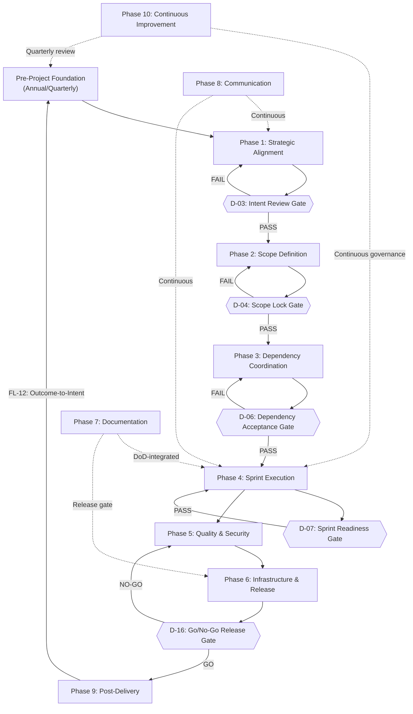
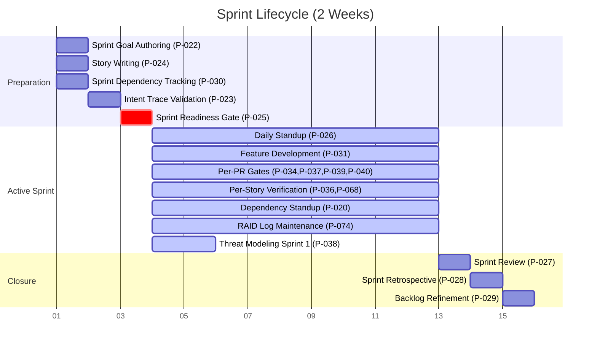
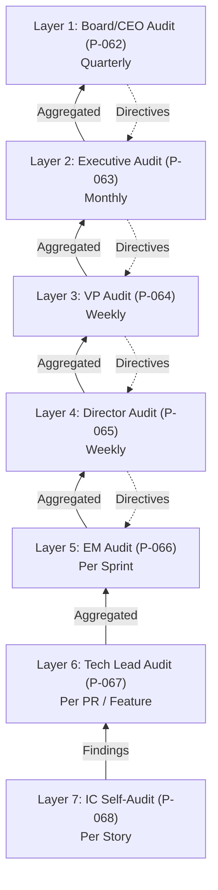

# Unified End-to-End Engineering Process Guide

**From Strategic Intent to Post-Delivery Learning**

**Version**: 1.0
**Date**: 2026-04-05
**Status**: Production
**Source**: Synthesized from 22 process documents comprising 93 formally specified engineering processes across 17 categories

---

## Preface

This document presents the complete engineering lifecycle as a single, coherent narrative. It integrates all 93 engineering processes (P-001 through P-093) across 17 categories into a unified workflow organized by when things happen in the project lifecycle, not by which category they belong to.

The engineering process framework rests on two foundational pillars:

1. **The Clarity of Intent Framework** -- A four-stage pipeline (Intent Frame, Scope Contract, Dependency Map, Sprint Bridge) with one artifact and one formal gate per stage. Each gate enforces a binary pass/fail decision before any downstream work begins.

2. **The Engineering Team Structure Guide** -- Thirteen agent roles across seven organizational reporting layers (Board/CEO through Individual Contributor), operating in a hybrid hierarchical and squad model.

This document does NOT replace the individual process specification documents (`01_intent_strategic_alignment.md` through `17_onboarding_knowledge_transfer.md`). It synthesizes them into a lifecycle narrative and cross-references each process to its source specification. When a process detail appears to conflict between this guide and a source specification, the source specification governs.

The intended audience includes product managers launching new projects, engineering managers running sprint ceremonies, TPMs coordinating cross-team dependencies, individual contributors seeking to understand where their daily work fits in the broader lifecycle, and leaders seeking organizational governance visibility.

---

## 0. How to Use This Guide

### 0.1 Navigation by Role

Each of the 13 agent roles has specific sections most relevant to their daily work. Use this table to find your entry point.

| Role | Description | Key Sections |
|:-----|:-----------|:-------------|
| `product-manager` | Owns intent articulation, scope definition, story writing, acceptance verification, and post-delivery measurement | 3, 4, 6, 10, 11, A1 |
| `engineering-manager` | Owns gates, sprint ceremonies, audit layers, capacity planning, and onboarding | 2, 3, 6, 9, 12, 14, 15 |
| `technical-program-manager` | Owns dependency lifecycle, RAID log, production release, and audit finding flow | 4, 5, 6, 7, 8, 12 |
| `software-engineer` | Owns feature development, ADR publication, and per-PR/per-story audit | 6, 9, 12 |
| `staff-principal-engineer` | Owns RFCs, technical debt tracking, guild standards, and language tier policy | 2, 10, 12 |
| `security-engineer` | Owns AppSec scope review, threat modeling, SAST/DAST, CVE triage, and compliance | 4, 6, 7, 13 |
| `qa-engineer` | Owns test architecture, automated testing framework, DoD enforcement, and performance testing | 4, 6, 7 |
| `platform-engineer` | Owns golden path adoption, environment self-service, SAST/DAST CI integration, and DX surveys | 6, 8, 12 |
| `cloud-engineer` | Owns infrastructure provisioning, CARB, and architecture pattern governance | 8, 12 |
| `sre` | Owns SLO definition, incident response, post-mortem, on-call management, and runbooks | 8, 11 |
| `data-engineer` | Owns data pipeline QA and schema migration processes | 8 |
| `ml-engineer` | Owns ML experiment logging, canary deployment, and drift monitoring | 8, 12 |
| `technical-writer` | Owns API documentation and release notes | 6, 8, 9 |

### 0.2 Navigation by Project Phase

| If You Are... | Go To |
|:-------------|:------|
| Starting a new project | Section 3 (Phase 1: Strategic Alignment) |
| Defining scope and planning | Section 4 (Phase 2: Scope Definition) |
| Mapping dependencies | Section 5 (Phase 3: Dependency Coordination) |
| In active development | Section 6 (Phase 4: Sprint Execution) |
| Preparing for release | Sections 7 and 8 (Phases 5 and 6) |
| After launch | Section 11 (Phase 9: Post-Delivery) |
| Running continuous processes | Sections 2, 10, 12 (Pre-Project, Communication, Continuous Improvement) |

### 0.3 Navigation by Process ID

Every process from P-001 through P-093 is listed in Appendix A1 (Master Process Table) with its section location, category, owner, phase, and execution cadence. To find any process by ID, consult that appendix.

### 0.4 Minimum Viable Adoption: The Core 12

Teams adopting this framework for the first time should start with these 12 processes, which represent the critical path from intent to delivered software:

| # | Process ID | Process Name | Why It Is Essential |
|:--|:----------|:-------------|:-------------------|
| 1 | P-001 | Intent Articulation | Without a clear Intent Brief, every downstream decision lacks a reference point |
| 2 | P-004 | Intent Review Gate | Ensures the team agrees on "why" before investing in "what" |
| 3 | P-007 | Deliverable Decomposition | Turns intent into concrete, ownable deliverables |
| 4 | P-008 | Definition of Done Authoring | Eliminates "what does done mean?" disputes during sprints |
| 5 | P-013 | Scope Lock Gate | Freezes scope so teams can commit to delivery timelines |
| 6 | P-015 | Cross-Team Dependency Registration | Makes invisible blockers visible before they delay sprints |
| 7 | P-019 | Dependency Acceptance Gate | Gets explicit commitments from dependency owners |
| 8 | P-022 | Sprint Goal Authoring | Connects each sprint to the project's purpose |
| 9 | P-024 | Story Writing | Engineers need clear stories with acceptance criteria |
| 10 | P-025 | Sprint Readiness Gate | Final check that the team is ready to execute |
| 11 | P-031 | Feature Development | The IC-level implementation workflow with CI gates |
| 12 | P-034 | Definition of Done Enforcement | Ensures quality standards are met per story, not retroactively |

These 12 processes cover the four Clarity of Intent gates and the minimum execution workflow. Everything else in this guide extends, supports, or governs these core processes.

### 0.5 Three-Phase Adoption Guide

For organizations not yet running all 93 processes, adopt in three phases:

- **Phase 1 (Weeks 1-4)**: The Core Four Gates -- adopt Categories 1-4 (18 processes). Success signal: your first project passes all four gates in 8-12 working days.
- **Phase 2 (Weeks 5-12)**: Add Quality, Security, and Risk -- layer in Categories 5, 6, 13 plus remaining Category 2-4 processes (40 total). Success signal: quality gates catch defects before release; security reviews happen early; risks are tracked systematically.
- **Phase 3 (Weeks 13-26)**: Full Framework -- adopt all remaining processes across Categories 7-12, 14-17 (93 total). Success signal: all processes active at their defined cadences; Quarterly Process Health Review (P-071) shows improving metrics.

---

## 1. The Engineering Lifecycle Overview

### 1.1 The Clarity of Intent Framework

The Clarity of Intent Framework is the backbone of the engineering delivery pipeline. It enforces a progressive narrowing of ambiguity through four sequential stages. Each stage produces exactly one artifact and enforces exactly one formal gate review before the next stage begins.

The four stages are:

1. **Intent Frame (Stage 1)** -- Answers "Why are we doing this?" Produces the Intent Brief (2 pages, 5 mandatory questions). Gate: Intent Review Gate (P-004).
2. **Scope Contract (Stage 2)** -- Answers "What exactly will we deliver?" Produces the Scope Contract (3-5 pages, 6 sections). Gate: Scope Lock Gate (P-013).
3. **Dependency Map (Stage 3)** -- Answers "Who else do we need, and are they committed?" Produces the Dependency Charter (2-4 pages, 4 sections). Gate: Dependency Acceptance Gate (P-019).
4. **Sprint Bridge (Stage 4)** -- Answers "Is this sprint team ready to execute?" Produces the Sprint Kickoff Brief (1 page, 5 sections). Gate: Sprint Readiness Gate (P-025).

Each stage progressively reduces ambiguity. No stage may begin until its predecessor's gate has passed. This sequential enforcement prevents the most common source of engineering waste: teams building the wrong thing, building the right thing with unclear completion criteria, or being blocked by dependencies nobody mapped.

### 1.2 The Four Formal Gates

| Gate | Process ID | Stage | Chaired By | Duration | Key Pass Criteria |
|:-----|:----------|:------|:----------|:---------|:-----------------|
| Intent Review Gate | P-004 | 1 | Engineering Director | 30 min sync or 48h async | All 5 Intent Brief questions answered with measurable specifics; OKR reference is real and active; at least 1 explicit exclusion; cost of inaction described |
| Scope Lock Gate | P-013 | 2 | Product Manager | 60 min | Every deliverable has a named owner squad; every DoD is testable; exclusions acknowledged; success metrics trace to Intent Brief; risks classified (P-075); AppSec review complete (P-012); test architecture drafted (P-032) |
| Dependency Acceptance Gate | P-019 | 3 | TPM | 45 min | Every dependency has a named, committed owner; critical path documented; resource conflicts resolved; escalation paths defined |
| Sprint Readiness Gate | P-025 | 4 | Engineering Manager | 10-15 min | Sprint goal connected to Scope Contract; intent trace visible; every story has acceptance criteria; engineers can answer what/why/done |

When a gate fails, the artifact is returned to the authoring team with specific revision requests. The revision loop (FL-01 through FL-04) typically takes 1-3 days for Stages 1-3 and same-day for Stage 4.

### 1.3 The 10-Phase Unified Lifecycle

The four Clarity of Intent stages form the delivery backbone. When supporting, governance, and operational processes are woven in, the lifecycle expands into 10 phases:

| Phase | Name | Objective | Key Gate | Cadence |
|:------|:-----|:---------|:---------|:--------|
| Pre-Project | Pre-Project Foundation | Establish organizational context and strategic priorities | D-01, D-02, D-19 | Annual/Quarterly |
| 1 | Strategic Alignment and Initiation | Produce a locked Intent Brief | D-03 | Per-project |
| 2 | Scope Definition and Planning | Produce a locked Scope Contract | D-04, D-05 | Per-project |
| 3 | Team Readiness and Dependency Coordination | Produce a locked Dependency Charter | D-06 | Per-project |
| 4 | Sprint Execution and Delivery | Execute through sprint cycles with integrated quality and security | D-07, D-08, D-09, D-10 | Per-sprint |
| 5 | Quality, Security, and Compliance | Validate work meets standards before production release | D-11, D-15 | Pre-release |
| 6 | Infrastructure, Platform, and Operations Readiness | Ensure infrastructure, SLOs, and release readiness | D-12, D-13, D-14, D-16 | Per-release |
| 7 | Documentation and Knowledge Management | Capture and distribute technical knowledge | None (DoD-integrated) | Continuous |
| 8 | Communication and Stakeholder Management | Maintain organizational alignment and visibility | None (cadence-driven) | Continuous |
| 9 | Post-Delivery and Retrospective | Measure outcomes and extract learning | D-17 | Post-project |
| 10 | Continuous Improvement and Organizational Governance | Govern technical standards and organizational health | D-18, D-19 | Continuous |



### 1.4 Dual-Track Model: Project vs. Organizational Processes

The 93 processes operate on two parallel tracks:

**Project Track (Sequential, Per-Project)**:
Processes that follow the gate-enforced sequence from intent through delivery. These run once per project and must complete in order. Examples: P-001 (Intent Articulation), P-007 (Deliverable Decomposition), P-015 (Dependency Registration), P-031 (Feature Development).

**Organizational Track (Cadence-Driven, Continuous)**:
Processes that run on fixed cadences regardless of whether a project is active. These provide the strategic, governance, and operational context within which all projects execute. Examples: P-005 (Strategic Prioritization, quarterly), P-006 (Technology Vision, annual), P-062-P-069 (7-layer audit system, per respective cadences), P-078 (OKR Cascade, quarterly).

Both tracks intersect at defined points. For instance, P-082 (Quarterly Capacity Planning) feeds P-005 (Strategic Prioritization), which determines which projects receive Intent Briefs. P-072 (OKR Retrospective) feeds P-078 (OKR Cascade) for the next quarter. The organizational track provides constraints and inputs to the project track; the project track provides data and outcomes back to the organizational track.

### 1.5 The 18 Execution Programs

The 93 processes are organized into 18 execution programs that define dependency ordering. Programs with lower numbers must complete (or be active) before programs with higher numbers can begin.

| Program | Processes | Blocked By |
|:--------|:---------|:-----------|
| 1 | P-006 Technology Vision | None (annual) |
| 2 | P-005 Strategic Prioritization, P-082 Capacity Planning | P-006 (vision constrains priorities) |
| 3 | P-078 OKR Cascade, P-081 DORA Metrics, P-084 Succession Planning | P-005 (priorities define OKRs) |
| 4 | P-001 Intent Articulation, P-002 OKR Alignment, P-003 Boundary Definition | P-005 (project approved), P-078 (OKRs available) |
| 5 | P-004 Intent Review Gate | P-001, P-002, P-003 |
| 6 | P-007 Deliverable Decomposition | P-004 (Intent locked) |
| 7 | P-008 DoD, P-009 Metrics, P-010 Risks, P-011 Exclusions, P-012 AppSec Review, P-075 Risk Register | P-007 |
| 8 | P-032 Test Architecture, P-013 Scope Lock Gate | P-008, P-009, P-010, P-011, P-012, P-075 |
| 9 | P-014 Scope Change Control, P-074 RAID Log, P-015 Dependency Registration | P-013 (Scope locked) |
| 10 | P-016 Critical Path, P-017 Resource Conflicts, P-018 Communication Protocol, P-083 Shared Resources | P-015 |
| 11 | P-019 Dependency Acceptance Gate | P-016, P-017, P-018, P-083 |
| 12 | P-091 Project Onboarding, P-093 Cross-Team Onboarding, P-020 Dependency Standup | P-019 (Dependencies committed) |
| 13 | P-022 Sprint Goal, P-024 Story Writing, P-030 Sprint Dependency Tracking | P-019 |
| 14 | P-023 Intent Trace, P-025 Sprint Readiness Gate | P-022, P-024 |
| 15 | P-026 Daily Standup, P-031 Feature Dev, P-033-P-040 (QA/Security during sprint), P-058 API Docs, P-060 ADRs, P-067-P-068 Audit | P-025 (Sprint started) |
| 16 | P-027 Sprint Review, P-028 Retro, P-029 Refinement | Sprint completion |
| 17 | P-035 Perf Testing, P-076 CAB, P-054 SLO, P-059 Runbooks, P-048 Release, P-061 Release Notes, P-044-P-047 Infrastructure | Pre-release readiness |
| 18 | P-073 Outcome Measurement, P-070 Post-Mortem, P-072 OKR Retro, P-071 Process Health, P-055-P-057 SRE Ops, P-049-P-053 Data/ML Ops, P-062-P-069 Audit, P-085-P-089 Tech Excellence, P-041-P-043 Security Governance, P-077 Quarterly Risk, P-080 Guild Standards, P-090 Onboarding, P-092 Knowledge Transfer | Various triggers and cadences |

### 1.6 The Critical Path: P-001 to P-073

The minimum viable sequence from strategic intent to post-launch outcome measurement follows this critical path:

```
P-001 (Intent Articulation)
  --> P-002 (OKR Alignment) + P-003 (Boundary Definition) [parallel]
    --> P-004 (Intent Review Gate)
      --> P-007 (Deliverable Decomposition)
        --> P-008 (DoD) + P-009 (Metrics) + P-011 (Exclusions) + P-012 (AppSec Review) [parallel]
          --> P-013 (Scope Lock Gate)
            --> P-015 (Dependency Registration)
              --> P-016 (Critical Path) + P-017 (Resource Conflicts) + P-018 (Communication) [parallel]
                --> P-019 (Dependency Acceptance Gate)
                  --> P-022 (Sprint Goal) + P-024 (Story Writing) [parallel]
                    --> P-025 (Sprint Readiness Gate)
                      --> P-026 (Daily Standup) + P-031 (Feature Development) [continuous]
                        --> P-034 (DoD Enforcement) --> P-036 (Acceptance Verification)
                          --> P-027 (Sprint Review)
                            --> P-048 (Production Release)
                              --> P-073 (Post-Launch Outcome Measurement, 30/60/90 days)
```

Elapsed time from P-001 to Sprint 1 readiness (P-025): approximately 8-15 working days. This investment in upfront alignment saves 2-4 sprints of rework by surfacing misalignment before code is written.

### 1.7 Process Execution Context Guide

Every process executes in one of eight contexts. This reference shows how the 93 processes distribute across execution contexts.

| Execution Context | Description | Process IDs |
|:-----------------|:-----------|:-----------|
| Per-project (once) | Runs once per project | P-001, P-002, P-003, P-004, P-007, P-008, P-009, P-010, P-011, P-012, P-013, P-015, P-016, P-017, P-018, P-019, P-032, P-038, P-070, P-075, P-091 |
| Per-sprint (recurring) | Runs every sprint (typically every 2 weeks) | P-022, P-023, P-024, P-025, P-026, P-027, P-028, P-029, P-030, P-066 |
| Per-story (every story) | Runs for each user story | P-034, P-036, P-068 |
| Per-PR (every pull request) | Runs on each pull request | P-031, P-037, P-039, P-067 |
| Per-release (each production release) | Runs at each release | P-035, P-048, P-054, P-059, P-061, P-076 |
| Event-driven (triggered) | Runs when a specific event occurs | P-014, P-021, P-040, P-041, P-042, P-050, P-055, P-056, P-085, P-087, P-088, P-090, P-092, P-093 |
| Continuous (ongoing) | Runs throughout the project or permanently | P-020, P-033, P-044, P-046, P-049, P-051, P-052, P-053, P-057, P-058, P-060, P-069, P-074, P-079, P-080 |
| Quarterly/Annual (cadence) | Runs on organizational cadence | P-005, P-006, P-043, P-047, P-062, P-063, P-064, P-065, P-071, P-072, P-073, P-077, P-078, P-081, P-082, P-083, P-084, P-086, P-089 |

---

## 2. Pre-Project Foundation

This section covers the annual and quarterly organizational processes that establish the strategic and operational context for all projects. These processes run on fixed cadences regardless of project phase.

### 2.1 Annual: Technology Vision Alignment (P-006)

**Primary Owner**: `engineering-manager` (CTO)
**Supporting Roles**: `staff-principal-engineer` (Distinguished Engineers), `engineering-manager` (VP)
**Trigger / Cadence**: Annual, aligned with the company strategic planning cycle
**Output**: Technology Vision document with architectural mandates

The Technology Vision Alignment process establishes the three-year technical direction for the engineering organization. The CTO chairs this process, working with Distinguished Engineers and VPs to produce a Technology Vision document that includes architectural mandates, technology investment priorities, and constraints that apply to all subsequent projects.

The Technology Vision document feeds directly into the Cloud Architecture Review Board (P-047), which uses it as guardrails for infrastructure decisions. It also constrains Intent Briefs (P-001): any project whose technical approach contradicts the Technology Vision must obtain explicit CTO approval or modify its approach.

> **Gate D-01: Technology Vision Alignment Review**
> - **Decision Criteria**: Technology direction consistent with 3-year strategic plan; architectural mandates documented; Staff/Distinguished Engineer consensus obtained
> - **Decision Owner**: CTO, VP of Engineering
> - **On PASS**: Technology Vision published; mandates communicated to all directors
> - **On FAIL**: Direction rejected or returned for revision

**Source**: `01_intent_strategic_alignment.md`

### 2.2 Quarterly: Strategic Prioritization (P-005)

**Primary Owner**: `engineering-manager` (VP)
**Supporting Roles**: `engineering-manager` (Director), `product-manager` (GPM)
**Trigger / Cadence**: Quarterly, before the OKR cycle begins
**Output**: Approved project portfolio for the quarter

The Strategic Prioritization process determines which projects receive authorization to proceed with Intent Briefs. The VP of Engineering chairs a prioritization session where demand signals from product, engineering, and business stakeholders are scored against available capacity (provided by P-082 Quarterly Capacity Planning).

The relationship between P-005 and P-082 is bidirectional: capacity data constrains prioritization decisions, and prioritization decisions drive capacity allocation. Neither can finalize independently. The typical pattern is: P-082 produces a preliminary capacity snapshot, P-005 ranks projects against that capacity, and the two processes iterate until the portfolio fits within available capacity.

> **Gate D-02: Quarterly Strategic Prioritization Gate**
> - **Decision Criteria**: Valid business case; sufficient capacity per P-082; ranks above capacity threshold
> - **Decision Owner**: VP of Engineering (final), Director (scoring input)
> - **On PASS**: Project added to approved portfolio; P-001 authorized
> - **On FAIL**: Project deferred to next quarter; Sponsor notified

**Source**: `01_intent_strategic_alignment.md`

### 2.3 Quarterly: Capacity Planning (P-082)

**Primary Owner**: `engineering-manager` (VP/Director/EM)
**Supporting Roles**: `product-manager` (GPM demand signals), `technical-program-manager` (cross-program demand aggregation)
**Trigger / Cadence**: Quarterly, concurrent with P-005
**Output**: Approved Headcount Plans, Quarterly Allocation Map, Squad Capacity Declarations

Quarterly Capacity Planning follows a five-stage process:

1. **Demand Aggregation**: Product, engineering, and business leaders submit demand signals for the quarter. The TPM aggregates cross-program demand.
2. **Headcount Plan**: VP and Directors draft the approved headcount plan, accounting for hiring pipeline, PTO, and on-call commitments.
3. **Squad-to-Program Allocation**: Each Director allocates their squads to programs and projects for the quarter.
4. **Squad Capacity Validation**: Each EM validates their squad's capacity declaration, accounting for planned absences, technical debt sprints, and on-call rotation.
5. **Over-Commitment Resolution**: Any squad allocated above capacity triggers a resolution process: either descope, defer, or obtain additional resources.

No project may be approved without a corresponding capacity allocation. Over-committed squads must be resolved before sprint commitments are made.

**Source**: `15_capacity_resource_management.md`

### 2.4 Quarterly: OKR Cascade Communication (P-078)

**Primary Owner**: `engineering-manager` (VP/Director)
**Supporting Roles**: `engineering-manager` (EM), `product-manager`
**Trigger / Cadence**: Quarterly, after company OKRs are published
**Output**: OKR cascade documents at every organizational level

The OKR Cascade Communication process ensures every engineer can trace their sprint goal to a company OKR within three degrees of separation. The cascade flows through five levels:

1. **Company OKRs** -- Published by executive leadership at quarter start (Q-day)
2. **Engineering OKRs** -- VP of Engineering publishes within 2 working days of company OKRs
3. **Domain/Area OKRs** -- Directors publish within 3 working days of engineering OKRs
4. **Squad OKRs** -- EMs publish within 5 working days of area OKRs
5. **Sprint Goals** -- Each sprint goal (P-022) traces to a squad OKR

Each level's OKR document must reference its parent OKR explicitly. The intent trace chain (P-023) verifies this traceability during sprint preparation.

**Source**: `14_communication_alignment.md`

### 2.5 Monthly/Quarterly: DORA Metrics Review (P-081)

**Primary Owner**: `engineering-manager`
**Supporting Roles**: `platform-engineer` (data collection), `sre` (reliability metrics)
**Trigger / Cadence**: Monthly review; quarterly organization-wide sharing
**Output**: DORA metrics reports

The four DORA metrics measure engineering velocity and stability:

| Metric | Definition | Elite Benchmark |
|:-------|:----------|:---------------|
| Deployment Frequency | How often code is deployed to production | On-demand (multiple deploys per day) |
| Lead Time for Changes | Time from code commit to production deployment | Less than one day |
| Change Failure Rate | Percentage of deployments causing a failure in production | 0-15% |
| Mean Time to Recovery (MTTR) | Time to restore service after a production failure | Less than one hour |

DORA metrics are reviewed monthly by Engineering Managers at the squad and area level. Quarterly, an organization-wide report is shared with all engineers and leadership. DORA data feeds directly into P-071 (Quarterly Process Health Review) and P-070 (Project Post-Mortem).

DORA metrics are never used for individual performance evaluation. They measure organizational and team health, not individual productivity.

**Source**: `14_communication_alignment.md`

### 2.6 Annual: Succession Planning (P-084)

**Primary Owner**: `engineering-manager`
**Supporting Roles**: `engineering-manager` (Director/VP)
**Trigger / Cadence**: Annual
**Output**: Succession plans for key roles; bus factor assessment

The Succession Planning process identifies key roles across the engineering organization and ensures each has at least one identified successor. The goal is bus factor reduction: no critical process or system should depend on a single person with no backup.

For each key role, the succession plan documents: the current holder, the identified successor(s), the knowledge gap between current holder and successor, and the plan to close that gap (training, shadowing, documentation). P-092 (Knowledge Transfer) is triggered when an engineer departs or rotates, ensuring captured knowledge is transferred.

**Source**: `15_capacity_resource_management.md`

### 2.7 Integration with Project Phases

Pre-project foundation processes gate and inform Phase 1 in the following ways:

- P-006 (Technology Vision) constrains all Intent Briefs -- a project that contradicts the vision requires CTO exception
- P-005 (Strategic Prioritization) determines which projects receive Intent Briefs -- only approved projects proceed to P-001
- P-082 (Capacity Planning) provides the data P-005 uses to decide what fits in the quarter
- P-078 (OKR Cascade) provides the OKR references that P-002 (OKR Alignment Verification) will validate
- P-081 (DORA Metrics) provides the baseline that P-071 (Process Health Review) will measure against

**Quarterly Cadence Calendar**:

| Timing | Process | Owner |
|:-------|:--------|:------|
| Q-day (quarter start) | P-078 OKR Cascade begins | `engineering-manager` (VP) |
| Q-day + 2 days | Engineering OKRs published | `engineering-manager` (VP) |
| Q-day + 5 days | Squad OKRs published | `engineering-manager` (EM) |
| Q-week 1 | P-005 Strategic Prioritization session | `engineering-manager` (VP) |
| Q-week 1 | P-082 Capacity Planning concurrent | `engineering-manager` (Director) |
| Q-month 1 end | P-081 DORA monthly review | `engineering-manager` (EM) |
| Q-month 2 end | P-081 DORA monthly review | `engineering-manager` (EM) |
| Q-month 3 end | P-081 DORA quarterly sharing | `engineering-manager` (VP) |
| Q-end | P-071 Quarterly Process Health Review | `engineering-manager` (Director) |
| Q-end | P-077 Quarterly Risk Review | `engineering-manager` (Director/VP) |
| Q-end | P-086 Technical Debt quarterly report | `staff-principal-engineer` |
| Q-end | P-089 Developer Experience Survey | `platform-engineer` |
| Annual | P-006 Technology Vision | `engineering-manager` (CTO) |
| Annual | P-084 Succession Planning | `engineering-manager` (Director) |


---

## 3. Phase 1: Strategic Alignment and Intent Framing

> **Phase Number**: 1
> **Phase Name**: Strategic Alignment and Intent Framing
> **Objective**: Establish organizational context, ensure capacity and priority alignment, and produce a locked Intent Brief that passes the Intent Review Gate before any project-specific scope work begins.
> **Corresponding Clarity of Intent Stage**: Stage 1 (Intent Frame)
> **Entry Criteria**: A business need, market signal, OKR initiative, or competitive pressure has been identified by the Sponsor; company OKR documentation is current; quarterly capacity data is available (P-082 has been run); Technology Vision document exists (P-006 has been run within the past 12 months)
> **Exit Criteria / Gate**: D-03 Intent Review Gate (P-004) -- PASS required
> **Source Process Documents**: `01_intent_strategic_alignment.md` (P-001 through P-006), `15_capacity_resource_management.md` (P-082), `14_communication_alignment.md` (P-078)
> **Primary Roles Responsible**: `product-manager` (P-001, P-002, P-003), `engineering-manager` Director (P-004), `engineering-manager` VP/CTO (P-005, P-006)

### 3.1 Phase Objectives, Entry Criteria, Exit Criteria

Phase 1 ensures that every engineering project begins with a clear, validated statement of intent before any scope definition or solution design occurs. The phase prevents the most expensive category of engineering waste: building the wrong thing because nobody articulated why the project exists or what success looks like.

The phase begins when a Sponsor identifies a business need and ends when the Intent Review Gate (D-03) passes. The elapsed time for this phase is typically 2-3 working days for a well-prepared team.

### 3.2 P-001: Intent Articulation Process

**Primary Owner**: `product-manager`
**Supporting Roles**: `engineering-manager`, Sponsor
**Trigger / Cadence**: Per-project, after P-005 authorization
**Output**: Intent Brief (2 pages, 5 mandatory questions)

The Intent Articulation process requires the PM and Sponsor to answer five mandatory questions, each designed to force clarity before scope work begins:

1. **What is the problem or opportunity?** -- Describe the current state and why it is insufficient. Avoid solution language.
2. **What outcome do we expect?** -- A measurable outcome with a timeline. Not "improve performance" but "reduce P95 API latency from 800ms to 200ms within 60 days of launch."
3. **How does this connect to our strategic objectives?** -- Reference a specific, active, tracked OKR. Not aspirational language, but a real OKR number.
4. **What is explicitly out of scope?** -- At least one exclusion is mandatory. Each exclusion must have a reason and a future home (backlog, next quarter, never).
5. **What happens if we do nothing?** -- The cost of inaction, quantified where possible. This prevents "nice-to-have" projects from consuming capacity meant for critical work.

The Intent Brief is a maximum of 2 pages. It is not a PRD, not a technical design document, and not a project plan. It is a decision-forcing function that aligns the team on purpose before investment begins.

The PM drafts the Intent Brief within a target window of 3 working days. The Sponsor provides strategic context and validates the cost of inaction. The Engineering Director or VP reviews for organizational fit.

**Source**: `01_intent_strategic_alignment.md`

### 3.3 P-002: OKR Alignment Verification

**Primary Owner**: `product-manager`
**Supporting Roles**: `engineering-manager`
**Trigger / Cadence**: Per-project, parallel with P-001 final review
**Output**: Verified OKR reference in the Intent Brief

The OKR Alignment Verification process validates that the strategic context in the Intent Brief references a real, active, tracked OKR -- not aspirational language or a goal that has already been superseded.

Verification checks:
- The referenced OKR exists in the current quarter's OKR cascade (P-078 output)
- The OKR is actively tracked (not deferred or completed)
- The project's expected outcome contributes meaningfully to the OKR's key result
- The OKR is traceable through the cascade (company to engineering to domain to squad)

If no valid OKR reference exists, the project either needs a new OKR created at the appropriate level (which requires Director or VP approval) or the project should not proceed this quarter.

**Source**: `01_intent_strategic_alignment.md`

### 3.4 P-003: Boundary Definition

**Primary Owner**: `product-manager`
**Supporting Roles**: `engineering-manager`, Sponsor
**Trigger / Cadence**: Per-project, parallel with P-001 and P-002
**Output**: Exclusion list in the Intent Brief

The Boundary Definition process creates the "NOT" list -- an explicit set of things this project will not do. Every exclusion must include:

- **What is excluded**: A clear description of the excluded functionality, system, or goal
- **Why it is excluded**: The rationale (out of scope, deferred to next quarter, responsibility of another team, deliberately chosen not to pursue)
- **Future home**: Where this exclusion lives after the project (backlog item, next quarter candidate, never)

A minimum of one exclusion is mandatory. Projects that claim "nothing is out of scope" have not thought carefully enough about boundaries, and the Intent Review Gate will fail them.

Boundary definition is not defensive documentation. It is a proactive tool that prevents scope creep by establishing what was intentionally excluded before scope work begins.

**Source**: `01_intent_strategic_alignment.md`

### 3.5 Gate D-03: Intent Review Gate (P-004)

**Chair**: `engineering-manager` (Director)
**Format**: 30-minute synchronous review or 48-hour asynchronous review
**Participants**: PM (presenter), Director (chair), Sponsor, Engineering Manager

**Pass Criteria** (all must be met):
1. All 5 Intent Brief questions are answered with measurable specifics (no vague or aspirational language)
2. The expected outcome is measurable with a defined timeline
3. The OKR reference is a real, active, tracked OKR (verified via P-002)
4. At least 1 explicit exclusion is stated with rationale and future home
5. The cost of inaction is described with quantified impact where possible

**On PASS**: Intent Brief is locked (version 1.0). All Category 2 processes (Phase 2) are unlocked. P-007 (Deliverable Decomposition) may begin.

**On FAIL**: Intent Brief is returned to the PM with specific revision requests documented in the gate decision record. The PM revises and resubmits. This activates feedback loop FL-01 (Gate Revision Loop for Intent), which typically takes 1-3 days.

> **Handoff H-01**: Locked Intent Brief
> - **From**: Phase 1 / `product-manager`
> - **To**: Phase 2 / `product-manager`
> - **Trigger**: D-03 Intent Review Gate PASS
> - **Artifact**: Locked Intent Brief (version 1.0)

**Source**: `01_intent_strategic_alignment.md`

### 3.6 Intent Brief Template and Worked Example

**Intent Brief Template**:

```
INTENT BRIEF
Project: [Project Name]
Date: [Date]
Author: [PM Name]
Sponsor: [Sponsor Name]
Version: [1.0 / revision number]

1. PROBLEM OR OPPORTUNITY
[Describe the current state and why it is insufficient. Use data where available.
Avoid solution language -- describe the problem, not the fix.]

2. EXPECTED OUTCOME
[State the measurable outcome with a timeline.
Format: "[Metric] will change from [current value] to [target value] within
[timeframe] of launch."]

3. STRATEGIC ALIGNMENT
[Reference: OKR [ID] -- [OKR text]
Explain how this project's outcome contributes to the key result.]

4. EXPLICIT EXCLUSIONS
- [Exclusion 1]: [Reason]. Future home: [backlog / next quarter / never]
- [Exclusion 2]: [Reason]. Future home: [backlog / next quarter / never]

5. COST OF INACTION
[What happens if we do not do this project? Quantify where possible:
revenue at risk, customer churn rate, competitive disadvantage, technical
debt accumulation rate.]
```

**Good Example -- Outcome Statement**:
"Reduce checkout API P95 latency from 1200ms to 300ms within 30 days of launch, measured by production Datadog percentile metrics."

**Bad Example -- Outcome Statement**:
"Improve checkout performance." (Not measurable, no timeline, no baseline, no target.)

**Good Example -- Exclusion**:
"Mobile-native checkout flow is excluded. Reason: the native app team has a separate roadmap for Q3. Future home: Q3 mobile squad backlog item MOB-1247."

**Bad Example -- Exclusion**:
"We won't do everything." (Not specific, no rationale, no future home.)

### 3.7 Anti-Patterns at Phase 1

> **Anti-Pattern**: Skipping the gate to "move faster"
> **What it looks like**: "We already know what we're building. Let's skip straight to Sprint Bridge."
> **Why it fails**: The gates exist to surface misalignment early. Skipping D-03 means scope disputes emerge during Sprint 2 instead of before Sprint 1. The 8-12 days invested in the four gates saves 2-4 sprints of rework.
> **Instead**: Run the gate. A 30-minute review is cheaper than 4 weeks of rework.

> **Anti-Pattern**: Writing the Intent Brief after Sprint 1
> **What it looks like**: "We'll document the Intent Brief retroactively to satisfy the process."
> **Why it fails**: The Intent Brief is not documentation -- it is a decision-forcing function. An Intent Brief written after Sprint 1 describes what was built, not what should have been built. The value is in the thinking it forces, not the document itself.
> **Instead**: Write the Intent Brief before any scope work. The discipline of answering the 5 questions is the point.

> **Anti-Pattern**: One person writes it alone
> **What it looks like**: "The PM can write the Intent Brief alone."
> **Why it fails**: The Intent Brief requires the sponsor's strategic context, the engineering leader's feasibility judgment, and the PM's product perspective. Single-author artifacts miss the blind spots these different viewpoints reveal.
> **Instead**: The PM drafts, the Sponsor validates strategic context and cost of inaction, the Engineering Director reviews for organizational fit.


---

## 4. Phase 2: Scope Definition and Contract

> **Phase Number**: 2
> **Phase Name**: Scope Definition and Planning
> **Objective**: Translate the locked Intent Brief into a versioned, controlled Scope Contract with every deliverable owned, every Definition of Done written, success metrics defined, and risks registered -- then lock it at the Scope Lock Gate.
> **Corresponding Clarity of Intent Stage**: Stage 2 (Scope Contract)
> **Entry Criteria**: Intent Review Gate (D-03) has passed; locked Intent Brief is available; organizational squad ownership map is current; AppSec Lead is available for P-012 review
> **Exit Criteria / Gate**: D-04 Scope Lock Gate (P-013) -- PASS required
> **Source Process Documents**: `02_scope_contract_management.md` (P-007 through P-014), `05_quality_assurance_testing.md` (P-032), `06_security_compliance.md` (P-012), `13_risk_change_management.md` (P-074, P-075)
> **Primary Roles Responsible**: `product-manager` (P-007-P-011, P-013, P-014, P-075), `security-engineer` (P-012), `qa-engineer` (P-032), `technical-program-manager` (P-074)

### 4.1 Phase Objectives, Entry Criteria, Exit Criteria

Phase 2 converts the "why" from the Intent Brief into the "what" of a Scope Contract. The Scope Contract is the authoritative reference for what will be delivered, how completion will be measured, what is excluded, and what risks are accepted. Once locked, the Scope Contract can only be modified through the formal Scope Change Control process (P-014).

The phase follows a structured sequence: P-007 runs first (it produces the deliverables table), then P-008 through P-012 and P-075 run in parallel (they each elaborate on different facets of the scope), then P-013 converges everything at the Scope Lock Gate.

Elapsed time for this phase is typically 3-5 working days.

### 4.2 P-007: Deliverable Decomposition

**Primary Owner**: `product-manager`
**Supporting Roles**: `software-engineer` (Tech Lead), `staff-principal-engineer` (cross-team review)
**Trigger / Cadence**: Per-project, first step after D-03 passes
**Output**: Deliverables table in the Scope Contract

The Deliverable Decomposition process follows a six-step approach:

1. PM proposes an initial list of deliverables derived from the Intent Brief's expected outcome
2. Tech Lead validates technical feasibility and identifies missing technical deliverables (infrastructure, migrations, tooling)
3. Staff/Principal Engineer reviews any deliverables that span multiple squads for architectural completeness
4. Each deliverable is assigned to exactly one owner squad (single-squad ownership rule)
5. Deliverables that span squads are decomposed into sub-deliverables, each owned by one squad
6. The final deliverables table is documented with columns: Deliverable ID, Description, Owner Squad, Dependencies, Target Sprint

The single-squad ownership rule is non-negotiable. When a deliverable cannot be assigned to a single squad, it must be decomposed further until each piece has a single owner. This prevents the "shared ownership means no ownership" failure mode.

**Source**: `02_scope_contract_management.md`

### 4.3 P-008: Definition of Done Authoring, P-009: Success Metrics Definition, P-010: Assumptions and Risks Registration, P-011: Exclusion Documentation

These four processes run in parallel after P-007 completes. They each elaborate on a different facet of the Scope Contract.

#### P-008: Definition of Done Authoring

**Primary Owner**: `product-manager`
**Supporting Roles**: `software-engineer` (Tech Lead), `qa-engineer`
**Output**: Testable DoD per deliverable

For each deliverable in the P-007 table, the PM and Tech Lead co-author a Definition of Done. Each DoD criterion must be binary (pass/fail), testable (an observer can verify it), and complete (when all criteria are met, the deliverable is done). The QA Engineer reviews DoD criteria for testability and coverage.

#### P-009: Success Metrics Definition

**Primary Owner**: `product-manager`
**Output**: Quantified success metrics that trace to the Intent Brief outcome

Success metrics are the bridge between the Intent Brief's expected outcome and the post-launch measurement (P-073). Each metric must specify: the metric name, the current baseline value, the target value, the measurement method, and the measurement timeline. Success metrics defined here are consumed by P-054 (SLO Definition) to set production performance thresholds and by P-073 to measure post-launch outcomes.

#### P-010: Assumptions and Risks Registration

**Primary Owner**: `product-manager`
**Supporting Roles**: `software-engineer` (Tech Lead), `security-engineer`
**Output**: Raw list of assumptions and risks

The PM captures all assumptions (things believed to be true but not yet verified) and risks (things that could go wrong). The Tech Lead contributes technical risks (performance, scalability, integration complexity). The security-engineer contributes security risks during the parallel AppSec Scope Review (P-012). The raw list from P-010 feeds into P-075 (Risk Register at Scope Lock) for formal classification.

#### P-011: Exclusion Documentation

**Primary Owner**: `product-manager`
**Output**: Explicit exclusion list in the Scope Contract

Exclusions from the Intent Brief (P-003) are carried forward and expanded. Any new exclusions discovered during scope definition are added. Each exclusion includes: what is excluded, why, and its future home. The exclusion list is reviewed and acknowledged by all gate attendees at P-013.

**Source**: `02_scope_contract_management.md`

### 4.4 P-012: AppSec Scope Review [Security Integration]

**Primary Owner**: `security-engineer` (AppSec Lead)
**Supporting Roles**: `product-manager`, `software-engineer` (Tech Lead)
**Trigger / Cadence**: Per-project, parallel with P-008 through P-011
**Output**: AppSec scope review findings

> **[Security Integration Point]**: P-012 (AppSec Scope Review) is conducted during this phase. The AppSec Lead reviews the project scope to define the security perimeter, identify sensitive data flows, and flag security risks that must be addressed. High-priority security findings are registered in P-010 (Assumptions and Risks) and gate the Scope Lock (P-013). See Section 13.1 for the full security concern matrix.

The AppSec Scope Review produces: a security perimeter definition (what systems and data are in scope for security review), identification of sensitive data flows (PII, payment data, health data, credentials), and initial security risk findings. These findings flow into P-010 (registered as risks) and ultimately into the Risk Register (P-075). The AppSec review must be complete before P-013 can pass.

> **Gate D-05: AppSec Scope Review Checkpoint**
> - **Decision Owner**: AppSec Lead / `security-engineer`
> - **On PASS**: Findings documented; high-priority findings in P-010; P-013 can proceed
> - **On FAIL**: Scope cannot pass P-013 until AppSec review is complete

> **Handoff H-05**: AppSec Scope Review Findings
> - **From**: Phase 2 / `security-engineer`
> - **To**: Phase 4 / `security-engineer`
> - **Trigger**: P-012 complete
> - **Artifact**: AppSec scope review findings (feeds P-038 Threat Modeling)

**Source**: `02_scope_contract_management.md`, `06_security_compliance.md`

### 4.5 P-075: Risk Register at Scope Lock [Risk Integration]

**Primary Owner**: `product-manager`
**Supporting Roles**: `technical-program-manager`
**Trigger / Cadence**: Per-project, after P-010 and P-012 complete
**Output**: Classified Risk Register

> **[Risk Integration Point]**: P-075 (Risk Register at Scope Lock) classifies and validates the raw assumptions and risks captured in P-010. This is a two-step process: P-010 captures raw risks during scope authoring; P-075 classifies them before the Scope Lock Gate. See Section 13.5 for the full risk concern matrix.

The PM takes the raw risk list from P-010 and classifies each item by:
- **Severity**: HIGH (project-blocking), MEDIUM (sprint-impacting), LOW (monitor only)
- **Probability**: HIGH (likely to occur), MEDIUM (possible), LOW (unlikely)
- **Mitigation plan**: For HIGH and MEDIUM risks, a mitigation approach must be documented
- **Owner**: Each risk must have a named owner responsible for monitoring and mitigation

The completed Risk Register is a prerequisite for the Scope Lock Gate (P-013). It also seeds the RAID Log (P-074) that will be maintained weekly throughout the project.

> **Handoff H-04**: Raw Risks to Risk Register
> - **From**: Phase 2 / `product-manager` (P-010)
> - **To**: Phase 2 / `product-manager` (P-075)
> - **Trigger**: P-007 and P-008 complete
> - **Artifact**: Classified Risk Register

**Source**: `13_risk_change_management.md`

### 4.6 P-032: Test Architecture Design [Quality Integration]

**Primary Owner**: `qa-engineer` (QA Lead)
**Supporting Roles**: `software-engineer` (Tech Lead), `product-manager`
**Trigger / Cadence**: Per-project, starts after P-007 and P-008 complete
**Output**: Test Architecture document

> **[Quality Integration Point]**: P-032 (Test Architecture Design) begins during Phase 2, after the Scope Contract DoD defines what must be tested. The QA Lead designs the test strategy for the entire project, including coverage targets and test pyramid proportions. See Section 13.2 for the full quality concern matrix.

The Test Architecture document defines:
- **Test pyramid proportions**: Unit tests (base, highest coverage), integration tests (middle), end-to-end tests (top, fewest). Typical ratio: 70/20/10.
- **Coverage targets**: Based on risk classification from P-075. HIGH-risk deliverables require 90%+ coverage; MEDIUM-risk require 80%; LOW-risk require 70%.
- **Test environments**: Which environments are needed and how they map to the test types
- **CI gate configuration**: What tests must pass before a PR can merge (P-034 DoD Enforcement)
- **Performance test scenarios**: Derived from SLO targets (P-054, when available) or from success metrics (P-009)

The Test Architecture document is a draft at Scope Lock. It is finalized before Sprint 1 and implemented as the automated test framework (P-033) during the first sprint.

> **Handoff H-03**: Test Architecture Document
> - **From**: Phase 2 / `qa-engineer`
> - **To**: Phase 3-4 / QA team
> - **Trigger**: Scope Lock Gate PASS; test architecture reviewed
> - **Artifact**: Test Architecture document

**Source**: `05_quality_assurance_testing.md`

### 4.7 Gate D-04: Scope Lock Gate (P-013)

**Chair**: `product-manager`
**Format**: 60-minute synchronous meeting
**Participants**: PM (chair), Tech Lead, QA Lead, AppSec Lead, Engineering Director (approves scope expansion)

**Pass Criteria** (all must be met):
1. Every deliverable in the P-007 table has a named owner squad
2. Every deliverable has a testable Definition of Done (P-008)
3. Explicit exclusions are listed and acknowledged by all attendees (P-011)
4. Success metrics trace to the Intent Brief outcome (P-009 references P-001)
5. All risks from P-010 are classified in the Risk Register (P-075)
6. AppSec scope review (P-012) is complete with findings documented
7. Test architecture (P-032) is drafted

**On PASS**: Scope Contract v1.0 is locked. Category 3 processes (Phase 3) are unlocked. P-014 (Scope Change Control) and P-074 (RAID Log Maintenance) are activated.

**On FAIL**: Scope Contract returned for revision with specific gaps documented. Feedback loop FL-02 (Gate Revision Loop for Scope) is activated, typically requiring 1-3 days to revise.

> **Handoff H-02**: Locked Scope Contract
> - **From**: Phase 2 / `product-manager`
> - **To**: Phase 3 / `technical-program-manager`
> - **Trigger**: D-04 Scope Lock Gate PASS
> - **Artifact**: Locked Scope Contract v1.0

**Source**: `02_scope_contract_management.md`

### 4.8 P-014: Scope Change Control (Post-Lock)

**Primary Owner**: `product-manager`
**Supporting Roles**: `engineering-manager` (Director for expansion), `software-engineer` (Tech Lead)
**Trigger / Cadence**: Event-driven, after Scope Lock
**Output**: Scope Change Request; versioned Scope Contract

Once the Scope Contract is locked, any change must go through the formal Scope Change Control process. The Scope Change Request form has four fields:

1. **What changed**: Description of the proposed change
2. **Why**: Business justification for the change
3. **Impact**: Effect on timeline, deliverables, risks, and resources
4. **Decision**: PM decides for changes within the scope boundary; Engineering Director decides for changes that expand scope or affect timeline by more than one sprint

Each approved change increments the Scope Contract version (v1.1, v1.2, etc.) and is communicated to all stakeholders via P-079. Each change is also assessed for risk impact and entered into the RAID Log (P-074).

**Source**: `02_scope_contract_management.md`

### 4.9 P-074: RAID Log Initialization

**Primary Owner**: `technical-program-manager`
**Supporting Roles**: `product-manager`, `engineering-manager`
**Trigger / Cadence**: Activated at Scope Lock; maintained weekly thereafter
**Output**: RAID Log (Risks, Assumptions, Issues, Dependencies)

The RAID Log is the central integration artifact for all risk-related processes throughout the project lifecycle. It is initialized at Scope Lock with data from:
- P-075 (Risk Register): classified risks
- P-010 (Assumptions and Risks): assumptions that need monitoring
- P-012 (AppSec Scope Review): security-related issues
- P-015 (Dependency Registration, Phase 3): dependencies once mapped

The RAID Log is maintained weekly by the TPM (P-074) from this point through project completion. Overdue items are escalated one organizational layer up. The RAID Log is reviewed by the Director in weekly audits (P-065) and is a data source for the post-mortem (P-070).

**Source**: `13_risk_change_management.md`

### 4.10 Scope Contract Template

```
SCOPE CONTRACT
Project: [Project Name]
Version: [1.0]
Date: [Date]
Author: [PM Name]
Intent Brief Reference: [Intent Brief version and date]

SECTION 1: OUTCOME RESTATEMENT
[Restate the expected outcome from the Intent Brief. This section confirms
that the scope serves the stated intent.]

SECTION 2: DELIVERABLES TABLE
| ID | Deliverable | Owner Squad | Dependencies | Target Sprint | DoD Reference |
|----|-------------|-------------|-------------- |---------------|---------------|
| D-1 | [Description] | [Squad] | [Deps] | [Sprint N] | [DoD-1] |

SECTION 3: DEFINITION OF DONE
DoD-1: [Deliverable D-1]
- [ ] [Criterion 1 -- binary, testable]
- [ ] [Criterion 2 -- binary, testable]
- [ ] [Criterion 3 -- binary, testable]

SECTION 4: EXCLUSIONS
| Exclusion | Reason | Future Home |
|-----------|--------|-------------|
| [What] | [Why] | [Backlog / Next Quarter / Never] |

SECTION 5: SUCCESS METRICS
| Metric | Baseline | Target | Measurement Method | Timeline |
|--------|----------|--------|--------------------|----------|
| [Name] | [Current] | [Goal] | [How measured] | [When] |

SECTION 6: ASSUMPTIONS AND RISKS
| ID | Type | Description | Severity | Probability | Owner | Mitigation |
|----|------|-------------|----------|-------------|-------|------------|
| R-1 | Risk | [Description] | HIGH/MED/LOW | HIGH/MED/LOW | [Name] | [Plan] |
| A-1 | Assumption | [Description] | - | - | [Name] | [Validation plan] |
```

### 4.11 Anti-Patterns at Phase 2

> **Anti-Pattern**: Silent scope changes
> **What it looks like**: "It's a small change, not worth the paperwork."
> **Why it fails**: Small, undocumented scope changes accumulate. By Sprint 4, the team is building something materially different from the Scope Contract, and nobody can point to where the drift started.
> **Instead**: Use P-014 for every change. The overhead is a single form with four fields -- it takes 10 minutes.

> **Anti-Pattern**: Treating gates as rubber stamps
> **What it looks like**: "Everyone is busy. Let's just sign off on the gate async without actually reading the artifact."
> **Why it fails**: A gate that passes without scrutiny is worse than no gate at all -- it creates a false sense of alignment. If reviewers cannot explain the project's purpose after the Scope Lock Gate, the gate has not done its job.
> **Instead**: Insist on the pass criteria being genuinely met. Review the artifact before the meeting.

> **Anti-Pattern**: DoD written at the story level only
> **What it looks like**: "We'll define done when we write the stories."
> **Why it fails**: Story-level DoD without a project-level DoD creates inconsistency. Each engineer interprets "done" differently. The Scope Contract DoD (P-008) establishes the project-wide standard that story-level criteria must meet or exceed.
> **Instead**: Write project-level DoD in Phase 2; derive story-level DoD from it in Phase 4.


---

## 5. Phase 3: Team Readiness and Dependency Coordination

> **Phase Number**: 3
> **Phase Name**: Dependency Coordination and Team Readiness
> **Objective**: Map all cross-team dependencies, analyze the critical path, resolve resource conflicts, establish communication protocols, get explicit commitment from every dependency owner, and prepare teams for sprint execution.
> **Corresponding Clarity of Intent Stage**: Stage 3 (Dependency Map)
> **Entry Criteria**: Scope Lock Gate (D-04) has passed; locked Scope Contract is available; organizational squad map is current; all squad TLs and EMs are available for dependency discovery sessions
> **Exit Criteria / Gate**: D-06 Dependency Acceptance Gate (P-019) -- PASS required
> **Source Process Documents**: `03_dependency_coordination.md` (P-015 through P-021), `15_capacity_resource_management.md` (P-083), `17_onboarding_knowledge_transfer.md` (P-091, P-093), `16_technical_excellence_standards.md` (P-085, P-088)
> **Primary Roles Responsible**: `technical-program-manager` (P-015-P-021, P-083, P-093), `engineering-manager` (P-091), `software-engineer` (Tech Lead, dependency validation)

### 5.1 Phase Objectives, Entry Criteria, Exit Criteria

Phase 3 transitions the project from "what we will build" to "who else do we need and are they committed." The most common source of sprint failure is not technical complexity but unmanaged dependencies -- teams waiting on other teams who never committed to the timeline. The Dependency Acceptance Gate (D-06) exists to eliminate this failure mode by requiring verbal commitment from every dependency owner before Sprint 1 begins.

The phase follows a structured sequence: P-015 runs first (it produces the Dependency Register through discovery sessions), then P-016, P-017, P-018, and P-083 run in parallel (they analyze the critical path, resolve resource conflicts, establish communication protocols, and allocate shared resources), then P-019 converges everything at the Dependency Acceptance Gate.

Elapsed time for this phase is typically 2-3 working days.

### 5.2 P-015: Cross-Team Dependency Registration

**Primary Owner**: `technical-program-manager`
**Supporting Roles**: `software-engineer` (all squad Tech Leads), `engineering-manager` (capacity validation)
**Trigger / Cadence**: Per-project, first step after D-04 passes
**Output**: Dependency Register

The TPM conducts dependency discovery sessions with each squad TL involved in the project. The process follows eight steps:

1. TPM reviews the Scope Contract deliverables table with each squad TL
2. For each deliverable, the TL identifies what their squad needs from other teams
3. For each dependency, the providing team's TL confirms awareness and assesses feasibility
4. Each dependency is registered with: Dependency ID, dependent team, depended-on team, what is needed, by-when date, current status, named owner, escalation path
5. External dependencies (third-party vendors, partner APIs, regulatory approvals) are flagged separately with longer lead times
6. EM validates that the providing team has capacity to fulfill the commitment
7. Dependencies with "Unknown" or "Not Started" status are flagged for immediate follow-up
8. The complete Dependency Register is compiled into the Dependency Charter

**Dependency Register Format**:

| Dep ID | Dependent Team | Depended-On Team | What Is Needed | By-When | Status | Owner | Escalation Path |
|:-------|:--------------|:----------------|:--------------|:--------|:-------|:------|:---------------|
| DEP-001 | [Squad A] | [Squad B] | [API endpoint X] | [Sprint 2, Day 3] | [Committed/In Progress/Blocked] | [Name] | [TL -> EM -> Director] |

**Source**: `03_dependency_coordination.md`

### 5.3 P-016: Critical Path Analysis, P-017: Shared Resource Conflict Resolution, P-018: Communication Protocol Establishment

These three processes run in parallel after P-015 completes. Together with P-083, they elaborate on different facets of the Dependency Charter.

#### P-016: Critical Path Analysis

**Primary Owner**: `technical-program-manager`
**Supporting Roles**: `software-engineer` (Tech Lead)
**Output**: Critical path diagram in the Dependency Charter

The TPM identifies the longest chain of dependent deliverables and dependencies. The critical path determines the minimum project duration and highlights which delays will directly impact the project timeline. Non-critical-path items have float and can absorb delays without affecting the overall schedule.

#### P-017: Shared Resource Conflict Resolution

**Primary Owner**: `technical-program-manager`
**Supporting Roles**: `platform-engineer`, `cloud-engineer`, `engineering-manager`
**Output**: Resource conflict resolution plan

When multiple projects compete for the same shared resource (a platform team, a cloud engineer, a testing environment), P-017 resolves the conflict through negotiation, scheduling, or escalation. The resolution approaches include: time-slicing (team A gets the resource in Sprint 1, team B in Sprint 2), parallel provisioning (spin up a second environment), or prioritization (VP decides which project gets the resource).

#### P-018: Communication Protocol Establishment

**Primary Owner**: `technical-program-manager`
**Output**: Communication protocol section of the Dependency Charter

The communication protocol defines: the dependency standup cadence (typically twice weekly, P-020), the escalation path for blocked dependencies (P-021), the notification channels (Slack channels, email lists), and the status update format. This protocol is used throughout Phase 4.

**Source**: `03_dependency_coordination.md`

### 5.4 P-083: Shared Resource Allocation [Capacity Integration]

**Primary Owner**: `technical-program-manager`
**Supporting Roles**: `engineering-manager`
**Trigger / Cadence**: Per-project, parallel with P-015 through P-018
**Output**: Resource allocation commitments

P-083 (Shared Resource Allocation) runs in parallel with dependency mapping. When shared resources are identified as dependencies in P-015, P-083 formalizes the allocation. Resource conflicts identified in P-017 are resolved via P-083's cross-project resource negotiation process.

**Source**: `15_capacity_resource_management.md`

### 5.5 Gate D-06: Dependency Acceptance Gate (P-019)

**Chair**: `technical-program-manager`
**Format**: 45-minute synchronous meeting
**Participants**: TPM (chair), all squad TLs, EMs for involved squads, PM

**Pass Criteria** (all must be met):
1. Every dependency in the Dependency Register has a named owner who has verbally committed
2. Critical path is documented and reviewed by all participants
3. All resource conflicts are resolved or have an escalation plan with a target date
4. Communication protocol (standup cadence, escalation paths, notification channels) is defined and agreed
5. Escalation paths are defined for all dependencies
6. No dependency has "Blocked" or "Not Started" status without a documented resolution plan

**On PASS**: Dependency Charter is locked. Sprint Bridge (Phase 4) is unlocked. P-020 (Dependency Standup, twice weekly) is activated. P-091 and P-093 are triggered.

**On FAIL**: Unresolved dependencies must be addressed. TPM escalates to Director/VP if an owner cannot or will not commit. Feedback loop FL-03 (Gate Revision Loop for Dependency) is activated, typically requiring 1-2 days.

> **Handoff H-06**: Locked Dependency Charter
> - **From**: Phase 3 / `technical-program-manager`
> - **To**: Phase 4 / `engineering-manager` + `product-manager`
> - **Trigger**: D-06 Dependency Acceptance Gate PASS
> - **Artifact**: Locked Dependency Charter

**Source**: `03_dependency_coordination.md`

### 5.6 P-091: New Project Onboarding (Post-Gate)

**Primary Owner**: `engineering-manager`
**Supporting Roles**: `software-engineer` (Tech Lead), `technical-program-manager`
**Trigger / Cadence**: Triggered by D-06 PASS
**Output**: Project context document distributed to all team members

Immediately after the Dependency Acceptance Gate passes, the EM distributes a project context document to all team members. This document includes all four Clarity of Intent artifacts produced so far: Intent Brief, Scope Contract, Dependency Charter, and (once Sprint 1 is prepared) the Sprint Kickoff Brief. Engineers joining the project have the complete context of why the project exists, what will be built, who depends on whom, and how success will be measured.

For new engineers joining the team, P-091 integrates with P-090 (New Engineer Onboarding) to provide project-specific context alongside organizational onboarding.

> **Handoff H-07**: Project Onboarding Package
> - **From**: Phase 3 / `technical-program-manager`
> - **To**: Phase 3-4 / `engineering-manager`
> - **Trigger**: D-06 PASS (triggers P-091)
> - **Artifact**: Project context document (all Clarity of Intent artifacts)

**Source**: `17_onboarding_knowledge_transfer.md`

### 5.7 P-093: Cross-Team Technical Onboarding (Post-Gate)

**Primary Owner**: `technical-program-manager`
**Supporting Roles**: `software-engineer` (Tech Lead), `technical-writer`
**Trigger / Cadence**: Triggered by D-06 PASS
**Output**: Cross-team dependency documentation shared

When the project has cross-team dependencies, the TPM coordinates the sharing of API documentation and runbooks between dependent teams. Each dependency owner provides: API documentation (OpenAPI specs, integration guides), runbooks (how to troubleshoot the dependency), and a joint architecture walkthrough. This ensures that no team enters Sprint 1 without understanding the systems they depend on.

> **Handoff H-08**: Cross-Team Dependency Documentation
> - **From**: Phase 3 / `technical-program-manager`
> - **To**: Phase 3-4 / `technical-program-manager`
> - **Trigger**: D-06 PASS (triggers P-093)
> - **Artifact**: API docs and runbooks shared between dependent teams

**Source**: `17_onboarding_knowledge_transfer.md`

### 5.8 P-020 and P-021: Dependency Standup and Escalation (Ongoing)

P-020 (Dependency Standup) activates after D-06 passes and runs twice weekly throughout active sprints. The TPM facilitates a brief status check on every active dependency: status, blockers, and ETA changes. P-021 (Dependency Escalation) is triggered when any dependency is blocked for more than 48 hours, activating an escalation hierarchy: TPM -> EM -> Director -> VP. These processes are detailed in Section 6 (Phase 4) where they operate during active sprints.

**Source**: `03_dependency_coordination.md`

### 5.9 Technical Excellence Integration

If the project requires new services or introduces new architectural patterns, the following processes may be activated during Phase 3:

- **P-085 (RFC Process)**: If the technical approach requires cross-organization consensus, an RFC is drafted and enters the review cycle. The RFC must be accepted before Sprint 1 if it affects the architecture.
- **P-088 (Architecture Pattern Change)**: If the project introduces a new architecture pattern, CARB (P-047) review and an RFC are required.

These processes are event-driven and only activated when the project's technical approach deviates from established patterns.

**Source**: `16_technical_excellence_standards.md`

### 5.10 Dependency Charter Template

```
DEPENDENCY CHARTER
Project: [Project Name]
Version: [1.0]
Date: [Date]
Author: [TPM Name]
Scope Contract Reference: [Scope Contract version and date]

SECTION 1: DEPENDENCY REGISTER
| Dep ID | Dependent Team | Depended-On Team | What Is Needed | By-When | Status | Owner | Escalation Path |
|--------|---------------|-----------------|---------------|---------|--------|-------|----------------|
| DEP-001 | [Team] | [Team] | [Description] | [Date] | [Status] | [Name] | [Path] |

SECTION 2: RESOURCE CONFLICTS
| Conflict ID | Resource | Competing Projects | Resolution | Resolution Owner | Target Date |
|-------------|----------|-----------------------|------------|-----------------|-------------|
| RC-001 | [Resource] | [Projects] | [Approach] | [Name] | [Date] |

SECTION 3: CRITICAL PATH
[Describe or diagram the critical path through dependent deliverables.
Identify which delays directly impact project timeline.]

SECTION 4: COMMUNICATION PROTOCOL
- Dependency Standup: [Day/Time, twice weekly]
- Escalation Path: TPM -> [EM] -> [Director] -> [VP]
- Notification Channel: [Slack channel / email list]
- Status Update Format: [Status / Blocker / ETA change]
- Escalation Trigger: Dependency blocked > 48 hours
```

### 5.11 Anti-Patterns at Phase 3

> **Anti-Pattern**: Ignoring the Dependency Charter for "internal" dependencies
> **What it looks like**: "We only need the Dependency Charter for external teams. Our internal dependencies are obvious."
> **Why it fails**: Internal dependencies are the most commonly underestimated source of sprint failure. "The API team will have it ready by Sprint 2" is not a commitment until the API team's TL has verbally confirmed it in the Dependency Acceptance Gate (P-019). Register all dependencies, internal and external.
> **Instead**: Register all dependencies. The 45-minute gate is cheaper than a blocked Sprint 2.

> **Anti-Pattern**: No escalation path defined
> **What it looks like**: "We'll figure it out if something gets blocked."
> **Why it fails**: Without pre-defined escalation paths, blocked dependencies lead to ad-hoc negotiations that take days instead of hours. The escalation hierarchy must be agreed upon before Sprint 1.
> **Instead**: Define escalation paths for every dependency in the charter. The 48-hour rule (P-021) ensures blocked items are escalated promptly.


---

## 6. Phase 4: Sprint Execution and Delivery

> **Phase Number**: 4
> **Phase Name**: Sprint Execution and Delivery
> **Objective**: Translate locked scope and committed dependencies into executable sprint work; execute through daily development cycles with quality, security, and documentation integrated into the Definition of Done; close each sprint with structured review and improvement ceremonies.
> **Corresponding Clarity of Intent Stage**: Stage 4 (Sprint Bridge) -- repeating per sprint
> **Entry Criteria**: Dependency Acceptance Gate (D-06) has passed; Scope Lock Gate (D-04) has passed; Sprint Readiness Gate (D-07) passes before each sprint begins
> **Exit Criteria / Gate**: D-07 Sprint Readiness Gate (per sprint); sprint completion when all committed stories meet DoD and acceptance criteria are verified
> **Source Process Documents**: `04_sprint_delivery_execution.md` (P-022-P-031), `03_dependency_coordination.md` (P-020, P-021), `05_quality_assurance_testing.md` (P-033, P-034, P-036, P-037), `06_security_compliance.md` (P-038, P-039, P-040), `10_documentation_knowledge.md` (P-058, P-060), `11_organizational_audit.md` (P-067, P-068), `13_risk_change_management.md` (P-074)
> **Primary Roles Responsible**: `engineering-manager` (P-022, P-023, P-025, P-027, P-028), `product-manager` (P-024, P-026, P-029, P-036), `software-engineer` (P-031, P-060, P-067, P-068), `technical-program-manager` (P-020, P-021, P-030, P-074), `security-engineer` (P-038, P-039, P-040), `qa-engineer` (P-033, P-034, P-037)

### 6.1 Phase Objectives

Phase 4 is the largest and most complex phase. It covers the full sprint lifecycle from preparation through closure, with cross-cutting activities from seven other categories woven in. A typical sprint is two weeks. The phase repeats for each sprint until all Scope Contract deliverables are complete.

### 6.2 Sprint Preparation: P-022, P-024, P-030

These three processes run in parallel at the beginning of each sprint.

#### P-022: Sprint Goal Authoring

**Primary Owner**: `engineering-manager`
**Supporting Roles**: `product-manager`
**Output**: Sprint goal (one sentence)

The sprint goal is a single sentence that connects the sprint's work to a Scope Contract deliverable and, through the intent trace, to the Intent Brief outcome. A good sprint goal answers: "At the end of this sprint, what will be true that is not true today?"

Good example: "Checkout API latency reduction is deployed to staging with P95 below 400ms, validating the database query optimization approach."

Bad example: "Work on checkout improvements." (Not specific, not measurable, not connected to outcome.)

#### P-024: Story Writing

**Primary Owner**: `product-manager`
**Supporting Roles**: `software-engineer` (Tech Lead), `qa-engineer`
**Output**: Stories with acceptance criteria in the sprint backlog

Each story must have acceptance criteria that are binary (met or not met), specific (an observer can verify them), and complete (when all criteria are met, the story is done). Stories without acceptance criteria cannot enter the sprint -- the Sprint Readiness Gate (D-07) will fail them.

#### P-030: Sprint-Level Dependency Tracking

**Primary Owner**: `technical-program-manager`
**Output**: Updated dependency status for the sprint

The TPM reviews all active dependencies from the Dependency Charter and updates their status before each sprint begins. Dependencies that are blocked or at risk are flagged before sprint commitment so the team does not commit to work that cannot be completed.

### 6.3 P-023: Intent Trace Validation

**Primary Owner**: `engineering-manager`
**Supporting Roles**: `product-manager`
**Trigger / Cadence**: Per-sprint, after P-022
**Output**: Validated intent trace in the Sprint Kickoff Brief

The Intent Trace Validation process verifies the traceability chain: Sprint Goal (P-022) -> Scope Contract Deliverable (P-013) -> Intent Brief Outcome (P-001). The EM documents this trace in the Sprint Kickoff Brief. If the trace is broken (the sprint goal does not connect to a Scope Contract deliverable), the sprint goal must be revised before the Sprint Readiness Gate.

**Source**: `04_sprint_delivery_execution.md`

### 6.4 Gate D-07: Sprint Readiness Gate (P-025)

**Chair**: `engineering-manager`
**Format**: 10-15 minute synchronous check
**Participants**: EM (chair), PM, all sprint engineers

**Pass Criteria** (all must be met):
1. Sprint goal is connected to a Scope Contract deliverable
2. Intent trace is visible in the Sprint Kickoff Brief (sprint goal traces to Intent Brief outcome)
3. Every story in the sprint has acceptance criteria
4. Engineers can independently answer: what they are building, why it matters, and how they will know it is done
5. Capacity is realistic given known commitments and absences
6. No unresolved engineering blockers

**On PASS**: Sprint begins. P-026 (Daily Standup) and P-031 (Feature Development) are activated.

**On FAIL**: Sprint does not begin. Specific gaps are addressed (missing criteria, unclear stories). Feedback loop FL-04 (Gate Revision Loop for Sprint) is activated, typically resolved the same day.

> **Handoff H-09**: Sprint Kickoff Brief
> - **From**: Phase 4 / `engineering-manager`
> - **To**: Phase 4 / all engineers
> - **Trigger**: D-07 Sprint Readiness Gate PASS
> - **Artifact**: Sprint Kickoff Brief (1 page, 5 sections)

**Source**: `04_sprint_delivery_execution.md`

### 6.5 Active Sprint: P-026 Daily Standup, P-031 Feature Development

#### P-026: Daily Standup

**Primary Owner**: `product-manager`
**Participants**: All sprint engineers, EM, TPM
**Cadence**: Daily, timeboxed to 15 minutes

Each participant answers three standard questions plus one dependency question:
1. What did I complete since last standup?
2. What will I work on next?
3. What is blocking me?
4. Are any dependencies at risk?

Blockers are captured. Dependency blockers are escalated to the TPM for tracking in the dependency standup (P-020). Items requiring discussion beyond 15 minutes are taken offline.

#### P-031: Feature Development

**Primary Owner**: `software-engineer`
**Supporting Roles**: `qa-engineer`, `security-engineer`, `technical-writer`
**Cadence**: Continuous during sprint

The IC-level implementation workflow follows a defined sequence: create branch from main, implement the feature, write automated tests, run local SAST/DAST checks, submit pull request, respond to code review feedback, merge when all CI gates pass.

Every PR triggers the per-PR gate chain (see Section 6.6). Every completed story triggers the per-story verification chain (see Section 6.7).

> **Handoff H-10**: Pull Request
> - **From**: Phase 4 / `software-engineer`
> - **To**: Phase 4 / `software-engineer` (Tech Lead)
> - **Trigger**: Implementation complete; CI gates green
> - **Artifact**: Pull request (code + tests + spec updates)

> **Handoff H-12**: Story with Acceptance Criteria
> - **From**: Phase 4 / `product-manager` (P-024)
> - **To**: Phase 4 / `software-engineer` (P-031)
> - **Trigger**: Story writing complete; accepted in Sprint Readiness Gate
> - **Artifact**: Story with acceptance criteria

**Source**: `04_sprint_delivery_execution.md`

### 6.6 Per-PR Activities: P-034, P-037, P-039, P-040, P-067

Every pull request triggers the following cross-cutting activities, all integrated into the CI/CD pipeline:

#### P-034: Definition of Done Enforcement

**Primary Owner**: `qa-engineer`
**Cadence**: Per-story (automated CI + QA review)
**Output**: DoD checklist verified

The DoD enforcement process checks that every story meets the project-level DoD criteria established in P-008. The DoD master checklist includes at minimum:
- Code reviewed and approved by Tech Lead
- Automated tests written and passing in CI
- SAST/DAST scan clean (no CRITICAL or unmitigated HIGH findings)
- Acceptance criteria verified by PM (P-036)
- API documentation updated if API changed (P-058)
- No unresolved CRITICAL security findings
- Story demonstrated to EM

#### P-037: Contract Testing

**Primary Owner**: `qa-engineer`
**Cadence**: Per-PR on API-changing stories
**Output**: Contract test results (pass/fail)

When a PR changes an API surface, contract tests run automatically against the published OpenAPI specification to verify backward compatibility. Contract test failures block the PR.

#### P-039: SAST/DAST CI Integration

**Primary Owner**: `security-engineer` (policy) + `platform-engineer` (implementation)
**Cadence**: Every PR, continuous
**Output**: SAST/DAST scan results

Static Application Security Testing (SAST) and Dynamic Application Security Testing (DAST) scans run on every PR. CRITICAL findings block the merge. HIGH findings are flagged for review. The `security-engineer` defines the scanning policies and rules; the `platform-engineer` implements the CI/CD integration.

#### P-040: CVE Triage

**Primary Owner**: `security-engineer`
**Cadence**: Per dependency update
**Output**: CVE triage decision (remediate, mitigate, accept, defer)

When a dependency update introduces a known CVE, the Security Champion triages within 24 hours of discovery. CRITICAL CVEs must be remediated before the PR can merge. HIGH CVEs require a mitigation plan. The AppSec Lead reviews triage decisions.

#### P-067: Tech Lead/Staff Engineer Audit (Per PR)

**Primary Owner**: `software-engineer` (Tech Lead)
**Cadence**: Per PR / per feature
**Output**: Code review approval or rejection

The Tech Lead reviews every PR for: code quality and standards compliance, security posture, ADR completeness (significant decisions require a published ADR per P-060), DoD compliance, and test coverage adequacy. This is Layer 6 of the 7-layer organizational audit system.

**Source**: `04_sprint_delivery_execution.md`, `05_quality_assurance_testing.md`, `06_security_compliance.md`, `11_organizational_audit.md`

### 6.7 Per-Story Activities: P-036, P-068

#### P-036: Acceptance Criteria Verification

**Primary Owner**: `product-manager`
**Cadence**: Per-story
**Output**: Story acceptance (done) or rejection (rework)

The PM verifies each acceptance criterion defined in the story (P-024). A story cannot be marked "done" without PM sign-off. If acceptance criteria are not met, the story is returned to the developer for rework or the criteria are renegotiated with PM approval.

> **Gate D-10: Story Acceptance Gate**
> - **Decision Owner**: `product-manager`
> - **On PASS**: Story marked done; counts toward sprint goal
> - **On FAIL**: Story returned for rework

#### P-068: IC Self-Audit (Per Story)

**Primary Owner**: `software-engineer` (IC)
**Cadence**: Per-story, before submitting PR
**Output**: Self-audit checklist completed

Before submitting a PR, the IC confirms the DoD checklist: tests written, security scan clean, API docs updated (if applicable), no CRITICAL findings, and story matches acceptance criteria. This is Layer 7 of the 7-layer organizational audit system -- the innermost audit loop.

**Source**: `05_quality_assurance_testing.md`, `11_organizational_audit.md`

### 6.8 Twice-Weekly: P-020 Dependency Standup, P-021 Escalation

#### P-020: Dependency Standup

**Primary Owner**: `technical-program-manager`
**Cadence**: Twice weekly during active sprints
**Output**: Updated dependency status; blockers surfaced

The TPM facilitates a brief (15-minute) dependency standup where each dependency owner reports status. The format follows the Dependency Charter's communication protocol (P-018). Blockers are surfaced and tracked.

#### P-021: Dependency Escalation

**Primary Owner**: `technical-program-manager`
**Cadence**: Event-driven, triggered when a dependency is blocked for more than 48 hours
**Output**: Escalation record; unblocked dependency

When a dependency remains blocked for more than 48 hours despite the standup, the TPM activates the pre-defined escalation hierarchy. Feedback loop FL-06 (Dependency Escalation Loop) operates until the dependency is unblocked.

**Source**: `03_dependency_coordination.md`

### 6.9 Sprint 1 Only: P-038 Threat Modeling

**Primary Owner**: `security-engineer` (Security Champion runs, AppSec reviews)
**Supporting Roles**: `software-engineer` (Tech Lead)
**Cadence**: Per-project, Sprint 1 only (for new features)
**Output**: Threat Model document (STRIDE analysis, trust boundaries, mitigations)

In the first sprint of a project involving new features, the Security Champion conducts a STRIDE-based threat model. The threat model identifies: trust boundaries, data flows, potential threats per STRIDE category (Spoofing, Tampering, Repudiation, Information Disclosure, Denial of Service, Elevation of Privilege), and mitigations for each identified threat.

> **Gate D-09: Threat Model Clearance Gate**
> - **Decision Owner**: AppSec Engineer
> - **Pass Criteria**: All CRITICAL findings resolved; HIGH findings have named owner and target sprint
> - **On PASS**: Feature development proceeds
> - **On FAIL**: Feature development blocked until CRITICAL findings resolved

CRITICAL findings must be resolved (mitigated, designed out, or formally excepted via P-041) before feature development proceeds. HIGH findings must have a named owner and a target sprint for resolution.

**Source**: `06_security_compliance.md`

### 6.10 Sprint Closure: P-027, P-028, P-029

These three processes run sequentially at the end of each sprint.

#### P-027: Sprint Review

**Primary Owner**: `engineering-manager`
**Supporting Roles**: `product-manager` (co-facilitates demo)
**Participants**: Sprint team, stakeholders, PM, EM
**Output**: Demonstrated functionality; stakeholder feedback

The sprint review is a demonstration of completed work to stakeholders. The EM and PM prepare the demo. Stakeholders provide feedback that may feed into backlog refinement (P-029) or scope change requests (P-014).

#### P-028: Sprint Retrospective

**Primary Owner**: `engineering-manager`
**Participants**: Sprint team (engineers, PM, TPM)
**Output**: Improvement action items for next sprint

The retrospective follows a blameless format. The team identifies what went well, what did not go well, and what to change for the next sprint. Action items are specific, owned, and time-bounded. The sprint retrospective is distinct from the project post-mortem (P-070): the retro is sprint-level (every 2 weeks, covers sprint execution); the post-mortem is project-level (once per project, covers all 4 Clarity of Intent stages).

#### P-029: Backlog Refinement

**Primary Owner**: `product-manager`
**Cadence**: Weekly (feeds next sprint)
**Output**: Refined and prioritized backlog for the next sprint

The PM reviews upcoming backlog items, writes or refines stories (P-024), prioritizes based on sprint review feedback and stakeholder input, and ensures the next sprint has sufficient ready stories.

Feedback loop FL-05 (Sprint Cadence Loop): P-027 (Review) -> P-028 (Retro) -> P-029 (Refinement) forms a closed loop that drives continuous improvement within the sprint cadence.

**Source**: `04_sprint_delivery_execution.md`

### 6.11 Weekly: P-074 RAID Log Maintenance

**Primary Owner**: `technical-program-manager`
**Cadence**: Weekly throughout the project
**Output**: Updated RAID Log; overdue items escalated

Each week, the TPM updates all RAID Log items: new risks and issues are added, existing items are updated with current status, closed items are marked resolved, and overdue items are escalated one organizational layer up. The RAID Log is reviewed by the Director in weekly audits (P-065). Feedback loop FL-07 (Risk Escalation Loop) activates when items remain overdue past their target date.

**Source**: `13_risk_change_management.md`

### 6.12 Sprint Kickoff Brief Template

```
SPRINT KICKOFF BRIEF
Sprint: [Sprint Number]
Dates: [Start Date] to [End Date]
Project: [Project Name]
Author: [EM Name]

SECTION 1: SPRINT GOAL
[One sentence connecting this sprint to a Scope Contract deliverable]

SECTION 2: INTENT TRACE
Sprint Goal -> Scope Contract Deliverable [ID] -> Intent Brief Outcome
[Show the complete trace from sprint goal to strategic intent]

SECTION 3: STORIES
| Story ID | Title | Owner | Acceptance Criteria Count | Points |
|----------|-------|-------|--------------------------|--------|
| [ID] | [Title] | [Engineer] | [N criteria] | [Points] |

SECTION 4: DEPENDENCIES
| Dep ID | Status | Owner | Risk Level |
|--------|--------|-------|-----------|
| [From Dependency Charter] | [On Track / At Risk / Blocked] | [Name] | [H/M/L] |

SECTION 5: DEFINITION OF DONE REMINDER
- [ ] Code reviewed and approved by Tech Lead (P-067)
- [ ] Automated tests written and passing in CI
- [ ] SAST/DAST scan clean (P-039)
- [ ] Acceptance criteria verified by PM (P-036)
- [ ] API docs updated if API changed (P-058)
- [ ] No unresolved CRITICAL security findings
- [ ] Story demonstrated to EM
```

### 6.13 Definition of Done Master Checklist

The following DoD criteria apply to every story in every sprint:

1. **Code reviewed and approved**: Tech Lead has reviewed and approved the PR (P-067)
2. **Tests written and passing**: Automated tests covering the implementation are written and pass in CI (P-033, P-034)
3. **SAST/DAST clean**: Static and dynamic security scans show no CRITICAL findings and no unmitigated HIGH findings (P-039)
4. **Acceptance criteria verified**: PM has verified every acceptance criterion and signed off (P-036)
5. **API documentation updated**: If the story changes API surface, OpenAPI spec is updated in the same PR (P-058)
6. **No unresolved CRITICAL findings**: No CRITICAL security, quality, or compliance findings remain open
7. **Story demonstrated**: Story functionality has been demonstrated to EM in sprint review or ad-hoc demo (P-027)

### 6.14 Anti-Patterns at Phase 4

> **Anti-Pattern**: Sprint goal disconnected from intent
> **What it looks like**: Sprint goals are task lists ("Complete tickets X, Y, Z") instead of outcome statements.
> **Why it fails**: Without an outcome-oriented sprint goal connected to the Scope Contract, engineers cannot prioritize trade-offs during the sprint. When a blocker arises, they do not know which work matters most because there is no sprint-level purpose.
> **Instead**: Write the sprint goal as a single sentence that describes what will be true at sprint end, connected to a Scope Contract deliverable.

> **Anti-Pattern**: Skipping the Sprint Readiness Gate
> **What it looks like**: "We know what we're doing, let's just start coding."
> **Why it fails**: The 10-minute Sprint Readiness Gate catches missing acceptance criteria, unclear stories, and capacity mismatches before they cause mid-sprint chaos. Engineers who cannot answer "what am I building and how will I know it is done" will produce work that fails acceptance.
> **Instead**: Run the 10-minute gate. It is the cheapest insurance against a wasted sprint.

> **Anti-Pattern**: Security review as a post-sprint activity
> **What it looks like**: "We'll do the security review after the sprint is complete."
> **Why it fails**: SAST/DAST integration (P-039) on every PR catches vulnerabilities at the point of introduction, when they are cheapest to fix. Post-sprint security review finds the same issues after they have been integrated, merged, and built upon -- making remediation 5-10x more expensive.
> **Instead**: Integrate SAST/DAST into the CI pipeline. Every PR is scanned automatically.




---

## 7. Phase 5: Quality, Security, and Compliance

> **Phase Number**: 5
> **Phase Name**: Quality Assurance and Security Compliance
> **Objective**: Validate that all delivered work meets quality standards, security requirements, and compliance obligations before production release. This phase overlaps heavily with Phase 4 (ongoing per-sprint) and has specific pre-release checkpoints.
> **Entry Criteria**: Scope Lock Gate (D-04) has passed (test architecture can begin); automated test framework (P-033) is configured; SLOs are defined (P-054) for performance thresholds
> **Exit Criteria / Gate**: All stories meet DoD (P-034); SAST/DAST clean (P-039); performance tests pass (P-035); CAB approved for HIGH-risk deployments (P-076); compliance review complete (P-042) for regulated features
> **Source Process Documents**: `05_quality_assurance_testing.md` (P-032-P-037), `06_security_compliance.md` (P-038-P-043), `13_risk_change_management.md` (P-076)
> **Primary Roles Responsible**: `qa-engineer` (P-032-P-035, P-037), `product-manager` (P-036), `security-engineer` (P-038-P-043), `technical-program-manager` (P-076)

### 7.1 Phase Objectives and Integration with Phase 4

Phase 5 is not a separate sequential phase that follows Phase 4. Most quality and security activities (P-033, P-034, P-036, P-037, P-038, P-039, P-040) run continuously during Phase 4 sprints. Phase 5's distinct contribution is the pre-release checkpoint activities that aggregate sprint-level quality into a release-level confidence decision.

The pre-release-specific activities in this phase are: P-035 (Performance Testing), P-042 (Compliance Review), P-041 (Security Exception), and P-076 (Pre-Launch Risk Review / CAB).

### 7.2 P-032: Test Architecture Design (Reference)

P-032 is set up in Phase 2 (Section 4.6). The Test Architecture document defines test pyramid proportions (typically 70% unit / 20% integration / 10% end-to-end), coverage targets by risk classification, and CI gate configuration. It is finalized before Sprint 1 and implemented as the automated test framework (P-033).

### 7.3 P-033: Automated Test Framework

**Primary Owner**: `qa-engineer`
**Supporting Roles**: `software-engineer` (Tech Lead), `platform-engineer`
**Trigger / Cadence**: Set up per-project before Sprint 1; runs continuously
**Output**: Automated test suite with CI gate configuration

The QA Lead sets up the automated test framework before Sprint 1, implementing the strategy defined in the Test Architecture (P-032). The framework includes: unit test harness, integration test infrastructure, contract test suite (for API boundaries), and CI gate configuration that enforces test passage before PR merge. The framework is maintained throughout the project and runs on every PR.

**Source**: `05_quality_assurance_testing.md`

### 7.4 P-035: Performance Testing (Pre-Release)

**Primary Owner**: `qa-engineer`
**Supporting Roles**: `sre` (SLO thresholds), `platform-engineer` (test environment)
**Trigger / Cadence**: Pre-release, before each production deployment
**Output**: Performance test results (pass/fail against SLO thresholds)

Performance testing runs before each production release. Pass/fail criteria are derived from SLO targets defined in P-054: availability target (e.g., 99.9%), latency P95 target (e.g., below 200ms), and error rate target (e.g., below 0.1%). Performance test results are required for the Go/No-Go release decision (P-048).

> **Handoff H-13**: Performance Test Results
> - **From**: Phase 5 / `qa-engineer`
> - **To**: Phase 6 / `technical-program-manager`
> - **Trigger**: P-035 complete
> - **Artifact**: Performance test results for Go/No-Go decision

**Source**: `05_quality_assurance_testing.md`

### 7.5 P-042: Compliance Review

**Primary Owner**: `security-engineer` (GRC Lead)
**Supporting Roles**: `product-manager`, `software-engineer` (Tech Lead)
**Trigger / Cadence**: For regulated features (PCI-DSS, SOC 2, GDPR, HIPAA)
**Output**: Compliance review report

When the project involves regulated features, the GRC Lead conducts a compliance review against applicable frameworks: SOC 2 Type II controls, PCI-DSS requirements for payment processing, GDPR/CCPA data handling requirements, and HIPAA for health data. Compliance findings are tracked in the RAID Log (P-074) and must be resolved or formally accepted before production deployment. Regulated features cannot ship with unresolved compliance findings.

**Source**: `06_security_compliance.md`

### 7.6 Gate D-15: Pre-Launch Risk Review / CAB (P-076)

**Chair**: `technical-program-manager`
**Format**: Synchronous meeting
**Participants**: TPM (chair), EM, SRE Lead, AppSec Lead

The Change Advisory Board (CAB) review is required for HIGH-risk production deployments. The CAB reviews:

**Prerequisites** (all must be met before CAB convenes):
1. SAST/DAST scan clean (P-039) -- no unresolved CRITICAL or HIGH findings
2. Performance tests passed against SLO thresholds (P-035)
3. RAID Log reviewed -- no unresolved HIGH-severity items related to the deployment
4. Rollback plan documented and tested
5. Deployment runbook complete (P-059)
6. On-call engineer designated for post-deployment monitoring

**Decision**: Binary approve/block. If blocked, specific outstanding items must be resolved before the CAB reconvenes.

**Source**: `13_risk_change_management.md`

### 7.7 P-041: Security Exception Process

**Primary Owner**: `security-engineer` (CISO approval required)
**Trigger / Cadence**: Event-driven, when a CRITICAL finding cannot be fully remediated before release
**Output**: Security exception record; risk tracked in RAID Log

> **Gate D-11: Security Exception Approval Gate**
> - **Decision Owner**: CISO
> - **Pass Criteria**: Risk documented; business justification clear; compensating controls defined; risk formally accepted
> - **On PASS**: Exception approved; risk tracked in RAID Log; feature proceeds
> - **On FAIL**: Exception denied; CRITICAL finding must be remediated

Security exceptions are formal, CISO-gated decisions -- not informal overrides. Each exception records: the finding being excepted, the business justification, the compensating controls in place, the time-bounded remediation plan, and the formal risk acceptance. Security exceptions are never permanent; each has a remediation deadline that is tracked in the RAID Log.

**Source**: `06_security_compliance.md`

### 7.8 Release Quality Gate Checklist

Before P-048 (Production Release) can proceed, all of the following must be true:

- [ ] All stories in the release meet DoD (P-034)
- [ ] SAST/DAST scans are clean -- no unresolved CRITICAL or HIGH findings (P-039)
- [ ] Performance tests pass against SLO thresholds (P-035)
- [ ] Contract tests pass against published API specs (P-037)
- [ ] CAB review completed and approved for HIGH-risk deployments (P-076)
- [ ] Compliance review complete for regulated features (P-042)
- [ ] Security exceptions formally approved for any accepted risks (P-041)
- [ ] Runbooks complete (P-059)
- [ ] On-call engineer designated
- [ ] Rollback plan documented and tested

### 7.9 Security Champions Model

Security Champions are `software-engineer` roles (L4-L5) who have received quarterly security training (P-043). They serve as the execution arm of the security function within squads:

- **Security Champions run**: Threat models (P-038), CVE triage (P-040), and initial SAST/DAST finding review
- **`security-engineer` (AppSec Lead) reviews**: Threat model severity classifications, security exception requests, and compliance assessments
- **Division of responsibility**: The `security-engineer` defines security policies and rules; the Security Champion runs the process within the squad; the AppSec Lead reviews output

This model scales security review across all squads without requiring a dedicated `security-engineer` in every squad.

---

## 8. Phase 6: Infrastructure, Platform, and Operations Readiness

> **Phase Number**: 6
> **Phase Name**: Infrastructure, Platform, and Operations Readiness
> **Objective**: Ensure infrastructure is code-managed, environments are self-service, cloud decisions are reviewed, production reliability is defined via SLOs, and the production release is executed through structured gates.
> **Entry Criteria**: For P-044: new service being created; for P-054 SLO: service nearing production; for P-048: all pre-release gates pass
> **Exit Criteria / Gate**: D-16 Production Release Go/No-Go (P-048) -- GO decision
> **Source Process Documents**: `07_infrastructure_platform.md` (P-044-P-048), `08_data_ml_operations.md` (P-049-P-053), `09_sre_operations.md` (P-054-P-057), `10_documentation_knowledge.md` (P-059, P-061)
> **Primary Roles Responsible**: `platform-engineer` (P-044, P-046), `cloud-engineer` (P-045, P-047), `technical-program-manager` (P-048), `sre` (P-054-P-057, P-059), `technical-writer` (P-061), `data-engineer` (P-049, P-050), `ml-engineer` (P-051-P-053)

### 8.1 Phase Objectives

Phase 6 covers infrastructure provisioning, the golden path, cloud governance, SLO definition, production release management, and post-production reliability operations. Infrastructure work starts early (as new services are created), SLOs are defined before production deployment, and the release is the culmination of all prior phases. This phase also includes the Data/ML parallel track for projects with data or ML components.

### 8.2 P-044: Golden Path Adoption

**Primary Owner**: `platform-engineer`
**Supporting Roles**: `software-engineer` (consumers), `technical-writer` (documentation)
**Trigger / Cadence**: Continuous; quarterly adoption review
**Output**: CI/CD golden path templates; developer portal integration

The golden path is the "easiest, not only" way to build and deploy services. It provides pre-configured CI/CD templates (YAML pipelines, Dockerfiles, Makefiles), developer portal integration (Backstage or Port for service catalog), and standardized project scaffolding.

The golden path is measured, not mandated. The quarterly adoption gate (D-13) reviews: new service setup time (target: under 2 hours), developer NPS on the golden path (target: net positive), and adoption rate (target: 60% or higher of new services). If metrics fall below thresholds, the Platform team conducts friction analysis and prioritizes improvements. Developer experience survey feedback (P-089) directly feeds golden path improvement.

The golden path enables fast onboarding (P-090): new engineers can set up their development environment using self-service templates on Day 1.

**Source**: `07_infrastructure_platform.md`

### 8.3 P-045: Infrastructure Provisioning

**Primary Owner**: `cloud-engineer`
**Supporting Roles**: `platform-engineer`
**Trigger / Cadence**: Per new service or infrastructure change
**Output**: Infrastructure-as-Code (IaC) modules

All infrastructure must be defined as code. No manual cloud console changes are permitted. IaC modules (Terraform, Pulumi, or equivalent) are managed by the `cloud-engineer` team and provisioned through PR-based workflows. Every infrastructure change goes through code review and CI validation before deployment.

**Source**: `07_infrastructure_platform.md`

### 8.4 P-046: Environment Self-Service

**Primary Owner**: `platform-engineer`
**Trigger / Cadence**: Continuous
**Output**: Self-service development, staging, and production environments

Development, staging, and production environments are provisioned through self-service via the developer portal. Engineers do not need to file tickets or wait for manual provisioning. The `platform-engineer` maintains the environment templates and self-service tooling.

**Source**: `07_infrastructure_platform.md`

### 8.5 Gate D-12: Cloud Architecture Review Board (P-047)

**Chair**: `cloud-engineer` (Cloud Architect)
**Format**: Weekly meeting
**Trigger**: New services, major infrastructure changes, new cloud services

**Decision Criteria**:
1. Proposed change is consistent with the Technology Vision (P-006) architectural mandates
2. Cost implications are reviewed and acceptable
3. Security implications are reviewed (integration with P-012 and P-038 findings)
4. Existing patterns are leveraged where possible (avoid unnecessary novelty)

**On PASS**: Architecture change approved; CARB decision record published
**On FAIL**: Change rejected or returned for revision with documented rationale

The CARB integrates with P-088 (Architecture Pattern Change) for changes that establish new patterns affecting multiple squads.

**Source**: `07_infrastructure_platform.md`

### 8.6 P-054: SLO Definition and Review

**Primary Owner**: `sre`
**Supporting Roles**: `product-manager` (SLO negotiation), `engineering-manager` (reliability investment)
**Trigger / Cadence**: Per-service before production + quarterly review
**Output**: SLO document per service

SLO definition begins with a service assessment to determine the tier classification:
- **Tier 1 (Critical)**: Revenue-impacting, customer-facing; highest SLO targets
- **Tier 2 (Important)**: Internal tools, batch processing; moderate SLO targets
- **Tier 3 (Best Effort)**: Experimental, low-traffic; basic monitoring only

For each service, three SLO indicators are defined:
- **Availability**: Target percentage (e.g., 99.9% for Tier 1)
- **Latency P95**: Target percentile (e.g., P95 < 200ms for Tier 1)
- **Error Rate**: Target percentage (e.g., < 0.1% for Tier 1)

The error budget is calculated from the availability SLO. For 99.9% availability, the error budget is 0.1% of total requests per quarter. When the error budget is exhausted, feedback loop FL-10 (Error Budget Loop) triggers: a reliability sprint is mandatory and feature work is paused until the budget is replenished.

> **Gate D-14: SLO Error Budget Gate**
> - **Decision Owner**: SRE Lead + PM + EM (joint, 60 min)
> - **Quarterly review**: Error budget >50% remaining = normal work continues; error budget exhausted = reliability sprint triggered

> **Handoff H-15**: SLO Document
> - **From**: Phase 6 / `sre`
> - **To**: Phase 5 / `qa-engineer`
> - **Trigger**: P-054 complete; SLO targets defined
> - **Artifact**: SLO document (defines performance test thresholds for P-035)

**Source**: `09_sre_operations.md`

### 8.7 P-059: Runbook Authoring

**Primary Owner**: `sre`
**Supporting Roles**: `software-engineer` (Tech Lead), `technical-writer`
**Trigger / Cadence**: Pre-release, mandatory before P-048
**Output**: Runbook per production service

A complete runbook contains: service overview, alert conditions and thresholds, diagnostic steps for common failure modes, escalation path, and rollback procedures. Runbooks are mandatory before production release -- they gate P-048. Runbooks are also shared with dependent teams via P-093 (Cross-Team Technical Onboarding).

> **Handoff H-16**: Runbooks Complete
> - **From**: Phase 6 / `sre`
> - **To**: Phase 6 / `technical-program-manager`
> - **Trigger**: P-059 complete before production release
> - **Artifact**: Runbooks (prerequisite for P-048)

**Source**: `10_documentation_knowledge.md`

### 8.8 Gate D-16: Production Release Go/No-Go (P-048)

**Chair**: `technical-program-manager` (Release Owner)
**Participants**: EM, SRE Lead
**Format**: Release decision meeting

**Decision Criteria** (all must pass):
1. All pre-release quality gates passed (DoD for all stories, SAST/DAST clean, performance tests pass)
2. CAB approved for HIGH-risk deployments (P-076)
3. Runbooks complete (P-059)
4. Release notes drafted (P-061)
5. Rollback plan documented and tested
6. On-call engineer designated

**On GO**: Production deployment proceeds
**On NO-GO**: Release blocked; specific outstanding items resolved before retry

> **Handoff H-17**: Go/No-Go Decision
> - **From**: Phase 6 / `technical-program-manager`
> - **To**: Phase 6 / all
> - **Trigger**: All pre-release gates pass
> - **Artifact**: Go/No-Go decision record

**Source**: `07_infrastructure_platform.md`

### 8.9 P-061: Release Notes

**Primary Owner**: `technical-writer`
**Trigger / Cadence**: Per production release
**Output**: Release notes published

Release notes are produced for every production release, containing: what changed (features, bug fixes, improvements), who it affects (internal teams, external partners, end users), breaking changes (flagged prominently), and known issues. Release notes are published within 24 hours of each production release.

> **Handoff H-18**: Release Notes
> - **From**: Phase 6 / `technical-writer`
> - **To**: Phase 6 / stakeholders
> - **Trigger**: Production release complete (P-048)
> - **Artifact**: Published release notes

**Source**: `10_documentation_knowledge.md`

### 8.10 Post-Production: P-055, P-056, P-057

These three processes are continuous from the first production deployment onward.

#### P-055: Incident Response

**Primary Owner**: `sre`
**Cadence**: Event-driven (production incident)

When a production incident occurs, the SRE team follows the incident response process. Incidents are classified by severity: SEV-1 (service down, revenue impact), SEV-2 (degraded service, significant impact), SEV-3 (minor impact), SEV-4 (negligible impact). The on-call engineer is the first responder. SEV-1 and SEV-2 incidents trigger the post-mortem process (P-056).

#### P-056: Post-Mortem (SRE)

**Primary Owner**: `sre`
**Cadence**: After every SEV-1 or SEV-2 incident

The blameless post-mortem documents: what happened, the timeline, the root cause, the resolution, and action items to prevent recurrence. Post-mortem findings enter the RAID Log (P-074) and contribute to the project post-mortem (P-070) and quarterly process health review (P-071).

> **Handoff H-19**: Incident Records and Post-Mortems
> - **From**: Phase 6 / `sre`
> - **To**: Phase 9 / `product-manager`
> - **Trigger**: P-055/P-056 complete
> - **Artifact**: Incident records and post-mortem findings

#### P-057: On-Call Rotation Management

**Primary Owner**: `sre`
**Cadence**: Continuous

The SRE team manages on-call rotation to ensure 24/7 coverage for production services. On-call schedules account for PTO, time zones, and workload balance. On-call data feeds into capacity planning (P-082).

**Source**: `09_sre_operations.md`

### 8.11 Data/ML Parallel Track: P-049, P-050, P-051, P-052, P-053

For projects with data or ML components, the following processes run as a parallel track alongside the core delivery pipeline. These are activated only for projects with data or ML scope -- they are not mandatory for all projects.

#### P-049: Data Pipeline Quality Assurance

**Primary Owner**: `data-engineer`
**Supporting Roles**: `qa-engineer`
**Cadence**: Per new data pipeline

No data pipeline ships without automated quality checks covering four dimensions: freshness (data is current), schema validation (data structure matches expectation), row count (data volume is within expected range), and null checks (required fields are populated). These checks run on every pipeline execution.

#### P-050: Data Schema Migration

**Primary Owner**: `data-engineer`
**Cadence**: Per schema change

Schema migrations must be backward-compatible with rollback scripts. The migration checklist includes: backward compatibility verified, rollback script tested, downstream consumers notified, and migration executed in staging before production.

#### P-051: ML Experiment Logging

**Primary Owner**: `ml-engineer`
**Cadence**: Per ML experiment

Every ML experiment is logged with full reproducibility metadata: dataset version, hyperparameters, environment configuration, model architecture, and evaluation metrics. Experiment tracking uses MLflow or equivalent. Versioned data from P-049 feeds into experiment logging.

#### P-052: Model Canary Deployment

**Primary Owner**: `ml-engineer`
**Cadence**: Per model promotion

Model deployment uses canary releases: traffic is split between the current production model and the candidate model. Promotion criteria are based on SLO thresholds. If the canary model meets SLO targets over the evaluation period, it is promoted to full production. If it does not, automatic rollback occurs.

#### P-053: Data Drift Monitoring

**Primary Owner**: `ml-engineer`
**Cadence**: Continuous post-deployment

Production models are monitored for feature drift and label drift. When drift exceeds the defined threshold, feedback loop FL-08 (ML Drift/Retraining Loop) triggers: the drift alert causes a retraining experiment to be logged (P-051), a new model to be trained, and a canary deployment (P-052) to validate the retrained model.

**Source**: `08_data_ml_operations.md`

### 8.12 Production Release Checklist

All conditions for a successful production deployment:

- [ ] All stories meet DoD (P-034)
- [ ] SAST/DAST clean (P-039)
- [ ] Performance tests pass against SLO thresholds (P-035)
- [ ] Contract tests pass (P-037)
- [ ] CAB approved for HIGH-risk changes (P-076)
- [ ] Compliance review complete for regulated features (P-042)
- [ ] Security exceptions approved for accepted risks (P-041)
- [ ] SLOs defined and monitoring configured (P-054)
- [ ] Runbooks complete and reviewed (P-059)
- [ ] On-call engineer designated (P-057)
- [ ] Rollback plan documented and tested
- [ ] Release notes drafted (P-061)
- [ ] Data pipeline quality checks passing (P-049, if applicable)
- [ ] ML canary deployment validated (P-052, if applicable)


---

## 9. Phase 7: Documentation and Knowledge Management

> **Phase Number**: 7
> **Phase Name**: Documentation and Knowledge Management
> **Objective**: Ensure all technical knowledge is captured, documented, and accessible -- as part of the Definition of Done during delivery, and comprehensively before and after production release.
> **Entry Criteria**: For P-058 and P-060: active sprint execution (Phase 4); for P-059: production release planned; for P-090/P-091/P-092: triggered by hiring, gate pass, or departure events
> **Exit Criteria**: API docs updated for all API-changing stories; runbooks complete before release; ADRs published for significant decisions; release notes published within 24 hours of release
> **Source Process Documents**: `10_documentation_knowledge.md` (P-058-P-061), `17_onboarding_knowledge_transfer.md` (P-090-P-093)
> **Primary Roles Responsible**: `technical-writer` (P-058, P-061), `sre` (P-059), `software-engineer` (P-060), `engineering-manager` (P-090, P-091, P-092), `technical-program-manager` (P-093)

### 9.1 Documentation as a DoD Criterion

Documentation is not a post-project cleanup activity. It is integrated into the Definition of Done at the story level. The consequences of treating documentation as an afterthought are: API consumers build against undocumented behavior, new engineers have no reference material, and production incidents take longer to resolve because there are no runbooks.

### 9.2 P-058: API Documentation

**Primary Owner**: `technical-writer`
**Supporting Roles**: `software-engineer` (writes OpenAPI spec in PR)
**Trigger / Cadence**: Per API-changing story
**Output**: Updated OpenAPI specification; published API documentation

API documentation follows a five-step lifecycle:
1. Engineer updates the OpenAPI specification (YAML/JSON) in the same PR as the code change
2. Contract tests (P-037) validate the specification against the implementation
3. Technical writer reviews the specification for completeness and clarity
4. API documentation is auto-published to the developer portal (Redoc or Swagger UI)
5. "API docs updated" is verified as part of DoD enforcement (P-034)

The requirement for the OpenAPI spec to be in the same PR as the code change is non-negotiable. This ensures documentation stays in sync with implementation.

> **Handoff H-11**: API Implementation for Documentation
> - **From**: Phase 4 / `software-engineer`
> - **To**: Phase 7 / `technical-writer`
> - **Trigger**: PR opened with OpenAPI spec update
> - **Artifact**: Updated OpenAPI specification

**Source**: `10_documentation_knowledge.md`

### 9.3 P-060: ADR Publication

**Primary Owner**: `software-engineer` (Tech Lead)
**Trigger / Cadence**: Per significant technical decision
**Output**: Architecture Decision Record (ADR) entry

An ADR is required when a technical decision: affects more than one squad, has implications lasting more than one quarter, or deviates from existing architectural patterns. Each ADR follows a standard template: title, date, status (Proposed, Accepted, Deprecated, Superseded), context, decision, consequences. ADR status progresses through: Proposed -> Accepted -> (optionally) Deprecated -> Superseded.

The Tech Lead audit (P-067) checks for ADR completeness on PRs involving significant decisions. RFC decisions (P-085) automatically produce ADR entries in the Architecture Decision Register.

> **Handoff H-27**: ADR Entries
> - **From**: Phase 4 / `software-engineer` (P-060)
> - **To**: Phase 10 / all
> - **Trigger**: Technical decision made; ADR published
> - **Artifact**: ADR entry in Architecture Decision Register

**Source**: `10_documentation_knowledge.md`

### 9.4 P-059: Runbook Authoring (Release Gate Reference)

P-059 is detailed in Section 8.7. Runbooks are authored by the SRE team before production release and are a mandatory gate for P-048. Runbooks are shared with dependent teams via P-093.

### 9.5 P-061: Release Notes (Release Trigger Reference)

P-061 is detailed in Section 8.9. Release notes are produced by the technical writer for every production release, published within 24 hours.

### 9.6 Knowledge Transfer Processes: P-090, P-091, P-092, P-093

#### P-090: New Engineer Onboarding

**Primary Owner**: `engineering-manager`
**Supporting Roles**: `software-engineer` (Tech Lead delivers technical onboarding), `platform-engineer` (golden path setup)
**Trigger / Cadence**: Per new hire
**Output**: Onboarding plan with 30/60/90-day milestones

New engineer onboarding follows four stages with defined milestones:

| Stage | Timeframe | Milestones |
|:------|:---------|:----------|
| Day 1 | First day | Environment setup via golden path (P-044); access to all tools and repositories; meet the team |
| Week 1 | First week | First PR submitted (target: PR in Week 1); read Intent Brief, Scope Contract, and Sprint Kickoff Brief for current project |
| Month 1 | First month | Independent navigation of system; contribute to sprint stories; understand team processes and ceremonies |
| Month 3 | Third month | Fully productive; can independently own stories end-to-end; understands cross-team dependencies |

The onboarding experience feeds the developer experience survey (P-089) NPS baseline.

#### P-092: Knowledge Transfer

**Primary Owner**: `engineering-manager`
**Supporting Roles**: `software-engineer` (departing/rotating engineer)
**Trigger / Cadence**: Per departure or rotation
**Output**: Knowledge transfer package

When an engineer departs or rotates to another team, P-092 captures their knowledge through: knowledge capture sessions (documented), a 2-week handoff period (minimum for key roles), documentation of undocumented processes or systems, and bus factor reduction verification (at least one other person can perform the departing engineer's critical functions).

**Source**: `17_onboarding_knowledge_transfer.md`

### 9.7 Documentation Completeness Checklist

- [ ] OpenAPI specifications current for all API endpoints (P-058)
- [ ] ADRs published for all significant technical decisions (P-060)
- [ ] Runbooks complete for all production services (P-059)
- [ ] Release notes published for all production releases (P-061)
- [ ] Onboarding documentation current (P-090)
- [ ] Project context document distributed to all team members (P-091)
- [ ] Knowledge transfer completed for departing engineers (P-092)
- [ ] Cross-team dependency documentation shared (P-093)

---

## 10. Phase 8: Communication and Stakeholder Management

> **Phase Number**: 8
> **Phase Name**: Communication and Stakeholder Alignment
> **Objective**: Maintain organizational alignment through OKR cascade, stakeholder visibility, guild standards communication, and DORA metrics sharing -- continuously throughout the project lifecycle.
> **Entry Criteria**: P-078: company OKRs published; P-079: project passed D-03; P-080: guild decision made; P-081: monthly DORA data collected
> **Exit Criteria**: Every engineer traceable to company OKR within 3 degrees; stakeholders receive updates at agreed cadence; DORA metrics reviewed monthly
> **Source Process Documents**: `14_communication_alignment.md` (P-078-P-081)
> **Primary Roles Responsible**: `engineering-manager` (P-078, P-081), `product-manager` (P-079), `staff-principal-engineer` (P-080)

### 10.1 P-078: OKR Cascade Communication

P-078 is detailed in Section 2.4. The five-level OKR cascade ensures every engineer can trace their sprint goal to a company OKR within three degrees. The timing requirements are: company OKRs at Q-day, engineering OKRs within 2 working days, domain OKRs within 3 working days, squad OKRs within 5 working days. Sprint goals (P-022) trace to squad OKRs.

Example cascade:
- **Company OKR**: "Increase platform revenue by 25% year-over-year"
- **Engineering OKR**: "Reduce checkout friction to increase conversion rate by 15%"
- **Domain OKR**: "Optimize checkout API performance to sub-300ms P95 latency"
- **Squad OKR**: "Deliver database query optimization for checkout service"
- **Sprint Goal**: "Deploy optimized query layer to staging with P95 below 400ms"

### 10.2 P-079: Stakeholder Update Cadence

**Primary Owner**: `product-manager`
**Trigger / Cadence**: Per-project, from initiation through post-delivery
**Output**: Regular stakeholder status updates

The stakeholder update cadence is defined at project initiation. Default cadence is bi-weekly. Each update follows a consistent format:

- **Progress vs. Plan**: Are we on track? What was completed since last update?
- **Risks**: What risks have changed? Any new risks?
- **Decisions Needed**: What decisions are required from stakeholders?
- **Next Milestones**: What will be completed before the next update?

The first update is sent after the scope draft (Phase 2). The final update is sent at project close. Scope changes (P-014) are communicated in stakeholder updates. If a stakeholder is not responding to updates requiring their input, the PM escalates to the stakeholder's manager.

### 10.3 P-080: Guild Standards Communication

**Primary Owner**: `staff-principal-engineer`
**Trigger / Cadence**: Per guild decision; quarterly review
**Output**: Guild standards publications

The engineering organization operates guilds organized by technology area: language guilds (Go, Python, TypeScript), platform guild, security guild, and others as formed. When a guild makes a standards decision (e.g., "all new Go services must use structured logging with slog"), the decision is published to all affected squads.

Guild standards are recommendations that squads are expected to follow. Squads may deviate from guild standards by publishing an ADR (P-060) documenting the deviation, the rationale, and the alternative approach. Guild leads review deviations quarterly.

### 10.4 P-081: DORA Metrics Review and Sharing

P-081 is detailed in Section 2.5. The four DORA metrics (deployment frequency, lead time, change failure rate, MTTR) are reviewed monthly by EMs and shared organization-wide quarterly. DORA data feeds process health review (P-071) and project post-mortem analysis (P-070).

DORA metrics are organizational health indicators, not individual performance measures. Using DORA metrics for individual performance evaluation is explicitly prohibited.

### 10.5 Communication Cadence Calendar

| Frequency | Activity | Owner | Participants |
|:----------|:---------|:------|:------------|
| Daily | Daily Standup (P-026) | `product-manager` | Sprint team |
| Twice weekly | Dependency Standup (P-020) | `technical-program-manager` | Dependency owners |
| Weekly | RAID Log Maintenance (P-074) | `technical-program-manager` | TPM, EM |
| Weekly | Director Audit (P-065) | `engineering-manager` (Director) | Directors, EMs |
| Weekly | VP Audit (P-064) | `engineering-manager` (VP) | VP, Directors |
| Weekly | CARB Review (P-047) | `cloud-engineer` | Cloud Architect, requestors |
| Bi-weekly (or per sprint) | Sprint Review (P-027) | `engineering-manager` | Team, stakeholders |
| Bi-weekly (or per sprint) | Sprint Retrospective (P-028) | `engineering-manager` | Sprint team |
| Bi-weekly | Stakeholder Update (P-079) | `product-manager` | PM, stakeholders |
| Monthly | DORA Metrics Review (P-081) | `engineering-manager` | EM, squad |
| Monthly | Executive Audit (P-063) | `engineering-manager` (CTO) | C-suite |
| Quarterly | OKR Cascade (P-078) | `engineering-manager` (VP) | All levels |
| Quarterly | DORA Org-Wide Sharing (P-081) | `engineering-manager` (VP) | All engineering |
| Quarterly | Process Health Review (P-071) | `engineering-manager` (Director) | Directors, VPs |
| Quarterly | Risk Review (P-077) | `engineering-manager` (Director) | Directors, TPMs |
| Quarterly | Board/CEO Audit (P-062) | `engineering-manager` (CTO) | Board, CEO, CTO |

---

## 11. Phase 9: Post-Delivery and Retrospective

> **Phase Number**: 9
> **Phase Name**: Post-Delivery Measurement and Retrospective
> **Objective**: Measure whether delivered work achieved its intended outcomes, extract organizational learning from execution quality, and close the project feedback loop before insights are lost.
> **Entry Criteria**: Production release (P-048) has occurred; 30 days elapsed since launch (for P-073); project complete (for P-070); quarter ended (for P-072, P-071)
> **Exit Criteria / Gate**: D-17 Post-Mortem Action Gate (P-070) -- post-mortem conducted within 2 weeks; 30/60/90-day measurement reports produced; OKR scores documented; process health review produces improvement actions
> **Source Process Documents**: `12_post_delivery_retrospective.md` (P-070-P-073), `11_organizational_audit.md` (P-069 findings as input), `13_risk_change_management.md` (P-074 as data source)
> **Primary Roles Responsible**: `product-manager` (P-070, P-072, P-073), `engineering-manager` Director/VP (P-071)

### 11.1 Why Post-Delivery Is Mandatory

Post-delivery measurement is not optional. The Clarity of Intent framework's principle of "How to Know the Process Is Working" requires measuring actual outcomes against intended outcomes. Organizations that skip post-delivery measurement accumulate two forms of debt: they repeat mistakes because nobody extracted the learning, and they cannot accurately prioritize future work because they do not know which past investments delivered value.

Feedback loop FL-12 (Outcome-to-Intent Loop) closes the cycle: post-launch outcome data (P-073) informs the next strategic prioritization cycle (P-005), ensuring that future investment decisions are based on evidence, not assumption.

### 11.2 P-073: Post-Launch Outcome Measurement (30/60/90 Days)

**Primary Owner**: `product-manager`
**Trigger / Cadence**: 30/60/90 days after production launch
**Output**: Outcome measurement reports at each interval

The PM measures the success metrics defined in the Scope Contract (P-009/P-013) at three intervals:

| Interval | What Is Measured | Purpose |
|:---------|:----------------|:--------|
| 30 days | Initial metric movement; adoption rate; critical bugs | Early signal: is the project tracking toward its outcome? Data required for post-mortem (P-070) |
| 60 days | Sustained metric improvement; user behavior changes | Mid-term validation: is the outcome durable or was the 30-day signal transient? |
| 90 days | Final outcome assessment against Scope Contract targets | Definitive answer: did the project achieve its intended outcome? Feeds OKR scoring (P-072) |

> **Handoff H-26**: Scope Contract Metrics to Outcome Measurement
> - **From**: Phase 2 / `product-manager` (P-013)
> - **To**: Phase 9 / `product-manager` (P-073)
> - **Trigger**: Success metrics defined at Scope Lock; measured post-launch
> - **Artifact**: Scope Contract success metrics (measured at 30/60/90 days)

**Source**: `12_post_delivery_retrospective.md`

### 11.3 P-070: Project Post-Mortem

**Primary Owner**: `product-manager` (facilitates)
**Supporting Roles**: `engineering-manager`, `technical-program-manager`
**Trigger / Cadence**: Per-project, within 2 weeks of completion (non-negotiable)
**Output**: Blameless post-mortem document

The post-mortem must be scheduled within 2 weeks of project completion. This deadline is non-negotiable -- if missed, it is escalated to the Engineering Director.

**Pre-read requirements**: Before the post-mortem session, all participants must read all four Clarity of Intent artifacts (Intent Brief, Scope Contract, Dependency Charter, Sprint Kickoff Briefs) plus the 30-day P-073 data.

The post-mortem covers three data tracks:
1. **PM Track (Scope Adherence)**: Was the delivered product consistent with the Scope Contract? Where did scope drift occur? Were success metrics on track at 30 days?
2. **EM Track (Sprint Execution)**: Were sprint goals met? What was the average velocity? Where did execution break down?
3. **TPM Track (Dependency Effectiveness)**: Were dependencies fulfilled on time? How many escalations occurred? Which dependencies caused delays?

The facilitated session uses the **4 L's retrospective framework**: Liked (what went well), Learned (new insights), Lacked (what was missing), Longed For (what the team wishes they had).

Action items from the post-mortem must be specific (one clear action), owned (one named person), and time-bounded (target completion date). Action items enter P-071 (Quarterly Process Health Review) and P-074 (RAID Log) for tracking.

> **Gate D-17: Post-Mortem Action Gate**
> - **Decision Owner**: `product-manager` (facilitates); `engineering-manager`, `technical-program-manager` (co-own actions)
> - **Pass Criteria**: Post-mortem conducted within 2 weeks; action items specific, owned, time-bounded; findings entered P-071 and P-074
> - **On PASS**: Post-mortem complete; actions tracked
> - **On FAIL**: Not conducted in 2-week window; escalated to Director

> **Handoff H-20**: Post-Mortem Action Items
> - **From**: Phase 9 / `product-manager`
> - **To**: Phase 10 / `engineering-manager`
> - **Trigger**: P-070 complete
> - **Artifact**: Post-mortem action items (feed P-071)

**Source**: `12_post_delivery_retrospective.md`

### 11.4 P-072: OKR Retrospective

**Primary Owner**: `product-manager`
**Trigger / Cadence**: Quarter-end
**Output**: OKR scoring report

The OKR Retrospective scores each OKR on a 0.0-1.0 scale:
- **0.0-0.3**: Significant miss. Root cause analysis required. Was the OKR too ambitious, was execution poor, or did conditions change?
- **0.4-0.6**: Partial achievement. Some value delivered but target not fully met.
- **0.7**: Target. The intended sweet spot for well-calibrated OKRs.
- **0.8-1.0**: Over-achievement. Either exceptional execution or the OKR was not ambitious enough. A consistent 1.0 score suggests OKRs are not being set ambitiously.

OKR scores consume P-073 success metrics data. OKR learnings feed the next quarter's OKR cascade (P-078) via feedback loop FL-09 (OKR Cascade Loop).

> **Handoff H-21**: OKR Retrospective Findings
> - **From**: Phase 9 / `product-manager`
> - **To**: Phase 1 / `product-manager` (next cycle)
> - **Trigger**: P-072 complete at quarter end
> - **Artifact**: OKR scoring report (informs P-078 next cascade)

**Source**: `12_post_delivery_retrospective.md`

### 11.5 P-071: Quarterly Process Health Review

**Primary Owner**: `engineering-manager` (Director/VP)
**Trigger / Cadence**: Quarterly
**Output**: Prioritized process improvement actions

The Quarterly Process Health Review aggregates signals from multiple sources:
- P-070 post-mortem action items (what went wrong across projects)
- P-081 DORA metrics (deployment velocity and stability trends)
- P-089 developer experience survey results (DX friction points)
- P-069 audit finding summaries (what the audit layers are catching)

Six core process health metrics are tracked:
1. Sprint goal completion rate (target: >80%)
2. Scope changes per project (target: declining trend)
3. Late dependency discoveries per project (target: <1)
4. Gate pass rate on first attempt (target: >70%)
5. Post-mortem action item closure rate (target: >90% within target date)
6. Engineer satisfaction with process (from P-089 survey, target: improving trend)

The Director/VP chairs the quarterly review and produces prioritized process improvement actions. These actions enter the next project cycle as constraints or improvements.

**Source**: `12_post_delivery_retrospective.md`

### 11.6 Closing the Loop: Post-Delivery Feeds Phase 1

Post-delivery processes complete the lifecycle by feeding data and learning back into Phase 1:

- **FL-12 (Outcome-to-Intent Loop)**: P-073 outcome data informs P-005 (next strategic prioritization). Projects that achieved their outcomes validate the prioritization framework; projects that missed inform recalibration.
- **FL-09 (OKR Cascade Loop)**: P-072 OKR retrospective learnings inform P-078 (next OKR cascade). Under-calibrated or over-calibrated OKRs are adjusted.
- **FL-11 (Process Improvement Loop)**: P-070 post-mortem action items feed P-071 (process health review), which produces improvements that enter the next project cycle.

> **Handoff H-22**: 30/60/90-Day Outcome Data
> - **From**: Phase 9 / `product-manager`
> - **To**: Phase 1 / `engineering-manager` (next cycle)
> - **Trigger**: P-073 complete
> - **Artifact**: Outcome data (feeds P-005 next prioritization)

### 11.7 Post-Mortem Document Template

```
PROJECT POST-MORTEM
Project: [Project Name]
Date: [Post-Mortem Date]
Facilitator: [PM Name]
Participants: [Names and Roles]
Intent Brief Reference: [Version/Date]
Scope Contract Reference: [Version/Date]

SECTION 1: PROJECT SUMMARY
[One paragraph: what was the project, what was the expected outcome,
what was actually delivered]

SECTION 2: OUTCOME DATA (30-Day)
| Metric | Target | Actual | Status |
|--------|--------|--------|--------|
| [From P-009] | [Target] | [Measured] | [Met / Partially / Missed] |

SECTION 3: PM TRACK -- SCOPE ADHERENCE
[Was delivered product consistent with Scope Contract? Where did drift occur?
How many scope change requests (P-014) were processed?]

SECTION 4: EM TRACK -- SPRINT EXECUTION
[Sprint goal completion rate? Average velocity? Where did execution break down?
Sprint retrospective themes across sprints?]

SECTION 5: TPM TRACK -- DEPENDENCY EFFECTIVENESS
[Were dependencies fulfilled on time? How many escalations (P-021)?
Which dependencies caused delays?]

SECTION 6: 4 L'S RETROSPECTIVE
- LIKED: [What went well]
- LEARNED: [New insights]
- LACKED: [What was missing]
- LONGED FOR: [What the team wishes they had]

SECTION 7: ACTION ITEMS
| ID | Action | Owner | Target Date | Status |
|----|--------|-------|-------------|--------|
| AI-1 | [Specific action] | [Name] | [Date] | [Open/Closed] |

SECTION 8: PROCESS RECOMMENDATIONS
[Recommendations for process improvements, fed into P-071]
```

---

## 12. Phase 10: Continuous Improvement and Organizational Governance

> **Phase Number**: 10
> **Phase Name**: Continuous Improvement and Organizational Governance
> **Objective**: Sustain and improve technical, organizational, and process health through continuous governance, technical excellence standards, and organizational auditing -- running in parallel with all project phases.
> **Entry Criteria**: No sequential entry criteria -- processes run on cadence or event triggers
> **Exit Criteria / Gate**: D-18 RFC Acceptance Gate (P-085); D-19 Quarterly Organizational Health Gate (P-077 + P-082 + P-071)
> **Source Process Documents**: `11_organizational_audit.md` (P-062-P-069), `16_technical_excellence_standards.md` (P-085-P-089), `12_post_delivery_retrospective.md` (P-071)
> **Primary Roles Responsible**: `engineering-manager` (P-062-P-066, P-071), `software-engineer` (P-067, P-068), `technical-program-manager` (P-069), `staff-principal-engineer` (P-085-P-087), `cloud-engineer` (P-088), `platform-engineer` (P-089)

### 12.1 The 7-Layer Organizational Audit System (P-062 through P-069)

The audit system ensures every organizational layer inspects delivery health. No layer is exempt. Findings flow in both directions: upward (findings propagate to leadership) and downward (remediation directives flow to execution teams).



| Layer | Process | Auditor Role | Cadence | Primary Focus |
|:------|:--------|:------------|:--------|:-------------|
| 7 | P-068 IC Self-Audit | `software-engineer` (IC) | Per story | DoD checklist, test coverage, security scan results |
| 6 | P-067 Tech Lead Audit | `software-engineer` (TL) | Per PR/feature | Code quality, security posture, ADR completeness, DoD compliance |
| 5 | P-066 EM Audit | `engineering-manager` (EM) | Per sprint | Sprint health, velocity trends, team health signals |
| 4 | P-065 Director Audit | `engineering-manager` (Director) | Weekly | Cross-squad view, RAID Log review, gate compliance |
| 3 | P-064 VP Audit | `engineering-manager` (VP) | Weekly | Cross-Director view, DORA trends, resource utilization |
| 2 | P-063 Executive Audit | `engineering-manager` (CTO/CPO/CISO) | Monthly | Cross-VP view, production reliability, strategic alignment |
| 1 | P-062 Board/CEO Audit | `engineering-manager` (CTO presents) | Quarterly | Strategic alignment, major risks, organizational health |

### 12.2 P-069: Audit Finding Flow

**Primary Owner**: `technical-program-manager`
**Cadence**: Continuous
**Output**: Audit findings tracked; entered into RAID Log

When an audit at any layer produces a finding (a gap, a risk, or a non-compliance), the finding enters the Audit Finding Flow (P-069). Findings propagate upward within defined SLAs (e.g., a Layer 6 finding must reach Layer 4 within one week if unresolved). Findings that require tracking enter the RAID Log (P-074) via feedback loop FL-07 (Risk Escalation Loop).

> **Handoff H-23**: Audit Findings Upward
> - **From**: Phase 10 / `software-engineer` (TL) via P-067/P-068
> - **To**: Phase 10 / `engineering-manager` (Director) via P-066, P-069
> - **Trigger**: Finding at any layer
> - **Artifact**: Audit finding record

> **Handoff H-24**: Audit Findings to RAID Log
> - **From**: Phase 10 / `technical-program-manager` (P-069)
> - **To**: Phase 4 / `technical-program-manager` (P-074)
> - **Trigger**: Finding requires tracking as risk/issue
> - **Artifact**: Audit finding entered in RAID Log

**Source**: `11_organizational_audit.md`

### 12.3 P-085: RFC Process

**Primary Owner**: `staff-principal-engineer` (Principal Engineer)
**Trigger / Cadence**: When a cross-organization technical decision is required
**Output**: RFC document; Architecture Decision Register entry

An RFC is required when a technical decision: affects more than 2 engineering domains, has multi-year implications, or contradicts existing architecture. The RFC process follows six stages:

1. **Draft**: Author writes the RFC document (problem statement, proposed solution, alternatives considered, migration plan)
2. **Sponsor Review**: A Staff or Distinguished Engineer sponsors the RFC
3. **Publication**: RFC is published to all affected engineering teams
4. **Comment Period**: Fixed 2-week comment period. All engineers may comment.
5. **Resolution**: Author addresses all major objections. Staff/Distinguished Engineers seek consensus.
6. **Decision**: Consensus achieved = RFC accepted. No consensus = VP makes final call.

Accepted RFCs become authoritative architecture decisions and are entered into the Architecture Decision Register (via P-060).

> **Gate D-18: RFC Acceptance Gate**
> - **Decision Owner**: Staff/Distinguished Engineers (consensus); VP Engineering (escalation)
> - **On PASS**: RFC accepted; entered Architecture Decision Register; communicated to affected teams
> - **On FAIL**: RFC rejected with documented rationale; proposer may revise and resubmit

**Source**: `16_technical_excellence_standards.md`

### 12.4 P-086: Technical Debt Tracking

**Primary Owner**: `staff-principal-engineer`
**Cadence**: Quarterly measurement and report
**Output**: Technical debt register; quarterly report

Technical debt is measured quarterly. The tech debt register catalogs known debt items with: description, affected systems, estimated remediation cost, business impact of leaving it unaddressed, and priority. Technical debt items are distinguished from known issues: tech debt is a deliberate or accumulated design compromise; known issues are bugs or defects.

High-priority debt items are added to the remediation backlog and compete for sprint capacity alongside feature work. The quarterly report is reviewed by the Director in the process health review (P-071).

**Source**: `16_technical_excellence_standards.md`

### 12.5 P-087: Language Tier Policy Change

**Primary Owner**: `staff-principal-engineer` (Guild Lead)
**Trigger / Cadence**: Per proposal
**Output**: Updated language tier policy

The organization classifies programming languages into tiers:
- **Tier 1 (Supported)**: Fully supported for production use. Examples: Go, Python, TypeScript
- **Tier 2 (Limited)**: Supported for specific use cases. Examples: Rust (performance-critical systems), Java (legacy services)
- **Tier 3 (Experimental)**: Approved for experimentation only, not production. Examples: Zig, Mojo
- **Tier 4 (Deprecated)**: Not approved for new projects. Existing usage has a migration timeline.

Tier changes require Guild Lead and Principal Engineer approval. New language proposals must demonstrate a clear gap that existing Tier 1 languages cannot fill.

**Source**: `16_technical_excellence_standards.md`

### 12.6 P-088: Architecture Pattern Change

**Primary Owner**: `cloud-engineer`
**Trigger / Cadence**: Per proposal (requires CARB + RFC)
**Output**: Updated architecture pattern standards

An architecture pattern is a design approach that applies across multiple squads or services (e.g., event-driven architecture, service mesh, CQRS). Changes to architecture patterns require both a CARB review (P-047) for operational viability and an RFC (P-085) for cross-organization consensus.

P-006 (Technology Vision) guides pattern decisions, and P-047 (CARB) is the operational review body.

**Source**: `16_technical_excellence_standards.md`

### 12.7 P-089: Developer Experience Survey

**Primary Owner**: `platform-engineer`
**Cadence**: Quarterly
**Output**: Developer NPS and SPACE survey results

The quarterly developer experience survey measures developer satisfaction across SPACE dimensions: Satisfaction, Performance, Activity, Communication, and Efficiency. Key metrics include: developer NPS (net promoter score), golden path satisfaction, toolchain friction points, and onboarding experience feedback.

Results feed into: P-044 (Golden Path improvement backlog) and P-071 (Process Health Review). Developer experience is a leading indicator -- declining DX scores predict declining velocity and retention problems before they manifest in delivery metrics.

> **Gate D-19: Quarterly Organizational Health Gate**
> - **Decision Owner**: Engineering Director/VP
> - **Decision Criteria**: Capacity plan approved (P-082); RAID trends reviewed (P-077); process health stable or improving (P-071)
> - **On PASS**: Quarterly plan approved; next OKR cycle begins
> - **On FAIL**: Over-commitments resolved; systemic risks escalated; process improvements mandated

**Source**: `16_technical_excellence_standards.md`


---

## 13. Cross-Cutting Concerns Reference

Cross-cutting concerns are processes and activities that apply across multiple phases rather than being confined to a single phase. This section consolidates the seven cross-cutting concerns with a phase-by-phase activity matrix for each. These concerns are also woven into the phase sections where they apply; this section provides the specialist and auditor view.

### 13.1 Security and Compliance

Security is not a post-delivery concern. It is active at every phase.

| Phase | Security Activities | Process IDs |
|:------|:-------------------|:-----------|
| Pre-Project | Technology Vision includes security architectural mandates; security capacity in P-082 | P-006, P-082 |
| Phase 1 | Security implications considered in Intent Brief boundary definition | P-003 |
| Phase 2 | AppSec Scope Review (P-012); security risks in P-010; Risk Register classifies security risks (P-075) | P-010, P-012, P-075 |
| Phase 3 | Security dependencies registered in Dependency Charter; AppSec team as dependency if required | P-015 |
| Phase 4 | Threat Modeling Sprint 1 (P-038); SAST/DAST every PR (P-039); CVE Triage per dependency update (P-040); Security exceptions as needed (P-041); Compliance reviews for regulated features (P-042) | P-038, P-039, P-040, P-041, P-042 |
| Phase 5 | Pre-release SAST/DAST clean required; CAB review for HIGH-risk deployments (P-076); Compliance review complete | P-039, P-042, P-076 |
| Phase 6 | SLOs include security-relevant reliability targets; CARB reviews security implications (P-047) | P-047, P-054 |
| Phase 7 | Runbooks include security incident response steps (P-059) | P-059 |
| Phase 8 | Security findings communicated to stakeholders via P-079 if material | P-079 |
| Phase 9 | Post-mortem covers security findings and resolution; RAID Log security items reviewed | P-070, P-074 |
| Phase 10 | Security Champions Training quarterly (P-043); audit layers include security review | P-043, P-062-P-069 |

### 13.2 Quality Assurance

| Phase | QA Activities | Process IDs |
|:------|:-------------|:-----------|
| Phase 2 | Test Architecture Design starts after Scope Lock (P-032) | P-032 |
| Phase 4 | Automated Test Framework (P-033); DoD Enforcement per story (P-034); Acceptance Criteria Verification per story (P-036); Contract Testing per API-changing PR (P-037) | P-033, P-034, P-036, P-037 |
| Phase 5 | Performance Testing pre-release (P-035); all quality gates must pass for release | P-035 |
| Phase 6 | Performance test results feed Go/No-Go decision (P-048) | P-048 |

### 13.3 Documentation and Knowledge

| Phase | Documentation Activities | Process IDs |
|:------|:------------------------|:-----------|
| Phase 1 | Intent Brief produced; Technology Vision document; OKR cascade documents | P-001, P-006, P-078 |
| Phase 2 | Scope Contract produced; Test Architecture document; RAID Log initialized | P-013, P-032, P-074 |
| Phase 3 | Dependency Charter produced; project context document for onboarding | P-019, P-091 |
| Phase 4 | API documentation per API-changing story (P-058); ADRs per technical decision (P-060) | P-058, P-060 |
| Phase 5 | Security exception records (P-041); compliance review reports (P-042) | P-041, P-042 |
| Phase 6 | Runbooks before production release (P-059); release notes per release (P-061) | P-059, P-061 |
| Phase 7 | Documentation completeness review; knowledge transfer packages (P-092) | P-092 |
| Phase 8 | Stakeholder updates (P-079); guild standards publications (P-080); DORA reports (P-081) | P-079, P-080, P-081 |
| Phase 9 | Post-mortem document (P-070); OKR scoring report (P-072); outcome measurement reports (P-073) | P-070, P-072, P-073 |
| Phase 10 | RFC documents (P-085); tech debt reports (P-086); DX survey reports (P-089) | P-085, P-086, P-089 |

### 13.4 Communication and Alignment

| Phase | Communication Activities | Process IDs |
|:------|:------------------------|:-----------|
| Phase 1 | OKR cascade published at quarter start; strategic priorities communicated | P-005, P-078 |
| Phase 2 | First stakeholder update published after scope drafted | P-079 |
| Phase 3 | Communication protocol established in Dependency Charter (P-018) | P-018 |
| Phase 4 | Daily standups (P-026); dependency standups twice weekly (P-020); stakeholder updates (P-079); sprint reviews as stakeholder demonstration (P-027) | P-020, P-026, P-027, P-079 |
| Phase 5 | Security and quality findings communicated to stakeholders | P-079 |
| Phase 6 | Release communication via release notes (P-061) and stakeholder update | P-061, P-079 |
| Phase 7 | Onboarding documentation shared with new team members | P-091 |
| Phase 8 | Monthly DORA review (P-081); guild standards published (P-080) | P-080, P-081 |
| Phase 9 | Post-mortem findings shared; OKR scoring communicated | P-070, P-072 |
| Phase 10 | RFC decisions communicated; audit findings communicated per finding flow | P-069, P-085 |

### 13.5 Risk and Change Management

| Phase | Risk Management Activities | Process IDs |
|:------|:--------------------------|:-----------|
| Phase 2 | Assumptions/Risks Registration (P-010); Risk Register at Scope Lock (P-075); RAID Log initialized (P-074) | P-010, P-074, P-075 |
| Phase 3 | Resource conflicts registered as risks (P-017); RAID Log updated with dependency risks | P-017, P-074 |
| Phase 4 | Weekly RAID Log Maintenance (P-074); scope changes processed via P-014 | P-014, P-074 |
| Phase 5 | SAST/DAST findings enter RAID Log; compliance findings tracked | P-042, P-074 |
| Phase 6 | Pre-Launch Risk Review / CAB (P-076); post-mortem findings enter RAID Log | P-056, P-074, P-076 |
| Phase 9 | RAID Log reviewed in post-mortem (P-070); quarterly risk review (P-077) | P-070, P-074, P-077 |
| Phase 10 | Audit findings enter RAID Log via P-069; quarterly risk review synthesizes across projects | P-069, P-074, P-077 |

### 13.6 Technical Excellence Standards

| Phase | Technical Excellence Activities | Process IDs |
|:------|:-------------------------------|:-----------|
| Phase 1 | Technology Vision (P-006) establishes architectural mandates constraining all projects | P-006 |
| Phase 3 | RFC process (P-085) or Architecture Pattern Change (P-088) if new services/patterns required | P-085, P-088 |
| Phase 4 | Coding standards enforced via Tech Lead audit per PR (P-067); ADRs published per decision (P-060) | P-060, P-067 |
| Phase 10 | RFC process (P-085); Technical Debt Tracking quarterly (P-086); Language Tier changes (P-087); Architecture Pattern changes (P-088); DX surveys quarterly (P-089) | P-085, P-086, P-087, P-088, P-089 |

### 13.7 Audit and Governance

| Phase | Audit Activities | Process IDs |
|:------|:----------------|:-----------|
| Phase 1 | Board/CEO Audit (P-062) reviews strategic direction; VP Audit (P-064) reviews project portfolio | P-062, P-064 |
| Phase 2 | Director Audit (P-065) reviews gate outputs; EM Audit (P-066) reviews scope quality | P-065, P-066 |
| Phase 3 | Director Audit reviews Dependency Charter; EM Audit validates capacity commitments | P-065, P-066 |
| Phase 4 | TL Audit per PR (P-067); IC self-audit per story (P-068); EM Audit per sprint (P-066) | P-066, P-067, P-068 |
| Phase 5 | Director Audit reviews quality metrics; EM Audit covers security compliance | P-065, P-066 |
| Phase 6 | Executive Audit reviews production reliability; CARB audit per architecture change | P-047, P-063 |
| Phase 7 | EM Audit includes documentation completeness check | P-066 |
| Phase 8 | VP Audit reviews DORA metrics and communication effectiveness | P-064 |
| Phase 9 | All audit layers receive post-mortem findings; Director reviews process improvement actions | P-065, P-070 |
| Phase 10 | All 7 audit layers operate on defined cadences; P-069 propagates findings | P-062-P-069 |

### 13.8 Concern-to-Phase Master Matrix

| Concern | Pre | Ph1 | Ph2 | Ph3 | Ph4 | Ph5 | Ph6 | Ph7 | Ph8 | Ph9 | Ph10 |
|:--------|:---:|:---:|:---:|:---:|:---:|:---:|:---:|:---:|:---:|:---:|:----:|
| Security & Compliance | x | x | x | x | x | x | x | x | x | x | x |
| Quality Assurance | | | x | | x | x | x | | | | |
| Documentation & Knowledge | | x | x | x | x | x | x | x | x | x | x |
| Communication & Alignment | | x | x | x | x | x | x | x | x | x | x |
| Risk & Change Management | | | x | x | x | x | x | | | x | x |
| Technical Excellence | | x | | x | x | | | | | | x |
| Audit & Governance | | x | x | x | x | x | x | x | x | x | x |

---

## 14. Decision Gates Master Reference

All 19 decision gates in lifecycle order, organized by type.

### 14.1 Formal Clarity of Intent Gates

These four gates enforce the sequential stage transitions of the Clarity of Intent framework. Each is a mandatory binary pass/fail.

#### Gate D-03: Intent Review Gate

| Field | Value |
|:------|:------|
| **Gate Name** | Intent Review Gate |
| **Phase** | Phase 1 |
| **Trigger Process** | P-004 |
| **Decision Criteria** | All 5 Intent Brief questions answered with measurable specifics; outcome measurable with timeline; OKR reference real and active; at least 1 exclusion; cost of inaction described |
| **Decision Owner** | Engineering Director (chairs, binary pass/fail) |
| **Pass Action** | Intent Brief locked; Phase 2 unlocked |
| **Fail Action** | Intent Brief returned with revision requests; FL-01 activated |
| **Source** | P-004, `01_intent_strategic_alignment.md` |

#### Gate D-04: Scope Lock Gate

| Field | Value |
|:------|:------|
| **Gate Name** | Scope Lock Gate |
| **Phase** | Phase 2 |
| **Trigger Process** | P-013 |
| **Decision Criteria** | Every deliverable has named owner; every DoD testable; exclusions acknowledged; metrics trace to Intent Brief; risks classified (P-075); AppSec review complete (P-012); test architecture drafted (P-032) |
| **Decision Owner** | PM (chairs); TL, QA Lead, AppSec attend; Director approves expansion |
| **Pass Action** | Scope Contract locked; Phase 3 unlocked; P-014, P-074 activated |
| **Fail Action** | Scope Contract returned; specific gaps documented; FL-02 activated |
| **Source** | P-013, `02_scope_contract_management.md` |

#### Gate D-06: Dependency Acceptance Gate

| Field | Value |
|:------|:------|
| **Gate Name** | Dependency Acceptance Gate |
| **Phase** | Phase 3 |
| **Trigger Process** | P-019 |
| **Decision Criteria** | Every dependency has committed owner; critical path documented; resource conflicts resolved; escalation paths defined; no unplanned blocked status |
| **Decision Owner** | TPM (chairs, 45 min) |
| **Pass Action** | Dependency Charter locked; Phase 4 unlocked; P-020, P-091, P-093 triggered |
| **Fail Action** | Unresolved dependencies addressed; escalated to Director/VP; FL-03 activated |
| **Source** | P-019, `03_dependency_coordination.md` |

#### Gate D-07: Sprint Readiness Gate

| Field | Value |
|:------|:------|
| **Gate Name** | Sprint Readiness Gate |
| **Phase** | Phase 4 (per sprint) |
| **Trigger Process** | P-025 |
| **Decision Criteria** | Sprint goal connected to Scope Contract; intent trace visible; every story has acceptance criteria; engineers can answer what/why/done; capacity realistic |
| **Decision Owner** | Engineering Manager (10-15 min) |
| **Pass Action** | Sprint begins; P-026, P-031 activated |
| **Fail Action** | Sprint delayed; gaps addressed same day; FL-04 activated |
| **Source** | P-025, `04_sprint_delivery_execution.md` |

### 14.2 Quality and Security Gates

#### Gate D-05: AppSec Scope Review Checkpoint

| Field | Value |
|:------|:------|
| **Phase** | Phase 2 | **Trigger** | P-012 | **Owner** | AppSec Lead |
| **Criteria** | Security perimeter defined; sensitive data flows identified; AppSec reviewed |
| **Pass** | Findings documented; P-013 can proceed | **Fail** | Scope blocked until review complete |

#### Gate D-08: Feature Development CI Gate

| Field | Value |
|:------|:------|
| **Phase** | Phase 4 (per PR) | **Trigger** | P-031 | **Owner** | Tech Lead + CI system |
| **Criteria** | All tests pass; SAST/DAST clean; DoD checklist complete; code review approved |
| **Pass** | PR merged | **Fail** | PR blocked; failure resolved |

#### Gate D-09: Threat Model Clearance Gate

| Field | Value |
|:------|:------|
| **Phase** | Phase 4 (Sprint 1) | **Trigger** | P-038 | **Owner** | AppSec Engineer |
| **Criteria** | All CRITICAL findings resolved; HIGH findings have named owner and target sprint |
| **Pass** | Feature development proceeds | **Fail** | Dev blocked until CRITICAL resolved |

#### Gate D-10: Story Acceptance Gate

| Field | Value |
|:------|:------|
| **Phase** | Phase 4/5 (per story) | **Trigger** | P-036 | **Owner** | Product Manager |
| **Criteria** | All acceptance criteria met and verified by PM |
| **Pass** | Story marked done | **Fail** | Story returned for rework |

#### Gate D-11: Security Exception Approval Gate

| Field | Value |
|:------|:------|
| **Phase** | Phase 4/5 | **Trigger** | P-041 | **Owner** | CISO |
| **Criteria** | Risk documented; business justification; compensating controls; risk accepted |
| **Pass** | Exception approved; tracked in RAID Log | **Fail** | Exception denied; CRITICAL remediated |

#### Gate D-15: Pre-Launch Risk Review (CAB)

| Field | Value |
|:------|:------|
| **Phase** | Phase 5/6 | **Trigger** | P-076 | **Owner** | TPM (chairs) |
| **Criteria** | SAST/DAST clean; performance tests passed; RAID reviewed; rollback plan; runbook complete; on-call designated |
| **Pass** | Deployment approved; P-048 proceeds | **Fail** | Deployment blocked; items resolved |

### 14.3 Infrastructure and Release Gates

#### Gate D-12: Cloud Architecture Review Board (CARB)

| Field | Value |
|:------|:------|
| **Phase** | Phase 6 (weekly) | **Trigger** | P-047 | **Owner** | Cloud Architect |
| **Criteria** | Consistent with Technology Vision; cost reviewed; security reviewed; existing patterns leveraged |
| **Pass** | Change approved; CARB record published | **Fail** | Change rejected or returned |

#### Gate D-13: Golden Path Quarterly Adoption Gate

| Field | Value |
|:------|:------|
| **Phase** | Phase 6/10 (quarterly) | **Trigger** | P-044 | **Owner** | Platform Engineering Manager |
| **Criteria** | Setup < 2 hours; developer NPS net positive; adoption >= 60% |
| **Pass** | Golden path continues; improvements scheduled | **Fail** | Friction analysis; improvements prioritized |

#### Gate D-14: SLO Error Budget Gate

| Field | Value |
|:------|:------|
| **Phase** | Phase 6 (quarterly) | **Trigger** | P-054 | **Owner** | SRE Lead + PM + EM |
| **Criteria** | Error budget status reviewed quarterly |
| **Pass** | Budget healthy (>50%): normal work continues | **Fail** | Budget exhausted: reliability sprint triggered |

#### Gate D-16: Production Release Go/No-Go

| Field | Value |
|:------|:------|
| **Phase** | Phase 6 (per release) | **Trigger** | P-048 | **Owner** | TPM |
| **Criteria** | All pre-release gates passed; release package complete; release notes drafted |
| **Pass** | Production deployment proceeds | **Fail** | Release blocked; items resolved |

### 14.4 Governance and Planning Gates

#### Gate D-01: Technology Vision Alignment Review

| Field | Value |
|:------|:------|
| **Phase** | Pre-Project (annual) | **Trigger** | P-006 | **Owner** | CTO, VP Engineering |
| **Criteria** | Direction consistent with 3-year plan; mandates documented; Staff/DE consensus |
| **Pass** | Vision published; mandates communicated | **Fail** | Direction rejected or revised |

#### Gate D-02: Quarterly Strategic Prioritization Gate

| Field | Value |
|:------|:------|
| **Phase** | Pre-Project (quarterly) | **Trigger** | P-005 | **Owner** | VP Engineering |
| **Criteria** | Valid business case; sufficient capacity (P-082); ranks above threshold |
| **Pass** | Project added to portfolio; P-001 authorized | **Fail** | Project deferred; Sponsor notified |

#### Gate D-17: Post-Mortem Action Gate

| Field | Value |
|:------|:------|
| **Phase** | Phase 9 | **Trigger** | P-070 | **Owner** | PM (facilitates) |
| **Criteria** | Post-mortem within 2 weeks; actions specific, owned, time-bounded; findings in P-071/P-074 |
| **Pass** | Post-mortem complete; actions tracked | **Fail** | Not conducted: escalated to Director |

#### Gate D-18: RFC Acceptance Gate

| Field | Value |
|:------|:------|
| **Phase** | Phase 10 | **Trigger** | P-085 | **Owner** | Staff/DE (consensus); VP (escalation) |
| **Criteria** | All major objections resolved; consensus or VP decision |
| **Pass** | RFC accepted; Architecture Decision Register entry | **Fail** | RFC rejected; may revise and resubmit |

#### Gate D-19: Quarterly Organizational Health Gate

| Field | Value |
|:------|:------|
| **Phase** | Pre-Project / Phase 10 (quarterly) | **Trigger** | P-077 + P-082 + P-071 | **Owner** | Director/VP |
| **Criteria** | Capacity plan approved; RAID trends reviewed; process health stable or improving |
| **Pass** | Quarterly plan approved; next OKR cycle begins | **Fail** | Over-commitments resolved; risks escalated |

---

## 15. Role Responsibilities Quick Reference

### 15.1 `product-manager`

**Roles Covered**: APM, PM, GPM, CPO; Scrum Master; Agile Coach
**Processes Owned (19)**: P-001, P-002, P-003, P-007, P-008, P-009, P-010, P-011, P-013, P-014, P-024, P-026, P-029, P-036, P-070, P-072, P-073, P-075, P-079
**Active Phases**: 1, 2, 4, 8, 9
**Decision Authority**: Approves scope changes within boundary (P-014); chairs Scope Lock Gate (P-013); approves acceptance criteria per story (P-036); schedules post-mortem within 2-week window
**Key Artifacts Owned**: Intent Brief, Scope Contract, Stories, Stakeholder Updates, Post-Mortem Document, OKR Scoring Report, 30/60/90-Day Outcome Reports

### 15.2 `engineering-manager`

**Roles Covered**: EM (M4-M5), Director, VP, CTO
**Processes Owned (22)**: P-004, P-005, P-006, P-022, P-023, P-025, P-027, P-028, P-062, P-063, P-064, P-065, P-066, P-071, P-077, P-078, P-081, P-082, P-084, P-090, P-091, P-092
**Active Phases**: Pre-Project, 1, 2, 4, 7, 9, 10
**Decision Authority**: Binary pass/fail at Intent Review Gate (Director); Sprint Readiness Gate (EM); scope expansion approval (Director); quarterly process health (Director/VP); reliability sprint approval (EM)
**Key Artifacts Owned**: Sprint Kickoff Brief, Sprint Review/Retro outputs, Audit reports, Capacity Plans, OKR Cascade documents, Technology Vision

### 15.3 `technical-program-manager`

**Roles Covered**: TPM; Program Manager; Release Manager; RTE
**Processes Owned (14)**: P-015, P-016, P-017, P-018, P-019, P-020, P-021, P-030, P-048, P-069, P-074, P-076, P-083, P-093
**Active Phases**: 2, 3, 4, 5, 6, 10
**Decision Authority**: Chairs Dependency Acceptance Gate (P-019); chairs CAB Review (P-076); owns Go/No-Go release decision (P-048)
**Key Artifacts Owned**: Dependency Charter, RAID Log, Release Decision Records, Audit Finding Flow records

### 15.4 `software-engineer`

**Roles Covered**: L3-L5 IC; Tech Lead (TL)
**Processes Owned (4)**: P-031, P-060, P-067, P-068
**Processes Supported (37)**: Highest support footprint across all roles
**Active Phases**: 2, 3, 4, 7
**Decision Authority**: TL approves/rejects PRs (P-067); IC story completion self-audit (P-068)
**Key Artifacts Owned**: Working code (PRs), ADR entries, Code review approvals

### 15.5 `staff-principal-engineer`

**Roles Covered**: Staff (L6), Principal (L7), Distinguished (L8), Fellow (L9)
**Processes Owned (4)**: P-080, P-085, P-086, P-087
**Active Phases**: 1, 3, 8, 10
**Decision Authority**: RFC acceptance (consensus); guild standards; language tier changes
**Key Artifacts Owned**: RFC documents, Technical Debt Register, Guild Standards publications, Language Tier Policy

### 15.6 `security-engineer`

**Roles Covered**: CISO, AppSec Lead, Security Champion; SOC; GRC
**Processes Owned (7)**: P-012, P-038, P-039, P-040, P-041, P-042, P-043
**Active Phases**: 2, 4, 5, 10
**Decision Authority**: CISO approves security exceptions (P-041); AppSec approves threat model severity (P-038); blocks dev on CRITICAL findings
**Key Artifacts Owned**: Threat Model, SAST/DAST reports, CVE triage records, Security exception records, Compliance review reports

### 15.7 `qa-engineer`

**Roles Covered**: QA Lead; Manual QA (L3-L5); SDET (L4-L6); Performance Engineer
**Processes Owned (5)**: P-032, P-033, P-034, P-035, P-037
**Active Phases**: 2, 4, 5
**Decision Authority**: Test coverage strategy (P-032); DoD enforcement blocks story (P-034)
**Key Artifacts Owned**: Test Architecture document, Automated test suite, Performance test results, Contract test suite

### 15.8 `platform-engineer`

**Roles Covered**: Platform Engineer; DevOps; Release Engineer; DX Engineer
**Processes Owned (3 + co-owned)**: P-044, P-046, P-089 (+ P-039 co-owned with security-engineer)
**Active Phases**: 3, 4, 6, 7, 10
**Decision Authority**: Golden path adoption gate; environment configurations; SAST/DAST CI implementation
**Key Artifacts Owned**: Golden path templates, Environment provisioning scripts, DX survey results

### 15.9 `cloud-engineer`

**Roles Covered**: Cloud Architect, Cloud Engineers (AWS/Azure/GCP); FinOps Engineer
**Processes Owned (3)**: P-045, P-047, P-088
**Active Phases**: 3, 6, 10
**Decision Authority**: CARB chair (P-047); infrastructure change approval
**Key Artifacts Owned**: IaC modules, CARB decision records, Architecture pattern standards

### 15.10 `sre`

**Roles Covered**: SRE (L4-L6); Observability Engineer; SRE Lead
**Processes Owned (5)**: P-054, P-055, P-056, P-057, P-059
**Active Phases**: 5, 6, 9
**Decision Authority**: Incident severity determination; reliability sprint trigger (error budget); runbook approval
**Key Artifacts Owned**: SLO documents, Incident records, Post-mortem reports, Runbooks, On-call schedules

### 15.11 `data-engineer`

**Roles Covered**: Data Engineer (L4-L6); Analytics Engineer; Data Architect
**Processes Owned (2)**: P-049, P-050
**Active Phases**: 4, 6
**Decision Authority**: Pipeline deployment on quality check results; no pipeline ships without automated checks
**Key Artifacts Owned**: Data quality check suites, Schema migration scripts with rollback plans

### 15.12 `ml-engineer`

**Roles Covered**: ML Engineer (L4-L6); MLOps Engineer; AI/ML Researcher
**Processes Owned (3)**: P-051, P-052, P-053
**Active Phases**: 4, 6, 10
**Decision Authority**: Canary promotion based on SLO thresholds; drift threshold retraining trigger
**Key Artifacts Owned**: ML experiment logs, Canary deployment configurations, Drift monitoring dashboards

### 15.13 `technical-writer`

**Roles Covered**: Technical Writer (L3-L5); Developer Advocate; Solutions Architect (L6-L7)
**Processes Owned (2)**: P-058, P-061
**Processes Supported (7)**: P-044, P-059, P-085, P-090, P-091, P-092, P-093
**Active Phases**: 4, 6, 7, 10
**Decision Authority**: Blocks PR merge if OpenAPI spec incomplete (P-058 DoD criterion)
**Key Artifacts Owned**: Published API documentation, Release notes


---

## Appendix A1: Master Process Table

This table lists all 93 formally specified engineering processes (P-001 through P-093). For each process, the section location refers to the section number in this document where the process is described in detail. Use the Process ID column to cross-reference with source specification documents.

| Process ID | Process Name | Category | Primary Owner | Section Location | Execution Cadence |
|:-----------|:-------------|:---------|:--------------|:-----------------|:------------------|
| P-001 | Intent Articulation | Cat 1: Strategic Alignment | product-manager | 3.2 | Per-project |
| P-002 | OKR Alignment Verification | Cat 1: Strategic Alignment | product-manager | 3.3 | Per-project |
| P-003 | Boundary Definition | Cat 1: Strategic Alignment | product-manager | 3.4 | Per-project |
| P-004 | Intent Review Gate | Cat 1: Strategic Alignment | engineering-manager (Director) | 3.5 | Per-project |
| P-005 | Strategic Prioritization | Cat 1: Strategic Alignment | engineering-manager (VP) | 2.2 | Quarterly |
| P-006 | Technology Vision Alignment | Cat 1: Strategic Alignment | engineering-manager (CTO) | 2.1 | Annual |
| P-007 | Deliverable Decomposition | Cat 2: Scope Contract | product-manager | 4.2 | Per-project |
| P-008 | Definition of Done Authoring | Cat 2: Scope Contract | product-manager | 4.3 | Per-project |
| P-009 | Success Metrics Definition | Cat 2: Scope Contract | product-manager | 4.4 | Per-project |
| P-010 | Assumptions and Risks Registration | Cat 2: Scope Contract | product-manager | 4.5 | Per-project |
| P-011 | Exclusion Documentation | Cat 2: Scope Contract | product-manager | 4.6 | Per-project |
| P-012 | AppSec Scope Review | Cat 2: Scope Contract | security-engineer | 4.7 | Per-project |
| P-013 | Scope Lock Gate | Cat 2: Scope Contract | product-manager | 4.10 | Per-project |
| P-014 | Scope Change Control | Cat 2: Scope Contract | product-manager | 4.11 | Event-driven |
| P-015 | Cross-Team Dependency Registration | Cat 3: Dependency Coordination | technical-program-manager | 5.2 | Per-project |
| P-016 | Critical Path Analysis | Cat 3: Dependency Coordination | technical-program-manager | 5.3 | Per-project |
| P-017 | Shared Resource Conflict Resolution | Cat 3: Dependency Coordination | technical-program-manager | 5.4 | Per-project |
| P-018 | Communication Protocol Establishment | Cat 3: Dependency Coordination | technical-program-manager | 5.5 | Per-project |
| P-019 | Dependency Acceptance Gate | Cat 3: Dependency Coordination | technical-program-manager | 5.7 | Per-project |
| P-020 | Dependency Standup | Cat 3: Dependency Coordination | technical-program-manager | 6.8 | Twice-weekly |
| P-021 | Dependency Escalation | Cat 3: Dependency Coordination | technical-program-manager | 6.8 | Event-driven |
| P-022 | Sprint Goal Authoring | Cat 4: Sprint Delivery | engineering-manager | 6.2 | Per-sprint |
| P-023 | Intent Trace Validation | Cat 4: Sprint Delivery | engineering-manager | 6.3 | Per-sprint |
| P-024 | Story Writing | Cat 4: Sprint Delivery | product-manager | 6.2 | Per-sprint |
| P-025 | Sprint Readiness Gate | Cat 4: Sprint Delivery | engineering-manager | 6.4 | Per-sprint |
| P-026 | Daily Standup | Cat 4: Sprint Delivery | product-manager | 6.5 | Daily |
| P-027 | Sprint Review | Cat 4: Sprint Delivery | engineering-manager | 6.10 | Per-sprint |
| P-028 | Sprint Retrospective | Cat 4: Sprint Delivery | engineering-manager | 6.10 | Per-sprint |
| P-029 | Backlog Refinement | Cat 4: Sprint Delivery | product-manager | 6.10 | Per-sprint |
| P-030 | Sprint-Level Dependency Tracking | Cat 4: Sprint Delivery | technical-program-manager | 6.2 | Per-sprint |
| P-031 | Feature Development | Cat 4: Sprint Delivery | software-engineer | 6.5 | Continuous |
| P-032 | Test Architecture Design | Cat 5: Quality Assurance | qa-engineer | 4.9 | Per-project |
| P-033 | Automated Test Framework | Cat 5: Quality Assurance | qa-engineer | 7.3 | Per-project (setup), continuous (run) |
| P-034 | Definition of Done Enforcement | Cat 5: Quality Assurance | qa-engineer | 6.6 | Per-story |
| P-035 | Performance Testing | Cat 5: Quality Assurance | qa-engineer | 7.4 | Pre-release |
| P-036 | Acceptance Criteria Verification | Cat 5: Quality Assurance | product-manager | 6.7 | Per-story |
| P-037 | Contract Testing | Cat 5: Quality Assurance | qa-engineer | 6.6 | Per-PR (API changes) |
| P-038 | Threat Modeling | Cat 6: Security & Compliance | security-engineer | 6.9 | Per-project (Sprint 1) |
| P-039 | SAST/DAST CI Integration | Cat 6: Security & Compliance | security-engineer + platform-engineer | 6.6 | Per-PR |
| P-040 | CVE Triage | Cat 6: Security & Compliance | security-engineer | 6.6 | Per-dependency-update |
| P-041 | Security Exception | Cat 6: Security & Compliance | security-engineer (CISO approval) | 7.7 | Event-driven |
| P-042 | Compliance Review | Cat 6: Security & Compliance | security-engineer (GRC) | 7.5 | Annual + feature-triggered |
| P-043 | Security Champions Training | Cat 6: Security & Compliance | security-engineer | 12.1 (ref) | Quarterly |
| P-044 | Golden Path Adoption | Cat 7: Infrastructure & Platform | platform-engineer | 8.2 | Continuous + quarterly review |
| P-045 | Infrastructure Provisioning | Cat 7: Infrastructure & Platform | cloud-engineer | 8.3 | Per-service |
| P-046 | Environment Self-Service | Cat 7: Infrastructure & Platform | platform-engineer | 8.4 | Continuous |
| P-047 | Cloud Architecture Review Board | Cat 7: Infrastructure & Platform | cloud-engineer | 8.5 | Weekly |
| P-048 | Production Release Management | Cat 7: Infrastructure & Platform | technical-program-manager | 8.8 | Per-release |
| P-049 | Data Pipeline Quality Assurance | Cat 8: Data & ML Operations | data-engineer | 8.11 | Per-pipeline |
| P-050 | Data Schema Migration | Cat 8: Data & ML Operations | data-engineer | 8.11 | Per-schema-change |
| P-051 | ML Experiment Logging | Cat 8: Data & ML Operations | ml-engineer | 8.11 | Per-experiment |
| P-052 | Model Canary Deployment | Cat 8: Data & ML Operations | ml-engineer | 8.11 | Per-model-promotion |
| P-053 | Data Drift Monitoring | Cat 8: Data & ML Operations | ml-engineer | 8.11 | Continuous |
| P-054 | SLO Definition and Review | Cat 9: SRE & Operations | sre | 8.6 | Per-service + quarterly |
| P-055 | Incident Response | Cat 9: SRE & Operations | sre | 8.10 | Event-driven |
| P-056 | Post-Mortem (SRE) | Cat 9: SRE & Operations | sre | 8.10 | Event-driven (SEV-1/2) |
| P-057 | On-Call Rotation Management | Cat 9: SRE & Operations | sre | 8.10 | Continuous |
| P-058 | API Documentation | Cat 10: Documentation & Knowledge | technical-writer | 9.2 | Per-API-change |
| P-059 | Runbook Authoring | Cat 10: Documentation & Knowledge | sre | 9.4 | Pre-release |
| P-060 | ADR Publication | Cat 10: Documentation & Knowledge | software-engineer (TL) | 9.3 | Per-decision |
| P-061 | Release Notes | Cat 10: Documentation & Knowledge | technical-writer | 9.5 | Per-release |
| P-062 | Board/CEO Audit | Cat 11: Organizational Audit | engineering-manager (CTO presents) | 12.1 | Quarterly |
| P-063 | CTO/CPO/CISO Executive Audit | Cat 11: Organizational Audit | engineering-manager (CTO/CPO/CISO) | 12.1 | Monthly |
| P-064 | VP Delivery Audit | Cat 11: Organizational Audit | engineering-manager (VP) | 12.1 | Weekly |
| P-065 | Director Engineering Audit | Cat 11: Organizational Audit | engineering-manager (Director) | 12.1 | Weekly |
| P-066 | Engineering Manager Audit | Cat 11: Organizational Audit | engineering-manager (EM) | 12.1 | Per-sprint |
| P-067 | Tech Lead/Staff Engineer Audit | Cat 11: Organizational Audit | software-engineer (TL) | 12.1 | Per-PR/feature |
| P-068 | IC/Squad Engineer Self-Audit | Cat 11: Organizational Audit | software-engineer (IC) | 12.1 | Per-story |
| P-069 | Audit Finding Flow | Cat 11: Organizational Audit | technical-program-manager | 12.2 | Continuous |
| P-070 | Project Post-Mortem | Cat 12: Post-Delivery | product-manager | 11.3 | Per-project |
| P-071 | Quarterly Process Health Review | Cat 12: Post-Delivery | engineering-manager (Director/VP) | 11.5 | Quarterly |
| P-072 | OKR Retrospective | Cat 12: Post-Delivery | product-manager | 11.4 | Quarterly |
| P-073 | Post-Launch Outcome Measurement | Cat 12: Post-Delivery | product-manager | 11.2 | 30/60/90 days post-launch |
| P-074 | RAID Log Maintenance | Cat 13: Risk & Change Management | technical-program-manager | 4.12 | Weekly |
| P-075 | Risk Register at Scope Lock | Cat 13: Risk & Change Management | product-manager | 4.8 | Per-project |
| P-076 | Pre-Launch Risk Review (CAB) | Cat 13: Risk & Change Management | technical-program-manager | 7.6 | Per-HIGH-risk-change |
| P-077 | Quarterly Risk Review | Cat 13: Risk & Change Management | engineering-manager (Director/VP) | 11.5 (ref) | Quarterly |
| P-078 | OKR Cascade Communication | Cat 14: Communication & Alignment | engineering-manager (VP/Director) | 10.1 | Quarterly |
| P-079 | Stakeholder Update Cadence | Cat 14: Communication & Alignment | product-manager | 10.2 | Per-sprint + weekly |
| P-080 | Guild Standards Communication | Cat 14: Communication & Alignment | staff-principal-engineer | 10.3 | Per-update + quarterly |
| P-081 | DORA Metrics Review and Sharing | Cat 14: Communication & Alignment | engineering-manager | 10.4 | Monthly + quarterly |
| P-082 | Quarterly Capacity Planning | Cat 15: Capacity & Resource Management | engineering-manager (VP/Director/EM) | 2.3 | Quarterly |
| P-083 | Shared Resource Allocation | Cat 15: Capacity & Resource Management | technical-program-manager | 5.6 | Per-project + quarterly |
| P-084 | Succession Planning | Cat 15: Capacity & Resource Management | engineering-manager | 2.6 | Annual |
| P-085 | RFC Process | Cat 16: Technical Excellence | staff-principal-engineer | 12.3 | Per-decision |
| P-086 | Technical Debt Tracking | Cat 16: Technical Excellence | staff-principal-engineer | 12.4 | Quarterly |
| P-087 | Language Tier Policy Change | Cat 16: Technical Excellence | staff-principal-engineer | 12.5 | Per-proposal |
| P-088 | Architecture Pattern Change | Cat 16: Technical Excellence | cloud-engineer | 12.6 | Per-proposal (CARB weekly) |
| P-089 | Developer Experience Survey | Cat 16: Technical Excellence | platform-engineer | 12.7 | Quarterly |
| P-090 | New Engineer Onboarding | Cat 17: Onboarding & Knowledge Transfer | engineering-manager | 9.6 | Per-hire |
| P-091 | New Project Onboarding | Cat 17: Onboarding & Knowledge Transfer | engineering-manager | 5.8 | Per-project |
| P-092 | Knowledge Transfer | Cat 17: Onboarding & Knowledge Transfer | engineering-manager | 9.7 | Per-departure/rotation |
| P-093 | Cross-Team Dependency Onboarding | Cat 17: Onboarding & Knowledge Transfer | technical-program-manager | 5.9 | Per-dependency |

**Category Reference**:

| Code | Category Name | Process IDs | Count |
|:-----|:-------------|:------------|:------|
| Cat 1 | Strategic Alignment | P-001–P-006 | 6 |
| Cat 2 | Scope Contract | P-007–P-014 | 8 |
| Cat 3 | Dependency Coordination | P-015–P-021 | 7 |
| Cat 4 | Sprint Delivery | P-022–P-031 | 10 |
| Cat 5 | Quality Assurance | P-032–P-037 | 6 |
| Cat 6 | Security & Compliance | P-038–P-043 | 6 |
| Cat 7 | Infrastructure & Platform | P-044–P-048 | 5 |
| Cat 8 | Data & ML Operations | P-049–P-053 | 5 |
| Cat 9 | SRE & Operations | P-054–P-057 | 4 |
| Cat 10 | Documentation & Knowledge | P-058–P-061 | 4 |
| Cat 11 | Organizational Audit | P-062–P-069 | 8 |
| Cat 12 | Post-Delivery | P-070–P-073 | 4 |
| Cat 13 | Risk & Change Management | P-074–P-077 | 4 |
| Cat 14 | Communication & Alignment | P-078–P-081 | 4 |
| Cat 15 | Capacity & Resource Management | P-082–P-084 | 3 |
| Cat 16 | Technical Excellence | P-085–P-089 | 5 |
| Cat 17 | Onboarding & Knowledge Transfer | P-090–P-093 | 4 |
| **TOTAL** | | | **93** |

---

## Appendix A2: Process Execution Programs

Processes are organized into 18 execution programs based on dependency ordering. Programs must execute in the sequence shown; a program may not begin until all programs it depends on (listed in the "Blocked By" column) are complete. Program 0 processes run continuously or on cadence and are not gated.

| Program | Name | Processes | Blocked By |
|:--------|:-----|:----------|:-----------|
| 0 | Foundation | P-001, P-005, P-006, P-043, P-054, P-062–P-068, P-071, P-074, P-078, P-081, P-082, P-086, P-089 | None (continuous / cadence-driven) |
| 1 | Intent Verification | P-002, P-003 | P-001 |
| 2 | Intent Gate | P-004 | P-001, P-002, P-003 |
| 3 | Scope Authoring | P-007, P-010 | P-004 |
| 4 | Scope Completion | P-008, P-009, P-011, P-012, P-032, P-075 | P-007, P-010 |
| 5 | Scope Gate | P-013 | P-007–P-012, P-075 |
| 6 | Dependency Mapping | P-015, P-033, P-039 | P-013, P-032 |
| 7 | Dependency Completion | P-016, P-017, P-018, P-083 | P-015 |
| 8 | Dependency Gate | P-019 | P-015–P-018, P-083 |
| 9 | Sprint Preparation | P-022, P-091, P-093 | P-019 |
| 10 | Sprint Kickoff | P-023, P-024, P-029, P-030 | P-022 |
| 11 | Sprint Gate | P-025 | P-022–P-024, P-030 |
| 12 | Active Sprint | P-026, P-020, P-031, P-038 | P-025 |
| 13 | Quality Gates | P-034, P-036, P-035, P-037 | P-031 |
| 14 | Sprint Close | P-027, P-028 | Sprint completion |
| 15 | Release Gate | P-076, P-048, P-058, P-059, P-061 | P-034, P-035, P-039 |
| 16 | Post-Launch | P-073, P-055, P-056 | P-048, P-054 |
| 17 | Project Close | P-070, P-072 | Project completion |

### Key Cross-Category Dependencies

| From Process | To Process | Dependency Nature |
|:------------|:----------|:-----------------|
| P-004 (Cat 1) | P-007+ (Cat 2) | Intent Brief locked before Scope Contract begins |
| P-013 (Cat 2) | P-015 (Cat 3) | Scope Contract locked before Dependency Mapping |
| P-019 (Cat 3) | P-022 (Cat 4) | Dependencies accepted before Sprint Bridge |
| P-007 (Cat 2) | P-032 (Cat 5) | Deliverables defined before Test Architecture |
| P-012 (Cat 2) | P-038 (Cat 6) | AppSec Scope Review enables Threat Modeling |
| P-033 (Cat 5) | P-039 (Cat 6) | Test framework required for SAST/DAST integration |
| P-054 (Cat 9) | P-035 (Cat 5) | SLO definitions required for Performance Testing thresholds |
| P-054 (Cat 9) | P-055 (Cat 9) | SLOs define incident severity thresholds |
| P-031 (Cat 4) | P-058 (Cat 10) | Feature development produces API changes needing documentation |
| P-048 (Cat 7) | P-059 (Cat 10) | Runbooks required before production release |
| P-048 (Cat 7) | P-061 (Cat 10) | Release triggers release notes |
| P-082 (Cat 15) | P-005 (Cat 1) | Capacity data required for strategic prioritization |
| P-005 (Cat 1) | P-078 (Cat 14) | Strategic priorities feed OKR cascade |
| P-013 (Cat 2) | P-073 (Cat 12) | Scope Contract defines success metrics to measure post-launch |
| P-074 (Cat 13) | P-065 (Cat 11) | RAID Log reviewed in Director audit |
| P-069 (Cat 11) | P-074 (Cat 13) | Audit findings tracked in RAID Log |

---

## Appendix A3: Key Artifact Templates

These six templates represent the core artifacts produced during the engineering lifecycle. Each template is the minimum viable structure; teams may extend sections but must not omit required fields. Templates are intended as starting points — adapt field names and structure to your organizational conventions while preserving all required fields.

---

### A3.1 Intent Brief Template

**Used by**: P-001 (Intent Articulation)
**Owned by**: `product-manager`
**Gate**: P-004 (Intent Review Gate)

```
INTENT BRIEF
Version: [e.g., v1.0]
Date: [YYYY-MM-DD]
Project Code Name: [Name]
Sponsor: [Name, Role]
PM: [Name]
EM: [Name]
Status: [Draft / Under Review / Approved]

SECTION 1: THE PROBLEM OR OPPORTUNITY
[Describe the current state and what problem or opportunity this project addresses.
Be specific: who is affected, how they are affected, what evidence exists.
Target: 2-4 sentences. Avoid vague language ("improve performance", "enhance UX").]

SECTION 2: INTENDED OUTCOME
[One sentence: what will be measurably true after this project succeeds that is not
true today? This must be observable and, ideally, quantifiable.
Example: "API P95 latency for checkout service will fall below 300ms, reducing
checkout abandonment by at least 8%."]

SECTION 3: OKR ALIGNMENT
Company OKR: [Quote the exact company-level OKR this project contributes to]
Engineering OKR: [Quote the engineering-level OKR]
Domain OKR: [Quote the domain/squad OKR]
Traceability: [Explain how this project's outcome contributes to the OKRs above]

SECTION 4: STRATEGIC PRIORITY TIER
Tier: [1 / 2 / 3]  (see P-005 for tier definitions)
Rationale: [Why this tier? What evidence supports this prioritization?]

SECTION 5: BOUNDARIES (PRELIMINARY)
What IS in scope (preliminary): [Bullet list]
What is NOT in scope (preliminary): [Bullet list -- be specific, not just "everything else"]
Known assumptions: [Bullet list -- include confidence level for each]
Known risks: [Bullet list -- include initial assessment of likelihood and impact]

SECTION 6: SUCCESS CRITERIA (PRELIMINARY)
[How will we know this project succeeded? What metrics will we measure?
These are refined in P-009 during Scope Contract authoring.
Example: "30-day post-launch: checkout conversion rate +5% vs. baseline;
P95 API latency <300ms for 95% of 30-day window."]

SECTION 7: GATE SIGN-OFF (P-004)
[ ] Intent is specific (not vague aspiration)
[ ] Problem statement grounded in evidence
[ ] Measurable outcome defined with timeline
[ ] OKR reference is traceable (not generic)
[ ] Boundaries preliminary but explicitly stated
[ ] All 5 reviewers can independently explain the project's purpose
Signed: _______________________ (Engineering Director)
Date: _________________________
```

---

### A3.2 Scope Contract Template

**Used by**: P-007 through P-014
**Owned by**: `product-manager`
**Gate**: P-013 (Scope Lock Gate)

```
SCOPE CONTRACT
Version: [e.g., v1.0]
Date: [YYYY-MM-DD]
Intent Brief Reference: [Version/Date of approved Intent Brief]
Project: [Name]
PM: [Name]  EM: [Name]  Tech Lead: [Name]

SECTION 1: DELIVERABLES (P-007)
For each deliverable:
  ID: D-[N]
  Name: [Deliverable name]
  Description: [What is built/produced -- specific, not a feature category]
  Acceptance Criteria: [Specific, testable criteria; each criterion must be
    independently verifiable as PASS/FAIL]
  Owner: [Role]
  Estimated Size: [S/M/L/XL]
  Dependencies: [Other deliverables or external dependencies required first]

SECTION 2: DEFINITION OF DONE (P-008)
A story is "done" when ALL of the following are true:
[ ] Acceptance criteria verified by PM (P-036)
[ ] Unit tests written and passing (>80% coverage for new code)
[ ] Integration tests passing
[ ] Contract tests passing (if API surface changed) (P-037)
[ ] SAST scan: 0 HIGH/CRITICAL findings (P-039)
[ ] Performance tested within SLO thresholds (P-035, if applicable)
[ ] API documentation updated (P-058, if API changed)
[ ] ADR published (P-060, if significant technical decision made)
[ ] PR reviewed and approved by Tech Lead
[ ] Deployed to staging environment and smoke tests passing

SECTION 3: SUCCESS METRICS (P-009)
For each metric:
  Metric: [Name -- specific KPI or KRI]
  Baseline: [Current measured value -- must be a real measurement, not an estimate]
  Target: [Specific, measurable target at 90 days post-launch]
  Measurement Method: [How/where it is measured -- tool, query, or report]
  Measurement Cadence: [30 days / 60 days / 90 days post-launch]

SECTION 4: EXCLUSIONS (P-011)
The following are explicitly out of scope for this project:
[Bullet list of what is excluded with brief rationale.
Being explicit here prevents scope creep during development.]

SECTION 5: ASSUMPTIONS (P-010)
[List assumptions with owner and what would invalidate each]
Format: "[Assumption statement] — Owner: [Role] — Invalidation condition: [what
would make this assumption false] — Validation date: [when this will be re-checked]"

SECTION 6: RISKS (P-010, P-075)
For each risk:
  ID: R-[N]
  Risk: [Specific, concrete description]
  Likelihood: [H/M/L]  Impact: [H/M/L]  Risk Tier: [see P-075 for tier definitions]
  Mitigation: [Specific action, not generic "monitor closely"]
  Owner: [Role]  Due: [Date or sprint]

SECTION 7: TEST ARCHITECTURE SUMMARY (P-032)
[Summary of test strategy: unit test coverage target, integration test scope,
contract test scope, performance test entry criteria. Full test architecture
documented separately by QA Engineer.]

SECTION 8: SCOPE LOCK GATE SIGN-OFF (P-013)
[ ] Every deliverable has a named owner
[ ] DoD written and agreed by PM and Tech Lead
[ ] Exclusions explicitly documented (not "TBD")
[ ] Success metrics traceable to Intent Brief intended outcome
[ ] All HIGH assumptions have explicit validation plans
[ ] RAID Log initialized (P-074) with initial risk entries
[ ] All participants confirm they understand their responsibilities
Signed: _______________________ (PM)
Co-signed: ____________________ (Tech Lead)
Date: _________________________
```

---

### A3.3 Dependency Charter Template

**Used by**: P-015 through P-019
**Owned by**: `technical-program-manager`
**Gate**: P-019 (Dependency Acceptance Gate)

```
DEPENDENCY CHARTER
Version: [e.g., v1.0]
Date: [YYYY-MM-DD]
Project: [Name]
TPM: [Name]
Scope Contract Reference: [Version/Date]

SECTION 1: DEPENDENCY REGISTER (P-015)
For each dependency:
  ID: DEP-[N]
  Dependency Name: [What we need -- be specific: API endpoint, dataset, library version]
  Type: [API / Service / Data / Library / Platform / Shared Resource / Approval]
  Providing Team/System: [Team name or system identifier]
  Providing Team Contact: [Name, role -- a specific person, not just "the API team"]
  Needed By: [Sprint number or calendar date]
  Expected Delivery: [Committed date from provider -- verbally confirmed]
  SLA for Delay Notification: [How many days' notice if slipping]
  Status: [Pending Acceptance / Accepted / At-Risk / Blocked]

SECTION 2: CRITICAL PATH DEPENDENCIES (P-016)
[List dependencies on the critical path. A dependency is critical-path if
its delay by 1 week would delay the project end date by 1 week or more.]
Critical path sequence: [DEP-N → DEP-M → Deliverable D-K → ...]
Float for each critical dependency: [0 = no slack, N days = days of slack]

SECTION 3: SHARED RESOURCE ALLOCATIONS (P-083)
For each shared resource:
  Resource: [Name/role -- e.g., "Security Engineer for P-038 Threat Modeling"]
  Allocated Sprints: [Sprint N through Sprint M]
  Allocation %: [e.g., 20% of one engineer's time]
  Confirmed By: [Name, role, date confirmed]
  Fallback if Unavailable: [Specific contingency plan]

SECTION 4: ESCALATION PATHS (P-021)
For each critical dependency:
  Primary escalation: [Name, role -- the first person to contact if blocked]
  Secondary escalation: [Name, role -- if primary unresponsive after 24h]
  Trigger condition: [What triggers escalation -- e.g., "delayed >48h without notice"]
  Maximum unblocked time before escalation: [e.g., 2 business days]

SECTION 5: COMMUNICATION PROTOCOLS (P-018)
Dependency standup cadence: [Twice-weekly, day/time]
Blocking issue notification: [Within 24h of identification, via Slack #project-channel]
Status update format: [DEP-ID: [Status] — [Last update] — [Next action]]

SECTION 6: DEPENDENCY ACCEPTANCE GATE SIGN-OFF (P-019)
[ ] Every dependency owner has verbally confirmed commitment in this meeting
[ ] Critical path documented; no unidentified critical-path gaps
[ ] Escalation paths defined for all critical-path dependencies
[ ] No unresolved conflicts with other projects for shared resources
[ ] Communication protocol agreed and documented
Signed: _______________________ (TPM)
Date: _________________________
Dependency owner confirmations: [List names and roles of owners who attended]
```

---

### A3.4 Sprint Kickoff Brief Template

**Used by**: P-022, P-023, P-025
**Owned by**: `engineering-manager`
**Gate**: P-025 (Sprint Readiness Gate)

```
SPRINT KICKOFF BRIEF
Sprint: [Sprint number]  Dates: [Start date] to [End date]
Project: [Name]
EM: [Name]  PM: [Name]  Tech Lead: [Name]

SECTION 1: SPRINT GOAL (P-022)
[One sentence: what will this sprint achieve and why does it matter to the project?
The sprint goal must be specific enough that at sprint end, a binary ACHIEVED/NOT
ACHIEVED verdict is possible. "Make progress on checkout" is not a sprint goal.]

SECTION 2: INTENT TRACE (P-023)
Sprint Goal: [Sprint goal statement]
  → Squad OKR: [Squad OKR this sprint contributes to]
    → Domain OKR: [Domain OKR]
      → Engineering OKR: [Engineering OKR]
        → Company OKR: [Company OKR]
[Every engineer must be able to recite this chain from memory by end of planning.]

SECTION 3: STORIES IN SCOPE
| Story ID | Title | Owner | Est. Points | Acceptance Criteria Summary |
|----------|-------|-------|-------------|----------------------------|
| [ID]     | [Title] | [Name] | [N] | [2-3 key criteria] |

Total capacity this sprint: [N story points or N engineer-days]
Committed capacity: [N story points -- must be <= total capacity]

SECTION 4: DEPENDENCIES IN THIS SPRINT (P-030)
| DEP-ID | What We Need | From | Required by Sprint Day | Status | Contingency |
|--------|-------------|------|----------------------|--------|-------------|
| [ID]  | [Need]      | [Team] | [Day N]            | [Status] | [If blocked] |

SECTION 5: RISKS AND WATCH ITEMS
[Sprint-specific risks or uncertainty. Reference RAID Log (P-074) for project-level risks.
Format: Risk — Likelihood — Impact — Mitigation/Owner]

SECTION 6: SPRINT READINESS GATE (P-025)
[ ] Sprint goal is specific and connected to OKR via traceable chain (P-023)
[ ] Every story has written acceptance criteria understood by the assignee
[ ] Engineers can independently explain what/why/done for their stories
[ ] Critical sprint dependencies are committed (not just "expected")
[ ] Velocity commitment is realistic given team capacity and historical velocity
[ ] No HIGH-priority RAID Log items unaddressed
Signed: _______________________ (EM)
Date: _________________________
```

---

### A3.5 RAID Log Template

**Used by**: P-074 (RAID Log Maintenance)
**Owned by**: `technical-program-manager`

```
RAID LOG
Project: [Name]
TPM: [Name]
Version: [vN -- increment on each substantive update]
Last Updated: [YYYY-MM-DD by Name]

RISKS
| ID  | Risk Description | Likelihood | Impact | Risk Tier | Mitigation | Owner | Due | Status | Added |
|-----|-----------------|-----------|--------|-----------|-----------|-------|-----|--------|-------|
| R-1 | [Specific risk] | H/M/L     | H/M/L  | 1/2/3/4   | [Action]  | [Name] | [Date] | Open/Mitigated/Closed | [Date] |

ASSUMPTIONS
| ID  | Assumption Statement | Confidence | Owner | Validation Date | Status |
|-----|---------------------|-----------|-------|----------------|--------|
| A-1 | [Assumption]        | H/M/L     | [Name] | [Date]         | Valid/Invalid/TBD |

ISSUES (Active Blockers)
| ID  | Issue Description | Severity | Owner | Resolution Plan | Opened | Target Resolution |
|-----|------------------|---------|-------|----------------|--------|------------------|
| I-1 | [Active blocker] | H/M/L   | [Name] | [Specific plan] | [Date] | [Date] |

DECISIONS
| ID  | Decision Made | Rationale | Decision Maker | Date | ADR Reference |
|-----|--------------|----------|---------------|------|---------------|
| D-1 | [Decision statement] | [Why this was chosen] | [Name/Role] | [Date] | [ADR-N or N/A] |

RAID Log Review Cadence:
- Weekly: TPM reviews for new items and status changes (P-074)
- Per-sprint: EM reviews at sprint audit (P-066)
- Weekly: Director reviews in EM sync (P-065)
- Quarterly: Risk trends fed into Quarterly Risk Review (P-077)
```

---

### A3.6 Post-Mortem Document Template

**Used by**: P-070 (Project Post-Mortem)
**Owned by**: `product-manager` (facilitates)

```
PROJECT POST-MORTEM
Project: [Project Name]
Date of Post-Mortem: [YYYY-MM-DD]
Facilitator: [PM Name]
Participants: [Name — Role, Name — Role, ...]
Intent Brief Reference: [Version/Date of approved Intent Brief]
Scope Contract Reference: [Version/Date of locked Scope Contract]
Days Since Project Completion: [N]  (Must be <= 14 days)

SECTION 1: PROJECT SUMMARY
[One paragraph: what was the project, what was the expected outcome (from Intent Brief),
what was actually delivered, and initial signal on outcome achievement (from P-073 30-day data).]

SECTION 2: OUTCOME DATA (30-Day) -- from P-073
| Metric | Baseline | Target | 30-Day Actual | Status |
|--------|----------|--------|---------------|--------|
| [From Scope Contract P-009] | [Baseline] | [Target] | [Measured] | Met / Partial / Missed |

SECTION 3: PM TRACK -- SCOPE ADHERENCE
How many scope change requests (P-014) were processed? [N]
Was the final delivered product consistent with the Scope Contract? [Yes / Partial / No]
Where did scope drift occur? [Specific description -- be honest]
Were success metrics on track at 30 days? [Yes / No / Early to tell]

SECTION 4: EM TRACK -- SPRINT EXECUTION
Sprint goal completion rate: [N/M sprints achieved their stated goal] = [N%]
Average velocity vs. committed: [Actual vs. planned story points per sprint]
Where did execution break down? [Specific sprints and root causes]
Sprint retrospective recurring themes: [What kept coming up across sprints?]

SECTION 5: TPM TRACK -- DEPENDENCY EFFECTIVENESS
Dependencies registered: [N total]
Dependencies fulfilled on time: [N/N total] = [N%]
Number of escalations (P-021): [N]
Which dependencies caused delays? [Specific: DEP-ID, how much delay, impact on sprint goals]
RAID Log effectiveness: [Did the RAID Log surface issues early or were surprises common?]

SECTION 6: 4 L'S RETROSPECTIVE
(Conduct as facilitated discussion; document agreed outputs)
- LIKED: [What went well -- specific, not generic]
- LEARNED: [New insights the team gained]
- LACKED: [What was missing that would have helped]
- LONGED FOR: [What the team wishes they had had]

SECTION 7: ACTION ITEMS
(Each action must be: specific, owned by one named person, time-bounded)
| ID   | Action | Owner | Target Date | Entry Point | Status |
|------|--------|-------|-------------|-------------|--------|
| AI-1 | [Specific action] | [One person's name] | [Date] | P-071 / P-074 | Open |

SECTION 8: PROCESS RECOMMENDATIONS
[Recommendations for process improvements to be raised at next P-071 Quarterly
Process Health Review. Be specific about which process or gate needs adjustment.]
```

---

## Appendix A4: Tool and Platform References

This appendix lists the tool categories referenced throughout the process framework. Specific tool selections are team- and organization-dependent. The framework is tool-agnostic; teams should select tools that satisfy the functional requirements described. Example tools are illustrative, not prescriptive.

| Category | Function | Example Tools | Referenced In |
|:---------|:---------|:-------------|:--------------|
| Project Tracking | Story management, sprint boards, backlog refinement, velocity tracking | Jira, Linear, GitHub Issues, Shortcut | P-024, P-026, P-029, P-030 |
| Source Control | Version control, pull requests, code review, branch protection | GitHub, GitLab, Bitbucket | P-031, P-034, P-037, P-039, P-060 |
| CI/CD Platform | Automated build, test, and deployment pipelines; environment promotion | GitHub Actions, GitLab CI, Jenkins, CircleCI, Buildkite | P-033, P-034, P-039, P-046, P-048 |
| SAST Tooling | Static Application Security Testing; code scanning in CI | Semgrep, SonarQube, Snyk Code, CodeQL | P-039, P-040 |
| DAST Tooling | Dynamic Application Security Testing; runtime vulnerability scanning | OWASP ZAP, Burp Suite Enterprise, StackHawk | P-039 |
| Dependency Scanning | CVE detection in third-party dependencies and container images | Snyk, Dependabot, OWASP Dependency-Check, Trivy, Grype | P-040 |
| Secrets Detection | Detect secrets committed to source control | TruffleHog, git-secrets, Gitleaks, GitHub Secret Scanning | P-039, P-041 |
| API Documentation | OpenAPI specification rendering, API portal, developer experience | Redoc, Swagger UI, Stoplight Studio, Scalar | P-058 |
| Observability | Metrics collection, log aggregation, distributed tracing, alerting | Datadog, Prometheus + Grafana, New Relic, Honeycomb, OpenTelemetry | P-054, P-055, P-081 |
| Incident Management | On-call rotation, alert routing, incident timelines, status pages | PagerDuty, OpsGenie, Incident.io, FireHydrant | P-055, P-057 |
| Architecture Decisions | ADR storage, tracking, and publishing | ADR Tools (CLI), GitHub Wiki, Confluence, Backstage TechDocs | P-060, P-085 |
| Performance Testing | Load testing, performance benchmarking, stress testing | k6, Gatling, JMeter, Locust, Artillery | P-035 |
| Infrastructure as Code | Declarative infrastructure provisioning, drift detection | Terraform, Pulumi, AWS CloudFormation, OpenTofu | P-045, P-047 |
| Container Orchestration | Container runtime, service mesh, deployment management | Kubernetes, ECS, GKE, AKS | P-044, P-045, P-046 |
| Secrets Management | Secure credential storage, rotation, and access control | HashiCorp Vault, AWS Secrets Manager, Azure Key Vault, GCP Secret Manager | P-039, P-041 |
| Developer Portal | Service catalog, API discovery, golden path onboarding, dependency map | Backstage, Port, Cortex | P-044, P-058 |
| Communication | Team messaging, project channels, async updates | Slack, Microsoft Teams | P-018, P-020, P-026, P-079 |
| Video Conferencing | Remote ceremonies, post-mortems, stakeholder reviews | Zoom, Google Meet, Microsoft Teams | P-027, P-028, P-070, P-072 |
| Documentation Platform | Technical documentation, runbooks, wikis, knowledge base | Confluence, Notion, GitBook, Markdown-in-repo | P-058, P-059, P-060, P-061 |
| DORA Metrics | Deployment frequency, lead time, change failure rate, MTTR tracking | DORA Metrics dashboards, Faros.ai, LinearB, Jellyfish | P-081 |
| ML Experiment Tracking | Experiment logging, model registry, artifact versioning | MLflow, Weights & Biases, DVC, Comet | P-051, P-052 |
| Data Quality | Data pipeline testing, schema validation, data observability | Great Expectations, dbt tests, Monte Carlo, Soda | P-049, P-050 |
| Code Quality | Static analysis, code coverage, complexity measurement | SonarQube, Codecov, Coveralls, CodeClimate | P-033, P-034 |
| OKR Management | OKR tracking, cascade visualization, check-in workflows | Lattice, Workboard, Betterworks, Notion OKR templates | P-078, P-072 |

**Selection Criteria**: When selecting tools in each category, evaluate: (1) integration with existing CI/CD pipeline and source control, (2) compatibility with language and framework choices, (3) organizational security, compliance, and data residency requirements, (4) developer experience and adoption friction (lower friction = higher adoption), (5) total cost of ownership including licensing, infrastructure, and maintenance, (6) vendor stability and community health for open-source options.

**Tool Governance**: Tool additions affecting security posture (SAST, DAST, secrets management, observability) require CARB review (P-047) if they involve new cloud services or significant architectural changes. New language-tier tools require Staff/Principal Engineer approval per the Language Tier Policy (P-087).

---

## Appendix A5: Anti-Patterns and How to Avoid Them

These anti-patterns represent the most common failure modes observed in engineering organizations that attempt to follow structured processes. Each is described with its characteristic temptation, its failure mode, and the corrective behavior required.

---

### Anti-Pattern 1: Skipping Gates to "Move Faster"

**The temptation**: "We already know what we're building, let's skip straight to Sprint Bridge."

**Why it fails**: The gates exist to surface misalignment early. Skipping the Intent Review Gate (P-004) means scope disputes emerge during Sprint 2 instead of before Sprint 1. Skipping Scope Lock (P-013) means the definition of "done" is negotiated during code review. The 8-12 days invested in the four gates saves 2-4 sprints of rework. Teams that skip gates do not move faster -- they move faster in the wrong direction.

**Corrective behavior**: Treat each gate as a forcing function for cross-functional alignment. The gate's value is the conversation it requires, not the paperwork it produces. If a gate feels like bureaucracy, it means the artifact was written in isolation rather than collaboratively.

---

### Anti-Pattern 2: Treating Gates as Rubber Stamps

**The temptation**: "Everyone is busy. Let's just sign off on the gate async without reading the artifact."

**Why it fails**: A gate that passes without scrutiny is worse than no gate at all -- it creates false alignment. If reviewers cannot explain the project's purpose after the Intent Review Gate, the gate has not done its job. False alignment discovered in Sprint 3 is far more expensive than disagreement surfaced in Sprint 0.

**Corrective behavior**: Insist that pass criteria are genuinely met. Test gate integrity by asking reviewers to independently summarize the project's purpose and intended outcome after the gate. If answers diverge, the gate has not passed.

---

### Anti-Pattern 3: Writing Artifacts After the Work Is Done

**The temptation**: "We'll document the Intent Brief and Scope Contract retroactively."

**Why it fails**: These artifacts are not documentation -- they are decision-forcing functions. An Intent Brief written after Sprint 1 describes what was built, not what should have been built. The value is in the thinking the artifact forces before commitments are made.

**Corrective behavior**: The artifact must be drafted before the gate it precedes. Retroactive artifact creation is a symptom of skipped gates and produces documents that have no decision-forcing value.

---

### Anti-Pattern 4: One Person Writes Everything

**The temptation**: "The PM can write the Intent Brief, Scope Contract, and Dependency Charter alone."

**Why it fails**: The artifacts require different perspectives. The Intent Brief needs the sponsor's strategic context. The Scope Contract needs the Tech Lead's technical judgment on feasibility and Definition of Done. The Dependency Charter needs the TPM's cross-team visibility. Single-author artifacts miss the blind spots these different viewpoints reveal.

**Corrective behavior**: Each artifact has mandatory co-owners specified in its gate's pass criteria. The Intent Brief requires the EM's sign-off. The Scope Contract requires the Tech Lead's DoD input. The Dependency Charter requires each dependency owner's verbal commitment. Co-authorship is the mechanism, not a recommendation.

---

### Anti-Pattern 5: Adopting All 93 Processes on Day One

**The temptation**: "We need to be rigorous. Let's implement everything at once."

**Why it fails**: Process overload causes process rejection. Teams that try to adopt everything simultaneously execute nothing well. The overhead of 93 processes applied incorrectly is greater than the value they generate.

**Corrective behavior**: Follow the phased adoption path described in Section 0.4. Master the Core 12 processes first (the four gates plus foundational execution processes), then expand. It is better to run 18 processes well than 93 processes poorly.

---

### Anti-Pattern 6: Ignoring the Dependency Charter for "Internal" Dependencies

**The temptation**: "We only need the Dependency Charter for external teams. Our internal dependencies are obvious."

**Why it fails**: Internal dependencies are the most commonly underestimated source of sprint failure. "The API team will have it ready by Sprint 2" is not a commitment until the API team's Tech Lead has verbally confirmed it in the Dependency Acceptance Gate (P-019). "Obvious" internal dependencies are the ones most likely to be assumed rather than confirmed.

**Corrective behavior**: Register all dependencies -- internal and external -- in the Dependency Charter. Apply the same acceptance gate rigor to internal dependencies as to external ones. Verbal confirmation in the gate meeting is the minimum standard for commitment.

---

### Anti-Pattern 7: Silent Scope Changes

**The temptation**: "It's a small change, not worth the paperwork."

**Why it fails**: Small, undocumented scope changes accumulate. By Sprint 4, the team is building something materially different from the Scope Contract, and nobody can point to where the drift started. Without P-014 (Scope Change Control), there is no audit trail and no shared understanding of what was agreed to change.

**Corrective behavior**: Use P-014 for every scope change, regardless of size. The overhead is a single form with four fields -- it takes 10 minutes. The 10-minute investment prevents 4-sprint post-delivery disputes about whether the project succeeded and who agreed to what.

---

### Anti-Pattern 8: Measuring Process Adoption by Artifact Count Instead of Outcome

**The temptation**: "We produced all four artifacts, so the process is working."

**Why it fails**: Artifacts are inputs, not outputs. Producing an Intent Brief that nobody reads, a Scope Contract that does not reflect real scope, and a Dependency Charter with uncommitted dependencies is worse than no artifacts -- it creates bureaucratic theater while providing none of the alignment benefits.

**Corrective behavior**: Measure process health by outcomes: sprint goal completion rate (>80%), scope changes per project (declining trend), late dependency discoveries per project (<1), gate pass rate on first attempt (>70%), engineer satisfaction with process (improving trend from P-089 developer experience survey). These are the signals described in the Clarity of Intent framework's "How to Know the Process Is Working" section.

---

### Anti-Pattern 9: Using Audit Layers as Punishment Mechanisms

**The temptation**: Using the 7-layer audit system (P-062 through P-069) to identify and penalize underperforming individuals or teams.

**Why it fails**: Audit-as-punishment creates gaming behavior. Teams optimize for appearing healthy rather than being healthy. Engineers hide problems rather than surface them. The audit system loses its diagnostic value and becomes a compliance theater exercise.

**Corrective behavior**: Frame audits as learning and support mechanisms. When an audit layer finds problems, the organizational response is "how do we help this team?" not "who is responsible?". DORA metrics (P-081) are organizational health indicators, explicitly prohibited from use in individual performance evaluation.

---

### Anti-Pattern 10: Post-Mortem Theater

**The temptation**: Conducting post-mortems that produce politically safe outputs rather than honest learning.

**Why it fails**: A post-mortem that concludes "everything went well, with some minor communication opportunities" when the project was late, over-budget, and missed its OKR teaches the organization nothing and damages trust in the process. Post-mortem theater creates the illusion of learning while making the same mistakes more likely.

**Corrective behavior**: The P-070 post-mortem must be blameless in attribution but honest in substance. "The dependency from Team X was committed at the gate but delivered 3 weeks late, causing Sprint 4 and Sprint 5 to miss their sprint goals" is an honest finding. "There were some coordination challenges" is post-mortem theater. Facilitators must probe for specifics and resist the social pressure to soften honest assessments.

---

## Appendix A6: Cross-Reference Index

This appendix provides three cross-reference tables for looking up processes by agent role, by lifecycle phase/stage, and by organizational layer. All 93 processes (P-001 through P-093) appear in at least one table in each section.

---

### A6.1 Process-to-Agent Mapping

For each of the 13 agent roles, the processes they own as primary responsible party and the processes they actively support.

| Agent Role | Processes Owned (Primary) | Processes Supported |
|:-----------|:--------------------------|:--------------------|
| `product-manager` | P-001, P-002, P-003, P-007, P-008, P-009, P-010, P-011, P-013, P-014, P-024, P-026, P-029, P-036, P-070, P-072, P-073, P-075, P-079 | P-004, P-005, P-012, P-017, P-018, P-019, P-022, P-023, P-025, P-027, P-028, P-031, P-034, P-038, P-041, P-042, P-048, P-054, P-061, P-065, P-066, P-071, P-076, P-078, P-082, P-091 |
| `engineering-manager` | P-004, P-005, P-006, P-022, P-023, P-025, P-027, P-028, P-062, P-063, P-064, P-065, P-066, P-071, P-077, P-078, P-081, P-082, P-084, P-090, P-091, P-092 | P-001, P-002, P-003, P-011, P-013, P-014, P-015, P-017, P-019, P-021, P-030, P-039, P-041, P-042, P-043, P-047, P-055, P-056, P-057, P-069, P-074, P-076, P-080, P-083, P-085, P-086, P-087, P-089 |
| `technical-program-manager` | P-015, P-016, P-017, P-018, P-019, P-020, P-021, P-030, P-048, P-069, P-074, P-076, P-083, P-093 | P-005, P-014, P-025, P-042, P-056, P-061, P-063, P-065, P-071, P-077, P-079, P-082, P-091 |
| `software-engineer` | P-031, P-060, P-067, P-068 | P-001, P-007, P-008, P-009, P-010, P-013, P-014, P-015, P-016, P-019, P-020, P-022, P-024, P-025, P-026, P-027, P-028, P-029, P-032, P-033, P-035, P-037, P-038, P-039, P-040, P-047, P-055, P-056, P-058, P-059, P-066, P-075, P-085, P-086, P-090, P-091, P-092, P-093 |
| `staff-principal-engineer` | P-080, P-085, P-086, P-087 | P-006, P-007, P-013, P-016, P-047, P-050, P-060, P-067, P-084, P-088 |
| `security-engineer` | P-012, P-038, P-039, P-040, P-041, P-042, P-043 | P-008, P-010, P-013, P-047, P-055, P-063, P-067, P-068, P-075, P-076, P-077, P-083, P-088 |
| `qa-engineer` | P-032, P-033, P-034, P-035, P-037 | P-008, P-024, P-025, P-036, P-048, P-049, P-058 |
| `platform-engineer` | P-039, P-044, P-046, P-089 | P-017, P-031, P-033, P-037, P-045, P-048, P-051, P-052, P-081, P-090 |
| `cloud-engineer` | P-045, P-047, P-088 | P-017, P-046 |
| `sre` | P-054, P-055, P-056, P-057, P-059 | P-009, P-032, P-035, P-048, P-049, P-050, P-052, P-053, P-066, P-076, P-081 |
| `data-engineer` | P-049, P-050 | P-009, P-042, P-051, P-073 |
| `ml-engineer` | P-051, P-052, P-053 | (none — ml-engineer is primarily a process owner within Cat 8) |
| `technical-writer` | P-058, P-061 | P-044, P-059, P-060, P-080, P-090, P-092, P-093 |

---

### A6.2 Process-to-Phase Mapping

Mapping all 93 processes to the lifecycle phase or section where they are primarily executed. Continuous processes span multiple phases.

| Phase / Section | Section # | Processes |
|:----------------|:----------|:----------|
| Pre-Project Foundation | 2 | P-005, P-006, P-082, P-084 |
| Phase 1: Strategic Alignment and Intent Framing | 3 | P-001, P-002, P-003, P-004 |
| Phase 2: Scope Definition and Contract | 4 | P-007, P-008, P-009, P-010, P-011, P-012, P-013, P-014, P-032, P-074, P-075 |
| Phase 3: Team Readiness and Dependency Coordination | 5 | P-015, P-016, P-017, P-018, P-019, P-083, P-091, P-093 |
| Phase 4: Sprint Execution and Delivery | 6 | P-020, P-021, P-022, P-023, P-024, P-025, P-026, P-027, P-028, P-029, P-030, P-031, P-034, P-036, P-037, P-038, P-039, P-040 |
| Phase 5: Quality, Security, and Compliance | 7 | P-033, P-035, P-041, P-042, P-043 |
| Phase 6: Infrastructure, Platform, and Operations Readiness | 8 | P-044, P-045, P-046, P-047, P-048, P-049, P-050, P-051, P-052, P-053, P-054, P-055, P-056, P-057, P-076 |
| Phase 7: Documentation and Knowledge Management | 9 | P-058, P-059, P-060, P-061, P-090, P-092 |
| Phase 8: Communication and Stakeholder Management | 10 | P-078, P-079, P-080, P-081 |
| Phase 9: Post-Delivery and Retrospective | 11 | P-070, P-071, P-072, P-073, P-077 |
| Phase 10: Continuous Improvement and Organizational Governance | 12 | P-062, P-063, P-064, P-065, P-066, P-067, P-068, P-069, P-085, P-086, P-087, P-088, P-089 |

**Note**: Several processes appear in multiple phases (e.g., P-039 SAST/DAST runs in Phase 4 per-PR and is reviewed as a release gate in Phase 6). The table shows the primary phase. For complete cross-phase activity, consult the individual process descriptions in the relevant sections.

---

### A6.3 Process-to-Organizational-Layer Mapping

Mapping processes to the 7 organizational reporting layers. This shows which organizational level is primarily responsible for executing or chairing each process.

| Organizational Layer | Layer Description | Processes Primarily Executed at This Layer |
|:---------------------|:------------------|:------------------------------------------|
| Layer 1: Board/CEO | Board and CEO oversight | P-062 (Board/CEO Audit) |
| Layer 2: CTO/CPO/CISO | C-suite engineering leadership | P-006 (Technology Vision), P-063 (Executive Audit) |
| Layer 3: VP of Engineering | Cross-domain VP oversight | P-005 (Strategic Prioritization), P-064 (VP Delivery Audit), P-077 (Quarterly Risk Review), P-081 (DORA Metrics), P-082 (Capacity Planning) |
| Layer 4: Director of Engineering | Multi-squad Director governance | P-004 (Intent Review Gate), P-065 (Director Audit), P-071 (Process Health Review) |
| Layer 5: Engineering Manager | Squad-level EM execution | P-022 (Sprint Goal), P-025 (Sprint Readiness Gate), P-027 (Sprint Review), P-028 (Sprint Retrospective), P-066 (EM Audit), P-084 (Succession Planning), P-090 (Onboarding) |
| Layer 6: Tech Lead / Staff Engineer | Technical leadership | P-060 (ADR Publication), P-067 (TL Audit), P-080 (Guild Standards), P-085 (RFC), P-086 (Tech Debt Tracking), P-087 (Language Tier), P-088 (Architecture Pattern) |
| Layer 7: IC / Squad Engineer | Individual contributor execution | P-024 (Story Writing), P-026 (Daily Standup), P-031 (Feature Development), P-034 (DoD Enforcement), P-036 (Acceptance Criteria), P-037 (Contract Testing), P-040 (CVE Triage), P-058 (API Docs), P-068 (IC Self-Audit) |
| Cross-layer / TPM-owned | Program management spanning layers | P-015–P-021 (Dependency), P-030, P-048, P-069, P-074, P-076, P-083, P-093 |
| Cross-layer / PM-owned | Product management spanning phases | P-001–P-003, P-007–P-014, P-029, P-070, P-072, P-073, P-075, P-079 |
| Cross-layer / Security | Security spanning phases | P-012, P-038–P-043 |
| Cross-layer / QA | Quality spanning phases | P-032–P-037 |
| Cross-layer / SRE | Reliability spanning phases | P-054–P-057, P-059 |
| Cross-layer / Platform | Platform spanning phases | P-044, P-046, P-089 |
| Cross-layer / Cloud | Cloud architecture spanning phases | P-045, P-047 |
| Cross-layer / Data | Data operations spanning phases | P-049, P-050 |
| Cross-layer / ML | ML operations spanning phases | P-051–P-053 |
| Cross-layer / Docs | Documentation spanning phases | P-061 |

---

## Appendix A7: Glossary

This glossary defines all key terms, role titles, artifact names, gate identifiers, and acronyms used in this document. Terms are listed alphabetically within each section.

---

### Roles and Organizational Titles

**`cloud-engineer`** — Owns infrastructure provisioning (P-045), Cloud Architecture Review Board (CARB, P-047), and architecture pattern governance (P-088). Reports at Layer 6 (Tech Lead level) or Layer 7.

**`data-engineer`** — Owns data pipeline quality assurance (P-049) and data schema migration processes (P-050). Operates at IC level (Layer 7) within data/ML squads.

**`engineering-manager` (EM)** — Owns sprint ceremonies, gate execution, squad audit layer, and onboarding. The EM is the primary organizational interface between the squad and leadership. Exists at Layer 5; Directors and VPs are senior EMs at Layers 3-4.

**`ml-engineer`** — Owns ML experiment logging (P-051), model canary deployment (P-052), and data drift monitoring (P-053). Operates at IC level within ML squads.

**`platform-engineer`** — Owns golden path adoption (P-044), environment self-service (P-046), and developer experience surveys (P-089). Provides infrastructure services to all squads.

**`product-manager` (PM)** — Owns intent articulation, scope definition, story writing, acceptance criteria verification, and post-delivery outcome measurement. Primary owner of the Scope Contract and its gate.

**`qa-engineer`** — Owns test architecture, automated test framework, Definition of Done enforcement, performance testing, and contract testing. Embedded in squads during active development.

**`security-engineer`** — Owns AppSec scope review, threat modeling, SAST/DAST integration, CVE triage, security exception management, compliance review, and security champions training.

**`software-engineer`** — Owns feature development (P-031), ADR publication (P-060), Tech Lead audit (P-067), and IC self-audit (P-068). The "software-engineer" role encompasses both IC engineers and Tech Leads.

**`sre`** — Site Reliability Engineer. Owns SLO definition (P-054), incident response (P-055), SRE post-mortem (P-056), on-call rotation (P-057), and runbook authoring (P-059).

**`staff-principal-engineer`** — Owns RFC process (P-085), technical debt tracking (P-086), language tier policy (P-087), and guild standards communication (P-080). Operates at Layer 6 (Staff) or above (Principal).

**`technical-program-manager` (TPM)** — Owns dependency lifecycle, RAID log, production release management, and audit finding flow. The TPM is the cross-team coordination layer for the entire delivery cycle.

**`technical-writer`** — Owns API documentation (P-058) and release notes (P-061). Supports onboarding documentation and cross-team dependency documentation.

---

### Artifacts

**ADR (Architecture Decision Record)** — A document recording a significant technical decision, its context, the options considered, the decision made, and its consequences. Produced by P-060. Required for decisions affecting more than one squad, lasting more than one quarter, or deviating from existing architectural patterns.

**Dependency Charter** — The Stage 3 artifact listing all cross-team dependencies, their owners, delivery commitments, critical path analysis, and communication protocols. Produced through P-015–P-018 and locked at P-019 (Dependency Acceptance Gate).

**Intent Brief** — The Stage 1 artifact capturing the problem statement, intended outcome, OKR alignment, priority tier, preliminary boundaries, and preliminary success criteria. Produced by P-001 and locked at P-004 (Intent Review Gate).

**RAID Log** — Risks, Assumptions, Issues, Decisions log. Maintained by the TPM throughout the project lifecycle via P-074. The RAID Log is initialized at Scope Lock (P-013) and reviewed weekly.

**RFC (Request for Comments)** — A formal technical proposal document used for significant architectural or standards decisions (P-085). RFCs are authored by Staff/Principal Engineers, circulated to stakeholders for comment, and accepted or rejected by designated decision-makers.

**Runbook** — An operational procedure document for a production service, authored by the SRE team via P-059. Runbooks are required before production deployment and cover: service overview, common failure modes and remediation steps, escalation paths, and rollback procedures.

**Scope Contract** — The Stage 2 artifact listing all deliverables (with acceptance criteria), Definition of Done, success metrics, explicit exclusions, assumptions, and risks. Produced through P-007–P-012 and locked at P-013 (Scope Lock Gate).

**Sprint Kickoff Brief** — The Stage 4 artifact specifying the sprint goal, intent trace, stories in scope, sprint-level dependencies, and risks. Produced through P-022–P-024, P-030 and verified at P-025 (Sprint Readiness Gate).

---

### Decision Gates

**D-01 through D-02** — Internal gate references for sub-steps within the Intent Frame stage; see Section 3.

**D-03 (Intent Review Gate)** — The formal gate at the end of Stage 1 (Phase 1). Chaired by the Engineering Director. Pass requires: specific intent, measurable outcome, OKR traceability, preliminary boundaries, and evidence-based problem statement. See P-004.

**D-04 (Scope Lock Gate)** — The formal gate at the end of Stage 2 (Phase 2). Chaired by the PM. Pass requires: all deliverables owned, DoD written and agreed, exclusions documented, success metrics traceable, RAID Log initialized. See P-013.

**D-05 through D-05** — Internal gate references within Dependency Coordination stage.

**D-06 (Dependency Acceptance Gate)** — The formal gate at the end of Stage 3 (Phase 3). Chaired by the TPM. Pass requires: all dependency owners verbally committed, critical path documented, escalation paths defined. See P-019.

**D-07 (Sprint Readiness Gate)** — The formal gate at the start of each sprint (Stage 4, Phase 4). Chaired by the EM. Pass requires: sprint goal specific and OKR-connected, stories have criteria, engineers understand what/why/done. See P-025.

**D-08 through D-11** — Per-story and per-sprint quality gates during Phase 4; see Section 6 (CI Gates, DoD, Acceptance Criteria, Contract Tests).

**D-12 (CARB Review Gate)** — Cloud Architecture Review Board approval. Required for new cloud services, significant infrastructure changes, and pattern deviations. See P-047.

**D-13 (Security Exception Gate)** — CISO approval required for any accepted security exception. No exception is valid without explicit CISO sign-off. See P-041.

**D-14 (SLO Gate)** — SLO definitions must be complete and approved before production deployment of a new service. See P-054.

**D-15 (CAB Review Gate)** — Change Advisory Board review for HIGH-risk production releases. See P-076.

**D-16 (Go/No-Go Release Gate)** — Final production release approval. All quality, security, reliability gates must pass; rollback plan tested; on-call confirmed. See P-048.

**D-17 (Post-Mortem Action Gate)** — Post-mortem must be conducted within 14 calendar days of project completion. Missing this gate is escalated to the Director. See P-070.

**D-18 (Post-Delivery Review Gate)** — End-of-quarter gate verifying all post-delivery processes complete: post-mortem held, 30-day outcome measurement available, OKR scores finalized, process health report produced. See Section 11.3.

**D-19 (Quarterly Organizational Health Gate)** — Composite gate verifying quarterly governance processes complete across risk review (P-077), capacity planning (P-082), and process health review (P-071).

---

### Feedback Loops

All 12 feedback loops (FL-01 through FL-12) are documented below with full field definitions per REQ-012.

**FL-01: Gate Revision Loop (Intent)**
- **Trigger**: P-004 Intent Review Gate FAILS
- **Participants**: PM, Sponsor
- **Cycle Duration**: 1–3 days
- **Output**: Revised Intent Brief
- **Source Processes**: P-001, P-004

**FL-02: Gate Revision Loop (Scope)**
- **Trigger**: P-013 Scope Lock Gate FAILS
- **Participants**: PM, Tech Lead, QA Lead
- **Cycle Duration**: 1–3 days
- **Output**: Revised Scope Contract
- **Source Processes**: P-007, P-008, P-009, P-010, P-011, P-012, P-013

**FL-03: Gate Revision Loop (Dependency)**
- **Trigger**: P-019 Dependency Acceptance Gate FAILS
- **Participants**: TPM, Tech Leads, Engineering Managers
- **Cycle Duration**: 1–2 days
- **Output**: Revised Dependency Charter
- **Source Processes**: P-015, P-016, P-017, P-018, P-019

**FL-04: Gate Revision Loop (Sprint)**
- **Trigger**: P-025 Sprint Readiness Gate FAILS
- **Participants**: Engineering Manager, PM, engineers
- **Cycle Duration**: Same day
- **Output**: Revised sprint plan
- **Source Processes**: P-022, P-023, P-024, P-025

**FL-05: Sprint Cadence Loop**
- **Trigger**: End of sprint (P-027 Sprint Review → P-028 Retro → P-029 Refinement)
- **Participants**: Engineering Manager, PM, all engineers
- **Cycle Duration**: 2 weeks (per sprint)
- **Output**: Improvement actions; refined backlog
- **Source Processes**: P-027, P-028, P-029

**FL-06: Dependency Escalation Loop**
- **Trigger**: Dependency blocked for more than 48 hours (P-020, P-021)
- **Participants**: TPM, Engineering Manager, Director/VP
- **Cycle Duration**: Per blockage event
- **Output**: Unblocked dependency; updated Dependency Charter
- **Source Processes**: P-020, P-021

**FL-07: Risk Escalation Loop**
- **Trigger**: RAID item overdue or risk tier elevated (P-074)
- **Participants**: TPM, Engineering Manager, Director
- **Cycle Duration**: Weekly + per overdue item
- **Output**: Escalated risk; resolution plan
- **Source Processes**: P-074, P-065

**FL-08: ML Drift / Retraining Loop**
- **Trigger**: Feature drift or label drift detected above threshold (P-053)
- **Participants**: ML Engineer, Data Engineer
- **Cycle Duration**: Per drift event
- **Output**: Retraining trigger; new experiment; canary rollback if needed
- **Source Processes**: P-053, P-051, P-052

**FL-09: OKR Cascade Loop**
- **Trigger**: OKR Retro at quarter end (P-072)
- **Participants**: PM, Engineering Manager, leadership
- **Cycle Duration**: Quarterly
- **Output**: OKR learnings fed into next OKR cascade
- **Source Processes**: P-072, P-078, P-005

**FL-10: Error Budget Loop**
- **Trigger**: Error budget exhausted or approaching threshold (P-054)
- **Participants**: SRE, PM, Engineering Manager
- **Cycle Duration**: Quarterly or per exhaustion event
- **Output**: Reliability sprint triggered; SLO recalibration
- **Source Processes**: P-054, P-055

**FL-11: Process Improvement Loop**
- **Trigger**: Post-mortem action items (P-070) aggregated at quarterly process health review (P-071)
- **Participants**: PM, Engineering Manager, TPM
- **Cycle Duration**: Per project → quarterly aggregation
- **Output**: Process improvements entered into backlog
- **Source Processes**: P-070, P-071

**FL-12: Outcome-to-Intent Loop**
- **Trigger**: Post-launch outcome measurement (P-073) and post-mortem (P-070)
- **Participants**: PM, Engineering Manager, Sponsor
- **Cycle Duration**: Per project (30/60/90 days post-launch)
- **Output**: Outcome data fed into next strategic prioritization cycle (P-005)
- **Source Processes**: P-073, P-070, P-005


---

### Terms and Acronyms

**AppSec** — Application Security. The discipline of identifying and remediating security vulnerabilities in application software. The AppSec scope review (P-012) determines which security processes apply to a given project.

**CARB** — Cloud Architecture Review Board. A weekly governance forum (P-047) that reviews proposed cloud service additions, infrastructure architecture changes, and cost-significant cloud commitments before approval.

**CAB** — Change Advisory Board. The review body for HIGH-risk production releases (P-076). The CAB reviews risk assessment, rollback plan, and go/no-go criteria before a HIGH-risk release proceeds.

**Clarity of Intent Framework** — The foundational four-stage pipeline (Intent Frame, Scope Contract, Dependency Map, Sprint Bridge) with one artifact and one formal gate per stage. The framework ensures every project has a clear, shared understanding of purpose before execution begins.

**DAST** — Dynamic Application Security Testing. Security testing that analyzes running applications for vulnerabilities, as opposed to SAST which analyzes source code. See P-039.

**Definition of Done (DoD)** — A shared checklist of conditions that must all be true for a user story to be considered complete. Defined in P-008, enforced in P-034. The DoD is agreed by PM and Tech Lead at Scope Lock.

**DORA Metrics** — Four software delivery performance metrics developed by the DevOps Research and Assessment (DORA) team: Deployment Frequency, Lead Time for Changes, Change Failure Rate, and Mean Time to Restore (MTTR). Reviewed monthly by EMs and shared org-wide quarterly (P-081).

**DX** — Developer Experience. The quality of the experience engineers have with tools, processes, workflows, and the development environment. Measured quarterly via P-089 (Developer Experience Survey).

**FL** — Feedback Loop. A labeled cross-phase information flow where outputs from one process or phase feed back into an earlier process or phase to create a continuous improvement cycle. See the Feedback Loops section above and Section 1.4.

**Golden Path** — A curated, opinionated set of tools, frameworks, and workflows that platform engineers have pre-approved and optimized for common engineering use cases. Governed by P-044. Using the golden path reduces setup time and ensures compliance with organizational standards.

**Guild** — A cross-squad community of engineers organized around a technology area (e.g., Go Guild, Security Guild, Platform Guild). Guilds set standards, share knowledge, and govern technology choices within their domain. Guild standards are communicated via P-080.

**Intent Brief** — See Artifacts section.

**MTTR** — Mean Time to Restore. The average time to restore a production service after an incident. One of the four DORA metrics. Measured and tracked by the SRE team (P-055, P-081).

**OKR** — Objectives and Key Results. A goal-setting framework where an Objective describes a qualitative outcome and Key Results are measurable milestones toward that outcome. OKRs cascade from company level through engineering, domain, and squad levels (P-078).

**P-ID** — Process Identifier. A unique identifier (P-001 through P-093) for each formally specified engineering process in this framework. Use Appendix A1 to find any process by ID.

**RAID Log** — See Artifacts section.

**RFC** — See Artifacts section (Request for Comments).

**SAST** — Static Application Security Testing. Security analysis performed on source code or compiled code without executing it. Run as part of the CI pipeline (P-039) on every pull request.

**SLO** — Service Level Objective. A target value or range of values for a service reliability metric (e.g., "P95 API latency < 500ms", "Error rate < 0.1%"). Defined by the SRE team per service (P-054). SLOs define error budgets that govern how much unreliability is acceptable.

**Sprint Bridge** — The fourth and final stage of the Clarity of Intent framework, bridging from planning to active sprint execution. The sprint bridge produces the Sprint Kickoff Brief and passes through the Sprint Readiness Gate (P-025).

**Sprint Goal** — A one-sentence statement of what the sprint will achieve and why it matters. Authored by the EM (P-022). The sprint goal must be specific enough that at sprint end, a binary ACHIEVED/NOT ACHIEVED verdict is possible.

**Tech Debt Tier** — A classification system for technical debt based on urgency and impact. Defined and tracked quarterly by Staff Engineers via P-086. Tier 1 debt must be addressed in the current or next sprint; Tier 2 in the current quarter; Tier 3 in the current half-year; Tier 4 is tracked but deferred.

**Technical Debt** — Code, infrastructure, or architectural decisions that were expedient at the time but create ongoing maintenance burden or constrain future development. Tracked systematically via P-086 to prevent unplanned accumulation.

---

*End of Unified End-to-End Engineering Process Guide*

