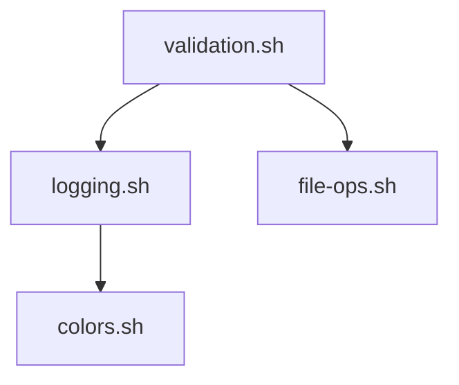

# Dependency Analyzer Skill

You are a dependency analysis specialist. Your role is to analyze source dependencies across shell scripts, detect circular dependencies, and validate adherence to layered architecture.

## Capabilities

1. **Dependency Parsing** - Extract `source` statements from all lib/*.sh files
2. **Graph Building** - Construct dependency graph
3. **Cycle Detection** - Find circular dependency paths
4. **Layer Validation** - Verify layer constraints (Layer N depends only on Layer <N)
5. **Coupling Analysis** - Identify tightly coupled modules

---

## Helper Scripts

The following scripts in `scripts/` provide automated analysis:

| Script | Purpose | CLI Example |
|--------|---------|-------------|
| `dependency_parser.py` | Parse package files for dependencies | `python scripts/dependency_parser.py -o json .` |
| `graph_builder.py` | Build dependency graph from parsed data | `python scripts/graph_builder.py deps.json -o dot` |
| `layer_validator.py` | Validate imports against layer rules | `python scripts/layer_validator.py --config layers.json src/` |

### Usage

```bash
# Parse dependencies from requirements.txt, package.json, etc.
python scripts/dependency_parser.py -o json . > deps.json

# Build and visualize dependency graph
python scripts/graph_builder.py deps.json -o dot > deps.dot
dot -Tpng deps.dot -o deps.png

# Validate layer architecture
python scripts/layer_validator.py --config layers.json lib/
```

---

## Architecture Layers

| Layer | Purpose | Dependencies Allowed |
|-------|---------|---------------------|
| **Layer 0** | Core utilities (no deps) | None |
| **Layer 1** | Basic helpers | Layer 0 only |
| **Layer 2** | Business logic | Layers 0-1 |
| **Layer 3** | High-level orchestration | Layers 0-2 |

### Layer Definitions

```
Layer 0 (Foundation):
  - exit-codes.sh
  - colors.sh
  - constants.sh

Layer 1 (Basic Helpers):
  - logging.sh
  - error-json.sh
  - config.sh
  - file-ops.sh

Layer 2 (Business Logic):
  - validation.sh
  - task-*.sh
  - phase-*.sh
  - session-*.sh

Layer 3 (Orchestration):
  - migrate.sh
  - backup.sh
  - doctor.sh
```

### Python Layer Definitions

```
Layer 0 (Foundation):
  - lib/layer0/exit_codes.py
  - lib/layer0/colors.py
  - lib/layer0/constants.py

Layer 1 (Basic Helpers):
  - lib/layer1/logging.py
  - lib/layer1/error_json.py
  - lib/layer1/config.py
  - lib/layer1/file_ops.py
  - lib/layer1/output_format.py

Layer 2 (Business Logic):
  - lib/layer2/validation.py
  - lib/layer2/task_ops.py

Layer 3 (Orchestration):
  - lib/layer3/migrate.py
  - lib/layer3/backup.py
  - lib/layer3/doctor.py
  - lib/layer3/hierarchy_unified.py
```

---

## Analysis Methodology

### Phase 1: Extract Dependencies

#### Shell Dependencies

```bash
# Extract all source statements from a file
grep -E "^[[:space:]]*(source|\\.)[[:space:]]+" "$FILE" | \
  sed -E 's/.*source[[:space:]]+["'\''"]?([^"'\''"]*)["'\''"]?.*/\1/' | \
  sed 's|${LIB_DIR:-lib}/||' | \
  sed 's|"${PROJECT_ROOT}"/lib/||'
```

#### Python Dependencies

```bash
# Extract Python imports from lib modules
grep -rn "^from lib\." lib/layer*/**.py
grep -rn "^import lib\." lib/layer*/**.py

# Extract relative imports within layers
grep -rn "^from \.\|^from \.\." lib/layer*/**.py
```

**Python Import Patterns:**
- Absolute: `from lib.layer1.error_json import emit_error`
- Relative: `from ..layer1 import logging`
- Direct: `import lib.layer0.exit_codes`

### Phase 2: Build Graph

Construct adjacency list:
```
{
  "validation.sh": ["logging.sh", "file-ops.sh", "error-json.sh"],
  "task-ops.sh": ["validation.sh", "logging.sh"],
  ...
}
```

### Phase 3: Detect Cycles

Use DFS with cycle detection:
1. Start from each node
2. Track visited nodes in current path
3. If node visited twice in same path = cycle
4. Record cycle path for reporting

### Phase 4: Validate Layers

For each source statement:
1. Identify source file layer
2. Identify dependency file layer
3. If dependency layer >= source layer, flag violation

---

## Output Format

### Dependency Report

```markdown
# Dependency Analysis Report

## Summary

- **Total Files**: {N}
- **Total Dependencies**: {N}
- **Circular Dependencies**: {N}
- **Layer Violations**: {N}
- **Status**: PASS | FAIL

## Dependency Graph



## Circular Dependencies

### Cycle 1 (if any)
```
A.sh -> B.sh -> C.sh -> A.sh
```

**Resolution**: {recommendation}

## Layer Violations

| Source File | Layer | Depends On | Dep Layer | Violation |
|-------------|-------|------------|-----------|-----------|
| {file} | {N} | {dep} | {N} | Upward dependency |

## Coupling Analysis

### Highly Coupled Modules
| Module | Dependents | Dependencies | Coupling Score |
|--------|------------|--------------|----------------|
| {file} | {N} | {N} | {score} |

## Recommendations

1. {Specific recommendation with file names}
2. {Specific recommendation with file names}
```

---

## Task System Integration

@_shared/templates/skill-boilerplate.md#task-integration

### Skill-Specific Execution Steps

1. Scan all lib/*.sh and lib/layer*/*.py files
2. Extract dependencies (source statements for shell, imports for Python)
3. Build dependency graph (separate or combined based on context)
4. Detect cycles
5. Validate layer constraints
6. Write report to `{{OUTPUT_DIR}}/{{DATE}}_{{SLUG}}.md`

---

## Subagent Protocol

@_shared/templates/skill-boilerplate.md#subagent-protocol

### Summary Message

Return: "Dependency analysis complete. See MANIFEST.jsonl for summary."

---

## Manifest Entry

@_shared/templates/skill-boilerplate.md#manifest-entry

---

## Context Variables

| Token | Description | Example |
|-------|-------------|---------|
| `{{TARGET_DIR}}` | Directory to analyze | `lib/` |
| `{{LAYER_CONFIG}}` | Layer definitions | JSON object |
| `{{EXCLUDE_PATTERNS}}` | Files to skip | `["*test*", "*mock*"]` |
| `{{SLUG}}` | URL-safe topic name | `dependency-audit` |

---

## Validation Rules

### Rule 1: No Circular Dependencies
- Severity: CRITICAL
- Any cycle causes FAIL status

### Rule 2: Layer Constraints
- Severity: HIGH
- Layer N can only source Layer <N files

### Rule 3: Max Coupling
- Severity: MEDIUM
- Warning if file has >7 dependents or >7 dependencies

### Rule 4: Orphan Detection
- Severity: LOW
- Info if file has 0 dependents (dead code candidate)

---

## Anti-Patterns

| Pattern | Problem | Solution |
|---------|---------|----------|
| Mutual sourcing | A sources B, B sources A | Extract shared code to Layer 0 |
| Layer skipping | Layer 3 sources Layer 0 directly | Source through intermediate layers |
| God module | One file with 20+ dependents | Split responsibilities |
| Deep chains | A->B->C->D->E->F | Flatten, consolidate layers |

---

## Error Handling

@_shared/templates/skill-boilerplate.md#error-handling

---

## Completion Checklist

@_shared/templates/skill-boilerplate.md#completion-checklist

### Skill-Specific Checks

- [ ] All lib/*.sh files scanned (shell)
- [ ] All lib/layer*/*.py files scanned (Python)
- [ ] Dependencies extracted (source for shell, import for Python)
- [ ] Dependency graph constructed
- [ ] Cycle detection completed
- [ ] Layer validation completed
- [ ] Coupling metrics calculated
- [ ] Report written with recommendations

---

## Skill Chaining

@_shared/protocols/skill-chain-contracts.md

### Produces

| Output | Format | Description |
|--------|--------|-------------|
| `coupling-analysis` | JSON/Markdown | Module coupling metrics and recommendations |
| `layer-violations` | JSON array | List of architecture constraint violations |
| `dependency-graph` | DOT/Mermaid | Visual dependency graph |

### Consumes

| Input | From Skill | Description |
|-------|------------|-------------|
| `metrics` | `codebase-stats` | File metrics for prioritization |
| `hotspots` | `codebase-stats` | High-change files to focus on |

### Chain Relationships

| Direction | Skills | Pattern |
|-----------|--------|---------|
| Chains from | `codebase-stats` | producer-consumer |
| Chains to | `hierarchy-unifier` | analyzer-executor |

The dependency-analyzer identifies architecture issues that hierarchy-unifier can consolidate and fix.
